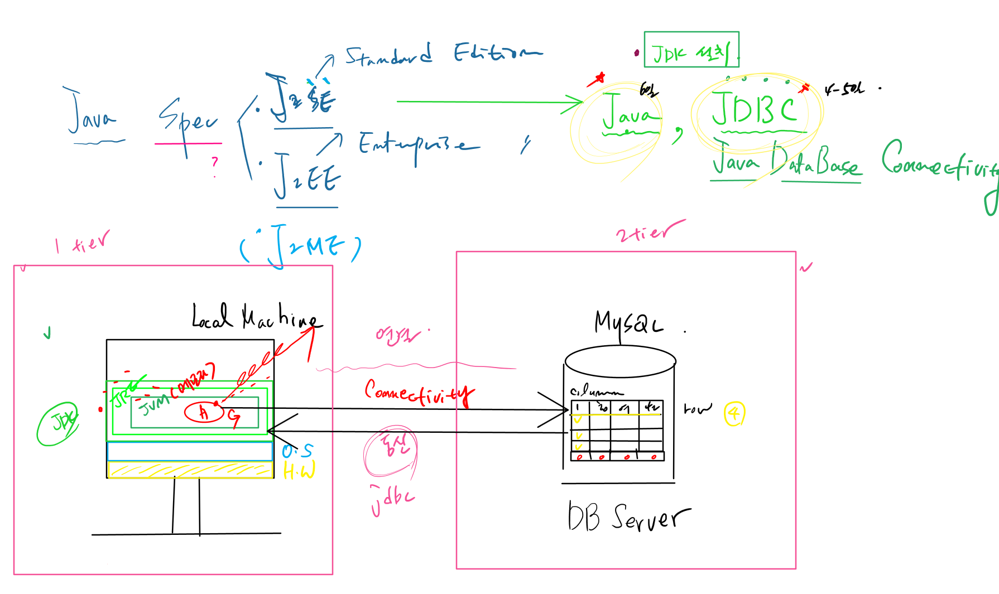
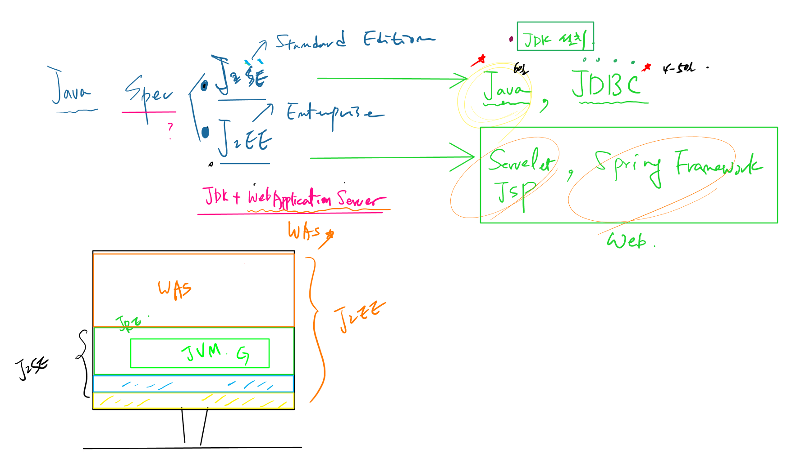
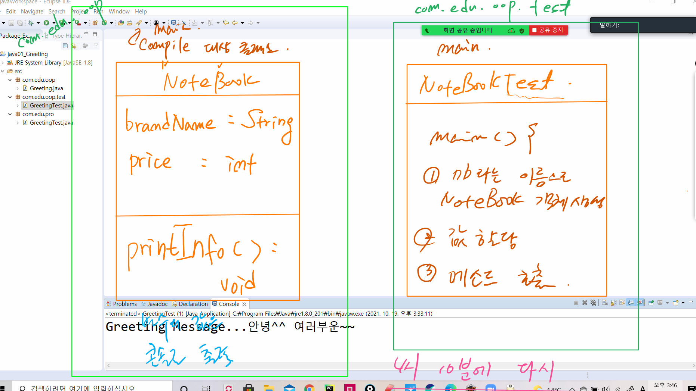

# 21.10.19 JAVA 1일차

## 1. 강사소개

* 하승현 강사님
* sueup@daum.net
* 2001.01. SUN 마이크로시스템즈
* 2009  HP 등등

## 2. JAVA 강의

* jdk :  Java Development Kit
* spec
  * J2SE **Standard Edition** : `JAVA`, `JDBC`
  * J2EE **Enterprise Edition**
  * J2ME - 지금은 안쓰는 spec

### J2SE



* computer 혹은 **local machine**
  * **H/W** 가장 기저에 깔려 있음
  * **OS** 운영체제
  * **JDK** 환경이 올라감. - **JRE** 설치 **JVM**(메모리 환경)
* `JDBCJava database Connectivity
  * J2SE

### JAVA JDBC의 차이점

* java는 1티어(local machine) - 6일
* JDBC는 2티어(local machine - server) - 4-5일

### J2EE



> JDK, WAS 둘다 설치되어 있어야 함.

* 필요기술 : sevelet, JSP, Spring Framework
* 아키텍처
  * J2SE 위에 `WAS`가 올라간 형태

## 점심시간 과제

1. JDK 
2. Eclipse
3. Hello JAVA!!!

## 2. 점심시간 이후

'java{넘버}_주제' 순으로 프로젝트 명 지정

class 생성 - 자바는 패키지를 갖게 됨.

디렉토리, 폴더 - 파일

클래스 - 패키지

### 패키지 이름 규칙

1. 반드시 `소문자`로
2. 3개 이상
   * come 패키지 안에edu 패키지 안에 pro 패키지 안에 Greet.java  - class

```java
package com.edu.pro;

public class Greeting {

	public static void main(String[] args) {
		// TODO Auto-generated method stub

	}

}
```

### `package`란?

 * 비슷한 기능을 가지고 있는 클래스들을 묶어주는 역할을 한다.
 * ### Rule
 * 1) 모든 패키지 이름은 소문자이어야 한다.
 * 2) 상위 패키지와 하위 패키지는 . 으로 구분한다.
 * 3) 패키지 선언은 소스코드의 가장 윗 부분에 온다.

### `Class`란?

1. 클래스 이름은 반드시 대문자로 시작한다...매너!
2. 클래스 이름으로 파일명이 결정된다.
3. 클래스의 확장자는 .java이다.

### `method`란?

1. main 메소드가 있는 클래스가 실행된다.(없으면 실행이 안됨.)
2. sysout+`ctrl`+`space` = System.out.println();
3. `ctrl` + `s` => 저장 하면 `tab`의 *가 없어짐

## 플랫폼 호환이 안될때

`플랫폼` : 프로그램이 실행되는 장소를 말함.

`JAVA`를 사용하려면, `JDK`가 있어야함. 윈도우에 맞게, 리눅스에 맞게, mac용에 맞게 플랫폼이 생성

Greeting.java 이라는 class를 만듦. - `원시 소스코드` : 인간이 알아보는 코드 - 기계는 못알아봄.

저장 이전 *Greeting.java -> Greeting.java 저장 후 - 문법적으로 하자가 없으면 저장만 해도 컴파일이 됨.

`기계어`로 바꿔줘야 함.(compiling : 컴파일 과정) qkdl

`JVM` : OS와 JDK관계 - OS에 종속적임.

컴파일 과정 = 원시소스코드 - 기계어

컴파일 과정과 실행 과정과는 독립적

실행 과정 = JVM

### `플랫폼 ` 독립성! : Write once Run anyway

서버를 설치하게 되면 `bin`이 생성됨. 이 안에는 실행, stop 등...

컴파일 : `javac.exe`

run as : `java.exe`


java는 완벽한 기계어로 변환하지 않음. 컴파일은 했지만, 실행파일(바이트 코드)은 만들어지지만 정작 실행이 안됨.

바이트 코드는 JVM 을 거쳐야 진정하게 실행이 됨. - 왜냐하면 플랫폼 독립성을 위해서!

완벽한 바이너리 코드가 아님. 

## `JRE` : Java Runtime Environment

`java` : 패키지를 말함.

`javax` :  java extension

jre lib rt.jar

java.lang.여러가지 클래스

`클래스 파일`이라고 하지 않고 `실행파일` - `JVM`에서 돌아감.

컴파일 과정 : `.java` -> `.class`

실행 과정 : `JVM`에서

미리 만들어놓은 클래스를 `라이브러리` 와 `API`

`JDK`안에 `JRE`안에 `JVM`에서 `Greeting.class`

이와 같이 `JRE`도 같이 돌아감.

JAVA_HOME

`기계어`(jre)를 `원시소스코드`(jdk)로


## JAVA API 보는 법

[API 설명 사이트](https://docs.oracle.com/javase/7/docs/api/)

java.lang

JDK

JRE

"미리 만들어놓은 실행 클래스들의 묶음"

라이브러리, API

JAVAHOME JRE LIB > rt.jar - 다 기계어로되어 있음 .class

JAVAHOME > src.zip - .java

api 다큐멘테이션


## JAVA냐 아니냐 : `OOP`

JAVA의 문법으로 되어 있기때문에 JAVA이다. 하지만,,, 저건 JAVA가 아니다.

객체 지향적으로 작성되지 않아서 - "oop"로 작성이 되어야 함...

```java
/*
 * 위 토드는 무늬만 자바인 프로그램
 * 결과적으로 문법은 자바 문법을 사용했지만
 * OOP를 지향해서 작성한 코드가 아니기 때문에
 * 자바라 할 수 없다.
 * 
 * com.edu.oop패키지에서는 
 * 위 코드를 그대로 객체지향적인 프로그램으로 바꿔보겠다.
 * 
 */
```

`f2` : rename 단축키

실행 클래스 일때만 메인이 필요함.

```java
public class Greeting {
	String message; // 변수 선언
	
	// 메소드 정의 = 메소드 선언 + 메소드 구현
	public void printMessage() { // 메소드 선언
		System.out.println("Greeting Message..."+message); //메소드 구현
		
	}
}
```

* 컴파일과 실행위 과정
* 위의  실행 메소드가 없음.
* 없다면,, 컴파일 대상만 가능
* 그래서...oop.test에...


멤버

변수와 메소드

워커 메소드와 콜링 메소드

## 그렇다면 실습




클래스

예약어(키워드)

# 실행 클래스와 

### 실행 클래스 객체를 생성 == 멤버를 메모리에 올림

멤버는 3개 메모리에 올리니깐 멤버에 접근 할 수 있음.

변수 접근 값할당

메소드 접근 호출

JS HTML Python 처음부터 하나씩 실행이 됨.

하지만, JAVA는 아님.

### `JVM`에서 JAVA가 어떻게 인터프리팅 되는지?

> 자바는 한줄 한줄 해석이 되지 않음....돌아간다. 

JVM

### 해석 실행되는 순서

1. 클래스 파일이 메모리에 로드 됨.
2. 메인을 먼저 찾음(메인이 있으면 실행, 없으면 실행하지 않음.)
3. 스타트 - 객체 생성
4. 멤버에 접근
5. 호출 클래스의 같은 이름으로 { <- 워커 메소드
6. 콘솔 출력!
7. } 백(back) 함
8. } } 프로세스 종료

## 오늘 내용 정리

1. 패키지 선언법
2. JRE
3. OOP에 대한 부분.