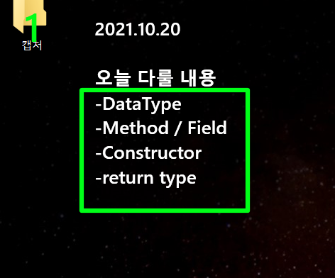
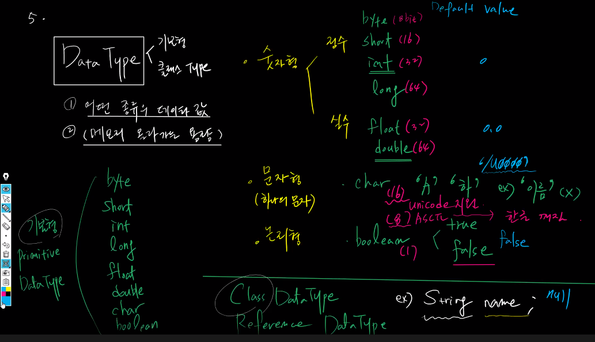
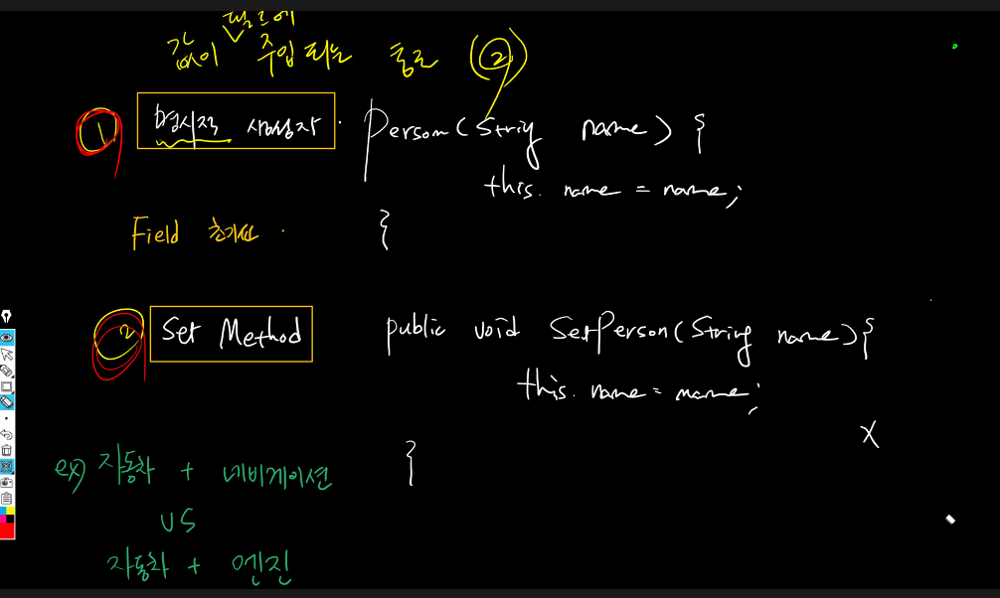
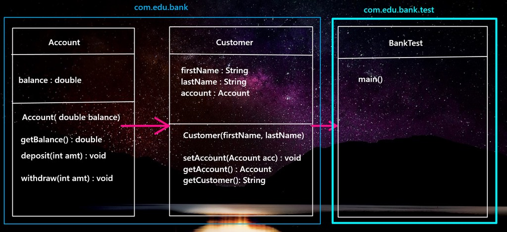

# 21.10.20 JAVA 2일차🖋

## 오늘 배울 내용



## 어제의 복습

### JAVA의 spec

* J2SE (JAVA) : 
  * oop + Advanced Feature
    * **oop** : constructure, 상속, feature, collection api
    * advanced feature : 예외처리, 쓰레드, 스트??, net
  * JDBC
    * SQL
    * **JavaDB**
* J2EE : JDK + 서버
  * **서블릿**
  * JSP
  * 프론트 UI : HTML5, CSS3, JavaScript - 아주 간단하게
  * Spring Framework : DI, MyBatis, Spring MVC

## 첫 시간

### field와 Method(클래스의 구성 요소)

* field : member Variable(변수)
* Method

`field`와 `method` 예시 코드

```java
package com.edu.oop;

public class NoteBook {
    // field 선언부 (위치는 클래스 선언 바로 아래!method 영역 바깥)
    // 형식 : DataType + 필드명;
	public String brandName;
	public int	price;
    //메소드 선언부
	public void //return type 이 void(반환값이 없을 때,여기서는 콘솔값을 출력만 하기에.)
        printInfo() //메소드 이름 identifier
    //메소드 구현부
    {
		System.out.println("NoteBook Brand :: "+brandName+", Price :: "+price);
	}
}
```

### 가장 유능한 PM의 역할은 identifier!

* NoteBook.java

```java
package com.edu.oop;
/*
 * 필드 선언 위치
 * ::
 * class 선언 바로 아래 + method 영역 바깥
 * 
 * method 선언부/ method 정의 부분
 * ::
 * return타입 + method 이름 (인자값 0~many){ //method 선언부
 * // method가 어떤 일을 하는지가 기술... // method 구현부 - worker/ method 정의
 * }
 */
public class NoteBook {
	public String brandName;
	public int	price;
	// field 추가
	public int serialNumber;
	
	public void printInfo() {
		// 수정 field가 추가 되어서 추가할 내용을 넣어야함.
		System.out.println("NoteBook Brand :: "+brandName+", Price :: "+price+", Number :: "+serialNumber);
	}
	// 메소드를 추가...return type이 void가 아닌 기능을 추가
	public String getBrandName() {//?
		// 어디로 리턴되는가?????? calling + worker 왔다갔다.
		return "NoteBook brandName :: "+brandName; // 호출한 곳으로 brandName이 return됨 ~test클래스의 26번째 라인
	}
}

```

* NoteBookTest.java

```java
package com.edu.oop.test;
/*
 * ~Test class
 * ::
 * 실행클래스...main
 * ::
 * 1. 객체 생성
 * 2. 메모리에 올라간 멤버에 접근...
 * 	field ---> 값 할당 (assign)
 * 	method ---> 호출 (calling)
 */
import com.edu.oop.NoteBook;

public class NoteBookTest {
	public static void main(String[] args) {
		// 1. NoteBook 클래스를 객체를 생성 == NoteBook 멤버를 메모리에 올림
	      NoteBook nb = new NoteBook();
	      
	    // 2. 멤버에 접근 : 값할당
	      nb.brandName = "apple macbook";
	      nb.price = 290;
	      nb.serialNumber = 1234;
	    // 3. 호출
	      nb.printInfo(); // 콘솔창에 출력(return 타입이 void라서)
	      //추가된 method 추가
	      System.out.println(nb.getBrandName());//String일때, 이쪽으로 리턴된 값을 출력
	   }
}

```


## 두번째 시간


`import`는 다른 

* import 시 jar로는 압축되지 않은 경우엔 *를 안쓰는게 좋음.


* 문제점 파악 : 코드가 너무 길다.

```java
package com.edu.oop.test;
import com.edu.oop2.NoteBook;
/*
 * NoteBookTest2 코드에서의 문제점을 찾아내보자
 * 1) class의 field에 값을 할당하는 부분이 코드라인을 너무 길게 만든다.
 * 만약에 field가 여러 개 더 추가된다면 field값 할당하는 부분이 늘어난다.
 * 더욱이 객체 생성을 여러개 한다면 기하급수적으로 코드라인이 늘어난다.
 * --> "재사용성"을 떨어뜨리는 결정적인 요인.
 * 해결책?
 * method를 만들어 해결한다.
 */


public class NoteBookTest2 {
	public static void main(String[] args) {
	      
		NoteBook nb = new NoteBook();
		NoteBook nb2 = new NoteBook();// 하나더 만듦.멤버를 메모리에 추가

	      
	      nb.brandName = "apple macbook pro";
	      nb.price = 290;
	      nb.serialNumber = 1234;
	      
	      nb2.brandName = "SAMSUNG GALAXY BOOK PRO 360";
	      nb2.price = 240;
	      nb2.serialNumber = 4455;
	      
	      nb.printInfo(); 
	      System.out.println(nb.getBrandName());
	      
	      System.out.println("=======================");
	      
	      nb2.printInfo(); 
	      System.out.println(nb2.getBrandName());

	   }
}
```

`재사용성`을 떨어뜨리는 요인이 됨.

### 한꺼번에 주석처리

* `ctrl` + `shift` + `/`
* `ctrl` + `shift` + `\`

### 변수(variable)

* Field(member)
  * class의 멤버
  * class 선언 아래, method영역 바깥
  * 선언만해도 기본값(null, 0 등)이 있다.
* local Variable
  * method영역 안에서 선언
  * 기본값이 없음.
* NoteBookTest2.java

```java
package com.edu.oop.test;
import com.edu.oop2.NoteBook;
/*
 * NoteBookTest2 코드에서의 문제점을 찾아내보자
 * 1) class의 field에 값을 할당하는 부분이 코드라인을 너무 길게 만든다.
 * 만약에 field가 여러 개 더 추가된다면 field값 할당하는 부분이 늘어난다.
 * 더욱이 객체 생성을 여러개 한다면 기하급수적으로 코드라인이 늘어난다.
 * --> 재사용성을 떨어뜨리는 결정적인 요인.
 * 
 * ::
 * 해결책?
 * method를 만들어 해결한다.
 * 
 */


public class NoteBookTest2 {
	public static void main(String[] args) {
	      
		NoteBook nb = new NoteBook();
		NoteBook nb2 = new NoteBook();// 하나더 만듦.멤버를 메모리에 추가

	      
	     /* nb.brandName = "apple macbook pro";
	      nb.price = 290;
	      nb.serialNumber = 1234;
	      
	      nb2.price = 240;
	      nb2.serialNumber = 4455;*/
	      
		nb.setNoteBookInfo("apple macbook pro", 290, 1234);
		nb2.setNoteBookInfo("SAMSUNG GALAXY BOOK PRO 360", 240, 4455);

		
	      nb.printInfo(); 
	      System.out.println(nb.getBrandName());
	      
	      System.out.println("=======================");
	      
	      nb2.printInfo(); 
	      System.out.println(nb2.getBrandName());

	   }
}
```

* NoteBook.java

```java
package com.edu.oop2;

public class NoteBook {
	public String brandName;
	public int	price;
	public int serialNumber;
	
	public void printInfo() {
		System.out.println("NoteBook Brand :: "+brandName+", Price :: "+price+", Number :: "+serialNumber);
	}
	public String getBrandName() {
		return "NoteBook brandName :: "+brandName; 
	}

	// method 추가... field에 값을 할당받을 수 있는 기능을 하나 추가한다.
	// identifier 설정
	//구현부(값 할당) : return 타입 이름 
	public void setNoteBookInfo(String brandName, int price, int serialNumber) //bn p ser 이것들은 변수지만 field가 아님. member변수가 아님.method영역 안에 선언됨.
	// local 변수, 지역 변수, argument list
	{
		//~Test에서 기능 호출할때 받은 인자값으로 다시 필드에 할당.
		//필드초기화(field initialization) : 새로운 값할당을 초기화라고 함.
		this.brandName=brandName; // 앞에는 field 뒤에는 local 변수
		this.price=price;
		this.serialNumber=serialNumber;
		// this.(예약어) :: field와 local variable의 이름이 같을때 구분하기 위해서 field앞에 붙인다.
		
	}
}

```

## 한번 풀어봅시다.

> 제임스 고슬링 : 자바의 창업자 (가전제품에 칩을 넣는 기술을 만들기 위해.)

## 오후수업

## 데이터 타입 : 기본형, class type



1. 어떤 종류의 데이터 값
2. 메모리 올라가는 용량

#### 숫자형

* 정수 
  * 바이트8
  * 쇼트16
  * int32
  * long64
* 실수
  * float32
  * double64

#### 문자형

* char[16] -unicode 지원(8bit는 asci코드 지원) 변수명 한글로 가능함.

#### 논리형 : boolean

* true1
* false1

기본형 : 바이트, 쇼트, int, long, float, double, char, boolean

클래스데이터 타입 : String

기술의 Level이 올라갈 수 록 class data type을 많이 사용

## 실습

> 패키지명은 camel case로 쓰면 안됨.

```java
package com.edu.datatype;
/*
 * Class를 여러개 한꺼번에 작성할때는
 * - main method를 가지는 class앞에 public을 붙인다.(다른 클래스 앞에는 붙이면 안됨.)
 * - public이 붙은 클래스 이름으로 파일명을 지정한다.
 * 
 */
class Date{
	int year;
	int month;
	int day;
	
	public void setDate(int year, int month, int day) {
		this.year = year;
		this.month = month;
		this.day = day;
	}
	//String + nonString 붙여지면 String으로 Converting!!
	public String getDate() {
		return year+"-"+month+"-"+day;
	}
}
class WhiteBoard{
	// company, color, material, price, scratch, madeDate(2000.1.23)
	String company;
	char color;
	String material;
	double price;
	boolean scratch;
	Date madeDate;
	
	//2. 필드에 값 할당...(setWhiteBoard())/할당된 값 받아오는...(getWhiteBoard())
	public void setWhiteBoard(char color, double price, boolean scratch, Date madeDate) {
		this.color = color;
		this.price = price;
		this.scratch = scratch;
		this.madeDate = madeDate;
		
	}
	public String getWhiteBoard() {
		return color+","+price+","+scratch+","+madeDate.getDate();//getDate() 선언
	}
	
}
public class WhiteBoardTest {
	public static void main(String[] args) {		
		//1. wb라는 이름으로 WhiteBoard 객체를 생성
		WhiteBoard wb = new WhiteBoard();
		//2. 필드초기화
		Date madeDate = new Date();
		madeDate.setDate(2020, 1, 12);
		wb.setWhiteBoard('W', 100.5, false, madeDate);
		//3. 필드값을 콘솔로 출력
		System.out.println(wb.getWhiteBoard());
		
	}
}
```


## 생성자 (Constructor)

값이 없어도 메모리에 값이 올라감. 

null/0

| p1   | p2   | p3   |
| ---- | ---- | ---- |
| null | null | null |
| 0    | 0    | 0    |

| p1   | p2   | p3   |
| ---- | ---- | ---- |
|      |      |      |
|      |      |      |



명시적 생성자

Person(String, name){ this.name= name;}

set Method

public void setPerson(String, name){this.name = name;}

두 가지의 공통점은 **필드 초기화** - 값이 field에 주입되는 통로는 `명시적 생성자` , `set Method`

두가지의 차이점.

명시적 생성자는 lifecycle을 같이 할때,(생성과 소멸을 같이함.)

set은 일주일 뒤이던 바꿀수 있을때, 

## 오늘 수업 정리

수평적인 관계 : Hasing 갖는 관계 **has a relation**

* 개발자가 노트북을 갖음.
* 노트북이 필드를, 개발자가 필드를 갖음.
* 노트북 타입으로 필드를 선언
* 주입(생성자, setter())

수직적인 관계 : 상속 

#### 내일 부터는 클래스간 관계를 설정하고 돌리도록 함.

`배열`...!

## 오늘 과제



Account

Customer


main()

1. account 객체 생성
2. customer가 account 계정을 hasing 하도록
3. jane이 개설한 통장을 받아서 1만원 저축 5천원 출금 잔액 확인.
