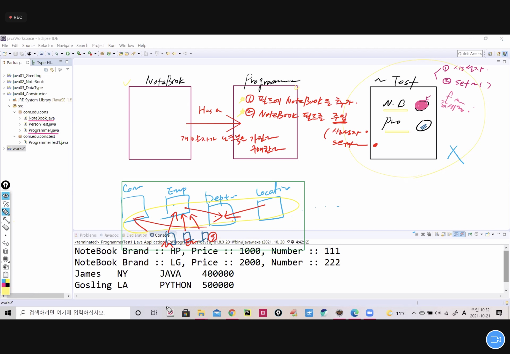

# 21.10.21. JAVA - 3일차

## 1021 수업 이슈

* Has a Relation
* 연산자, Scanner
* 제어문()
* 반복문
* Encapsulation

### oop의 3대 특징

1. Encapsulation
2. inheritance
3. polymorphism



### Has a 관계의 규칙

1. 필드에 따라 NoteBook을 `추가`
2. NoteBook을 필드로 `주입`(명시적 생성자, set())

### Identifier는

: `simple`보다 `specific`이 더 중요함.

* NoteBook.java

```java
package com.edu.cons;

public class NoteBook {
	public String brandName;
	public int	price;
	public int serialNumber;
	// 생성자는 return 타입이 없음.
	public NoteBook(){}
	public NoteBook(String brandName, int price, int serialNumber) {
		this.brandName = brandName;
		this.price = price;
		this.serialNumber = serialNumber;
	}
	
	public void printInfo() {
		System.out.println("NoteBook Brand :: "+brandName+", Price :: "+price+", Number :: "+serialNumber);
	}
	public String getBrandName() {
		return "NoteBook brandName :: "+brandName; 
	}

	// method 추가... field에 값을 할당받을 수 있는 기능을 하나 추가한다.
	// identifier 설정
	//구현부(값 할당) : return 타입 이름 
	public void setNoteBookInfo(String brandName, int price, int serialNumber) //bn p ser 이것들은 변수지만 field가 아님. member변수가 아님.method영역 안에 선언됨.
	// local 변수, 지역 변수, argument list
	{
		//~Test에서 기능 호출할때 받은 인자값으로 다시 필드에 할당.
		//필드초기화(field initialization) : 새로운 값할당을 초기화라고 함.
		this.brandName=brandName; // 앞에는 field 뒤에는 local 변수
		this.price=price;
		this.serialNumber=serialNumber;
		// this.(예약어) :: field와 local variable의 이름이 같을때 구분하기 위해서 field앞에 붙인다.
		
	}
}

```

* Programmer.java

```java
package com.edu.cons;

// Programmer 가 NoteBook을 가지는 관계를 설정...Has A Relation..
/*
 * 1. 필드 레벨에 추가하고자 하는 클래스를 선언
 * 2. 추가한 필드를 주입하는 통로를 하나 생성
 *    생성자 혹은 setter()
 */

public class Programmer {
	String name;
	String address;
	String mainSkill;
	int	salary;
	
	// !Hasing! NoteBook nb; //프로그래밍의 초짜!
	//가장 좋은 변수명은
	NoteBook noteBook;
	
	
	
	public Programmer(){}
	public Programmer(String name, String address, String mainSkill, int salary){
		this.name = name;
		this.address = address;
		this.mainSkill = mainSkill;
		this.salary = salary;
	}
	
	//!Hasing! setter()를 추가
	public void buyNoteBook(NoteBook noteBook)//천천히 가더라도 내껄로 이해하고 가야 함.
	{
		this.noteBook = noteBook;
	}
	//주입한 노트북을 다시 받아오는 루트도 추가한다.
	public NoteBook getNoteBook() {
		return noteBook;
	}
	
	public void setProgrammerInfo(String name,
			String address, String mainSkill, int salary) {
		this.name=name;
		this.address=address;
		this.mainSkill=mainSkill;
		this.salary=salary;
	}
	public String getProgrammerInfo() {
		return "name :: "+name+"\t livingPlace :: "+address+"\t mainSkill :: "+mainSkill+"\t salary :: "+salary; 
	}
	public int getAnnualSalary() {
		return salary * 12;
		
	}
	//
	public String getMainSkill() {
		return mainSkill;
	}
}

```

* ProgrammerTest.java

```java
package com.edu.cons.test;

import com.edu.cons.NoteBook;
import com.edu.cons.Programmer;

public class ProgrammerTest {

	public static void main(String[] args) {
		/*
		 * 1. Programmer 객체를 생성..이름을 james로
		 * 2. james가 삼성 노트북 한대를 구매함.
		 * 3. james가 구매한 노트북의 정보를 출력함.
		 *    이때, james의 기술셋(mainSkill)도 함께 출력함.
		 */
		Programmer james = new Programmer("james", "NY","JAVA", 300000);
		
		//james가 노트북을 구매...has a relation
		
		/*NoteBook nb = new NoteBook("SAMSUNG", 200, 1234);
		james.buyNoteBook(nb);*/
		
		//만들어서 바로 주입.
		james.buyNoteBook(new NoteBook("SAMSUNG", 200, 1234));// 개발자 james가 samsung노트북을 갖는 시점.
		
		System.out.println("James의 주력 기술은 "+james.getMainSkill()+"!!!");
		//james가 구매한 노트북 정보를 출력...
		james.getNoteBook().printInfo();//노트북이 return됨.printInfo()를 통해 출력
	}

}

```

### 단축키 정리

* source 생성 불러오기 : `shift` + `alt` + `s` 
* New : `ctrl` + `n` 
* 바로 생성 : `alt` + `shift` + `n`  -> `↓`
* 라인 삭제 : `ctrl` +`d` 
* 입력값 이동 : 마우스 drag 상태 + `alt` + 방향키
* 입력값 복사 : 마우스 drag 상태 + `alt`+`ctrl` + 방향키
* 실행 : `ctrl`+`f11`
* 꽉찬 화면: `ctrl`+`m`
* 전체 컴파일 : `ctrl`+`shift`+`s`
* 자동 정렬 :  `ctrl`+`shift`+`f`
* 임포트 : `ctrl`+`shift`+`o`
* 전체 닫기 : `ctrl` + `shift` + `w`
* 글자크기 : `ctrl` + `+` / `-`

## Workshop01

React, js, Java Base로...!

python : 도구 AI

JAVA BASE 로 이클립스를 많이 씀. vscode도 많이 씀.

IDE(Integrated Development Environment) : 이클립스, vscode

왜 이클립스를 사용하는가?


Account -{개설}-> Customer

1. field에 account 개설
2. 주입 생성자, setter()

* Account
```java
package com.edu.bank;

public class Account {
	double balance;

	public Account(double balance) {
		this.balance = balance;
	}

	public double getBalance() {
		return balance;
	}
	//입금 구현 : 잔액 1만원 5천원 입금 -> 잔액1만5천원
	public void deposit(int amt) {
		// balance = balance + amt;
		balance += amt; //성능상 더 좋음.
	}
	//출금 구현
	public void withdraw(int amt) {
		// balance = balance - amt;
		balance -= amt; //성능상 더 좋음.
	}

}
```


* Customer
```java
package com.edu.bank;

public class Customer {
	String firstName;
	String lastName;
	
	//Has a Relation
	Account account; //1
	
	public Customer(String firstName, String lastName) {
		super();
		this.firstName = firstName;
		this.lastName = lastName;
	}
	//field명을 중심으로 class명을 짜여지게 되므로....identifier가 중요함. 
	public Account getAccount() {
		return account;
	}
	public void setAccount(Account account) {
		this.account = account;
	}
	public String getCustomer() {
		return lastName+" "+firstName;
	}
}
```


* BankTest

```java
package com.edu.bank.test;

import com.edu.bank.Account;
import com.edu.bank.Customer;

public class BankTest {

	public static void main(String[] args) {
		// 1. 고객을 생성
		Customer  custom = new Customer("James", "Gosling");
		
		// 2. James가 통장을 하나 개설...Has a Relation...
		custom.setAccount(new Account(10000.0));
		
		// 3. James가 개설한 통장을 하나 받아서....
		//Customer클래스에 있는 getAccount()를 호출...
		Account jamesAcc = custom.getAccount(); // balance가 1만원
		//return을 받은 이유는 사용하려고, 
		
		// 4. 이제 james가 개설한 통장을 사용할 수 있다.
		// 5000원, 3000원, 20000원을 입금 / 25000원 을 출금 / 잔액 13000원
		jamesAcc.deposit(5000);
		jamesAcc.deposit(3000);
		jamesAcc.deposit(20000);
		/////
		jamesAcc.withdraw(25000);
		
		System.out.println("James Account Balance :: "+jamesAcc.getBalance());
	}
}
```

## Operator : 연산자

```java
package com.edu.test;
/*
 * 자바에서 알아야하는 연산자를 정리한다...
 */
class Operator{
	public boolean test1() {
		System.out.println("test1()...calling");
		return true;
	}
	public boolean test2() {
		System.out.println("test2()...calling");
		return true;
	}
}

public class OperatorTest1 {
	public static void main(String[] args) {
		//변수 : 멤버(field), local 변수
			int i = 10;//로컬변수 method영역 안에서만 사용할 수 있다.
			int j = 8;//로컬변수
			// = 은 assign의 의미를 갖음. 공간의 이름이 i 10이라는 값이 i에 할당.
			// == 는 같다.
			/*
			 *  = :: 할당
			 *  == :: 같다.
			 *  != :: 같지 않다.
			 *  % :: modulars 나머지를 구해줌.
			 */
			System.out.println(i==j); //False
			System.out.println(i!=j); //True
			System.out.println("==============================");
			System.out.println("연산자 % ::"+i % j); //2
			
			// ++ :: 1씩 값을 증가시키는 연산자
			// -- :: 1씩 값을 감소시키는 연산자
			int k = 10; //Local V 초기화 (선언 + 값할당)
			System.out.println(k++); //10... 1이 나중에 증가
			System.out.println(k);		//11
			
			int m = 10;
			System.out.println(++m);// 11...먼저 1이 증가됨.
			System.out.println(m); //11
		}
//		i=100; 로컬변수는 영역밖에서 쓰면 에러가 남.
}
```

## Scanner

프로그램에서는 값을 실행시 입력,

실행 할때마다 서로 다른 값이 입력 필수 있어여함.

```java
package com.edu.test;

import java.util.Scanner;

/*
 * Scanner class
 * ::
 * 실행시 코드에 값을 직접 입력받는 것이 아니라(compile시점에 값이 하드코딩 되어져 있다....)
 * new Account(10000);
 * 
 * 실행시점에서 값을 입력받을 수 있도록 할때, 필요한 class가 Scanner
 */
public class ScannerTest2 {
	public static void main(String[] args) {
		System.out.println("=====키보드로 숫자를 입력하세요 >>>>>>>");
		//1. Scanner 객체를 생성...메모리에 올린다.
		// System.in(콘솔창) Sysyem.out(키보드)
		Scanner sc = new Scanner(System.in);
		int i = sc.nextInt();//키보드로 입력한 것을 알아서 받아옴
		//nextInt()공백을 기준으로 데이터를 반환함.
		int j = sc.nextInt();//키보드로 입력한 것을 알아서 받아옴
		String name = sc.next();// 공백을 기준으로 데이터를 반환함.
		
		System.out.println("숫자값 : "+i+","+j);
		System.out.println("당신의 이름은 "+name);
	}

}
```

## 제어문(조건문)

#### 정의 : 특정한 상황에서만 코드가 실행되도록 제어하는 문장

조건이 참 일 때만 코드블럭{ }을 실행

* `if` (조건)
* `else if` (조건)
* `else` (조건X)

```java
if (i=0){
    
    
}
//에러가 남...
if(i==0){
    
    
}
//이래야 됨.
```

* 생략버전

```java
package com.edu.condition.test;

public class GradeIfTest1 {
	public static void main(String[] args) {
		int grade =88; //Local Variable
		
		if(grade >= 90 & grade <= 100)//false가 떨어져서 안돌아감. 
		{
			System.out.println("A grade..");
		}else if(grade>=80 & grade<90) {
			System.out.println("B grade..");
		
		}else if(grade>=70 & grade<80) {
			System.out.println("C grade..");
		}else{
			System.out.println("Try Again...!");
		}
	}

}
```

* {} 생략버전

```java
package com.edu.condition.test;

public class GradeIfTest1 {
	public static void main(String[] args) {
		int grade = 88; // Local V
		
		if(grade>=90 & grade <=100) 
			System.out.println("A grade..");			
		else if(grade>=80 & grade<90) 
			System.out.println("B grade..");
		else if(grade >=70 & grade<80)
			System.out.println("C grade..");
		else 
			System.out.println("Try Again...!!");				
		
	}//main
}//clas
```

### 프로그램은 무엇인가?

내가 1, 2라는 값을 집어넣으면

`프로그램`을 거쳐

100, 101을 출력하는 것.

input - {알고리즘} - output이 달라짐. //명료함.

수많은 양의 데이터 - {M/L(개입X)} - 결과를 도출함. //명료하지 않음.

```java
package com.edu.condition.test;

import java.util.Scanner;

public class GradeIfTest1 {
	public static void main(String[] args) {
		//int grade = 88; // Local V
		//이렇게 되면 컴파일시 하드코딩되어 변수가 넣어짐.
		System.out.println("당신의 점수를 입력하세요 >>>>>>>");
		Scanner sc = new Scanner(System.in);
		int grade = sc.nextInt();
		sc.close();
		
		if(grade>=90 & grade <=100) 
			System.out.println("A grade..");			
		else if(grade>=80 & grade<90) 
			System.out.println("B grade..");
		else if(grade >=70 & grade<80)
			System.out.println("C grade..");
		else 
			System.out.println("Try Again...!!");				
		
	}//main
}//clas
```

### java에서의 조건문

* if 문
  * `if` (조건)
  * `else if` (조건)
  * `else` (조건X)

* switch문

  * switch (변수 : 숫자 문자 문자열/실수는 안됨.) {

    case 1 : 

    case 6 :

    case 7 :

    ... : ~~~~

    break;//케이스를 빠져나오기 위함.

    case 8 : 

    ​		system.out.println("수영장 가고 싶어요.")

     }

  * `switch`, `case`, `break`

#### switch 의 사례 : 케이스에 따라서 

* 웹페이지에서 버튼을 구현 할때,
* 월별로 상황별로 직접적으로 제어하고 싶을때, 

[java api중 lang.math](https://docs.oracle.com/javase/8/docs/api/)

* abs()
  * Returns the absolute value of a `double` value.
* random()
  * Returns a `double` value with a positive sign, greater than or equal to `0.0` and less than `1.0`.
  * 0에서 1사이의 실수`float`를 출력함. 0 <= random() <1

#### static은 메모리에 안올리고 바로 가져다 사용. : 이미 메모리에 올라가 있기 때문,

* static이 붙어 있으면, 객체생성 과정을 생략 할 수 있음.


break;는 switch를 빠져나가게됨

```java
package com.edu.condition.test;
/*
 *  앞에서 배운 switch문은 break 키워드를 어떻게 활용하느냐에 따라서
 *  다양한 결과를 도출할 수 있다.
 *  
 *  1) static한 기능을 접근하는 방법
 *  2) break 키워드 사용법
 *  ::
 *  Math m = new Math();
 *  m.random();
 *  random()은 static한 성질로 만들어져 있기 때문에
 *  위처럼 객체 생성할 필요가 없다.
 *  미리 메모리에 올라가 있다.
 *  --> 
 *  Math.random(); 이렇게 className.기능();
 */
public class SwitchNoBreakTest3 {
	public static void main(String[] args) {
		
		/*double time = Math.random(); //0~1사이의 실수를 return한다.
		System.out.println(time);*/
		int time = (int)(Math.random()*4) + 8; //8~11까지의 정수를 return한다.
		System.out.println("[현재시각 : "+time+" 시]");
		
		switch(time) {
			case 8: //8시 인경우
				System.out.println("출근 준비 합니다...");
			case 9: //9시 인경우
				System.out.println("회사 도착, 아침 회의를 가집니다...");
			case 10: //10시 인경우
				System.out.println("오전 업무를 봅니다...");
			case 11: //11시 인경우
				System.out.println("외근을 나갑니다...");
				
		}//switch
		
	}//main

}//class

```


## Encapsulation

invalid 값이 들어가는 경우

명확하고 정확한 값을 넣어야 함.

필드에 값을 직접적으로 넣으면 원래는 없는 짓임.

class에서 가장 중요한 것은 **field(data)**

아무도 접근하지 못하도록 capsule을 씌움 - 데이터가 보호됨.하지만 접근이 안됨.

Field값을 보호하려는 목적

1. 외부(다른 class)로부터 직접적인 접근을 막을때 
   * `private`을 설정 - 저장은 되지만,,, 접근이 불가함.
2. field값을 set() / get() method로 소통 public으로 열어 놓음.
   * 개구멍을 하나 뚫음. set(), get()이 두 가지 method만 public으로 열어 놓음.

3. **ㅇㄹ**

