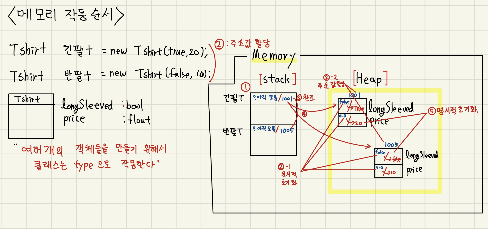

# 21.10.22. JAVA-4일차

## 어제의 복습

* 메모리에 값을 올리는 이유는 사용하려고
* 값할당 : set(), 명시적 생성자
* 필드초기화

## 오늘의 수업 이슈

* 객체 생성시 메모리 할당 순서
* Looping문(반복문)
* Array(배열)
  * Primitive Array
  * Class Type Array

## 어제의 과제 해설

* MyDate.java

```java
package com.edu.capsul;
//오늘 날짜 정보를 가지고 있는 클래스...
/*
 * Encapsulation Pattern
 * 1. field앞에 private을 지정 -- 다른 클래스에서 필드에 값할당 못함(직접적인 접근을 막는다.)
 * 2. void setXxxx(0,0)  / int return타입지정 getXxxx() 는 public으로 지정
 * 3. setXxxx() method에서 필드 초기화 되기 직전에 받은 값이 타당한 값인지에 대한 유효성 검사
 */
public class MyDate {
	//private은 같은 클래스에서만 ...접근 가능... 다른 class에서 접근 불가
	private int month;
	private int day;
	
	public int getMonth() {
		return month;
	}
	public void setMonth(int month) {
		// invalid한 값이 전달되더라도 필드 초기화 되기 직전에 걸러낼 수 있다.
		// month에 해당하는 값이 1~12일 경우에만 필드초기화 되도록한다.
		// field에 타당한 값만 들어가도록 유효성 검사 진행
		if(month >= 1 & month <= 12) {
			this.month = month;//1~12
		}else {
			System.out.println("잘못된 월 입력입니다.");
			System.exit(0); //정상 종료, -1(비정상종료)
		}
	}
	public int getDay() {
		return day;
	}
	public void setDay(int day) {
		switch(month) {
			case 2:
				if(day >= 1 & day <= 28) {
					this.day = day;
				}else { 
					System.out.println("잘못된 일 입력입니다.");
					System.exit(0); //여기서 프로그램을 끝내도록...다시 Test가 돌아가지 않도록
				}
					break;
				case 4:
				case 6:
				case 9:
				case 11:
					if(day >= 1 & day <= 30) {
						this.day = day;
					}else { 
						System.out.println("잘못된 일 입력입니다.");
						System.exit(0); //여기서 프로그램을 끝내도록...다시 Test가 돌아가지 않도록
						}
						break;
				default:
					if(day >= 1 & day <= 31) {
						this.day = day;
					}else {
						System.out.println("잘못된 일 입력입니다.");
						System.exit(0); //여기서 프로그램을 끝내도록...다시 Test가 돌아가지 않도록
					}
					break;
				}//switch
		/*
		 * switch문을 사용
		 * 1,3,5,7,8,10,12월일떄는 day가 1~31일
		 * 4,6,9,11월일때는 day가 1~30일
		 * 2월일때는 day가 1~28일까지의 값을 갖도록 로직을 제어하세요
		 */
	}//setDay

}

```

* MyDateTest.java

```java
package com.edu.capsul.test;
import java.util.Scanner;

/*
 * Encapsulation Pattern
 * 1. 외부(다른 class)로부터 직접적인 접근을 막을때 
 * `private`을 설정 - 저장은 되지만,,, 접근이 불가함.
 * 2.field값을 set() / get() method로 소통 public으로 열어 놓음.
 * 3. set() method 어디에 제어문을 달아야 하는지.
 */
import com.edu.capsul.MyDate;

public class MyDateTest {

	public static void main(String[] args) {
		Scanner sc = new Scanner(System.in);
		System.out.println("오늘 날짜를 입력하세요.");
		MyDate md = new MyDate(); //Ctrl+ Shift + o
		
		System.out.println("월 입력>>");
		int month = sc.nextInt();
		
		System.out.println("날짜 입력>>");
		int day = sc.nextInt();
		
		sc.close();
		//필드에 직접적인 접근은 막아둔다.
		/*md.month = 33;	// invalid 값이 들어감.
		md.day = 33;	// invalid 값이 들어감.
		 */
		//method...call setMonth()를 먼저...(월에 따라서 날짜가 달라지기 때문)
		md.setMonth(month);
		md.setDay(day);
		//출력될때 0월 21일
		//10월 0일 ...이런 값이 최종적으로 출력이 안되도록 하시기 바랍니다.
		//1. case 0을 추가한다.
		//2. system.exit(0)

		System.out.println("오늘은 "+md.getMonth()+"월 "+md.getDay()+"일");
		}

}

```

## 메모리에 올라가는 순서

기본형 데이터타입 - 기본형은 값이 바로 

```java
int age;
age =40;
```

클래스형 데이터타입 - 객체 생성

```java
myDate md;//스택에
md = new MyDate();// 힙에
```

### < 메모리 올라가는 순서 >


`jvm` `platform` 

`stack` : 

`heap` : 

객체 생성 = `주석값` 할당 : 100번지를 할당

`reference`

참조변수 **md** = new MyDate();

묵시적 초기화

명시적 초기화





## 반복문(Loop문)


```java
package com.edu.loop.test;
/*
 * Loop문...반복문
 * ::
 * for, while
 * ::
 * 참인 조건을 만족하는 동안에만
 * 코드블락을 반복적으로 수행하는 문장
 * ::
 * <Syntax>
 * for(initialization;boolean expresion;update){
 * //code block
 * }
 * 
 * <Syntax>
 * initialization
 * while(boolean) {
 * 
 * }
 * 
 */
public class BasicLoopTest1 {
	public static void main(String[] args) {
		
		/*System.out.println("===========for==========\n");
		//statement가 하나이기 때문에...{} 없애도 됨!
		// for (1번 순서 :: int i=0;2번 순서 :: i < 10;3번 순서:: ++i)
		for (int i=0; i < 10; ++i) {
			System.out.println("for....."+i);
		}
		//또 i를 써도 무관함.
		//이중으로 쓸수 있다.
		for(int i=1, j=1; i <= 10 & j <= 10; i++) {
			System.out.println(i+"...for loop..."+j);
		}*/
		System.out.println("==================while================");
		int i=10;
		while(i>0) {
			System.out.println("while..."+i);
			i--;
			}
		
		
	}
}
```

`continue` : 조건이 무엇이 되었던 간에 건너뛰고 반복은 되도록 설정하는것!

```java
package com.edu.loop.test;
/*
 * Looping
 * ::
 * break, 
 * continue - 
 */
public class ContinueTest2 {
	public static void main(String[] args) {
		int total = 0;
		
		for(int num = 1; num <= 10; num++) {
			if(num % 2 == 0) continue;//아랫 문장을 수행하지 않지만 계속 반복을 continue
			total += num;
		}//for
		System.out.println("1부터 10까지 홀수의 합은"+total);
			
		}

	}


```

## array

> 같은 데이터 타입을 가지는 서로 다른 값들을 하나의 변수로 처리하는 것.

배열 객체는 1개 칸이 n개(배열의 사이즈)


* array

```java
package com.edu.array.test;
/*
 * Array란?
 * 같은 데이터 타입을 가지는 서로 다른 값들을
 * 하나의 변수로 처리하는 것
 * 
 * 11 12 13 14 15 16...99 value 100개
 * 원래는,,,하나의 변수(variable)에는 하나의 값(value) 뿐 저장이 안됨.
 * 
 * Array 선언, 생성, 초기화
 * 1. 선언			2. 생성(new)반드시 사이를 명시!		3. 초기화(initialization
 * int[  ] arr;		arr = new int[3];	
 */

public class BasicArrayTest1 {
	public static void main(String[] args) {
		//1. 배열선언
		int[ ] arr;
		
		//2. 배열 생성
		arr  = new int[3];
		
		//3. 초기화
		arr[0] = 11;
		arr[1] = 22;
		arr[2] = 33;
		
		System.out.println("배열 각각의 칸에 들어 있는 값....");
		for(int i=0; i < arr.length; i++) // arr.length 배열의 사이즈를 나타내는 필드 .int반환
			System.out.print(arr[i]+" ");
		System.out.println("배열 객체를 참조하는 주소값 ::"+arr);
	}
}

```

## 쓰레기 객체


```java
package com.edu.array.test;


public class BasicArrayTest3 {
	public static void main(String[] args) {
		
		//1. 배열 선언과 생성과  초기화를 한번에
		int[ ] arr = {11, 22, 33};
		int[ ] arr2 = {1,2,3};
		
		System.out.println("배열 각각의 칸에 들어 있는 값....");
		for(int i=0; i < arr.length; i++)
			System.out.print(arr[i]+" ");
		System.out.println("배열 객체를 참조하는 주소값 ::"+arr);
		
		System.out.println("\n===================================\n");
		//추가....메모리에서 어떤 일이 벌어지는 지를 잘 생각해보시기 바랍니다.
		//가능하다면 직접 그림!!! 그려주세요!!!
		arr2 = arr;
		System.out.println("배열 각각의 칸에 들어 있는 값....");
		for(int i=0; i < arr2.length; i++)
			System.out.print(arr2[i]+" ");
		System.out.println("배열 객체를 참조하는 주소값 ::"+arr2);
		//toString()...주소값을 문자열로 리턴하는 기능
		System.out.println("배열 객체를 참조하는 주소값 ::"+arr2.toString());//레퍼런스 변수를 찍으면 무조건 ...
	}
}

```

## 배열의 리사이징

```java
package com.edu.array.test;
/*
 * 배열이 가지고 있는 중요한 성질...
 * 
 * "배열은 Resizing이 안됨..."
 * 한번 만든 배열 객체를 가지고 사이즈를 수정하게 되면
 * 새로운 객체가 만들어진다...아까 만든건 쓰레기 객체가 됨.
 * 한번 배열을 만들때 사이즈를 넉넉히 만들자!!!
 * 
 * "다른 사이즈를 가진 배열의 내용을 Copy해 올수는 있다."
 * System.arraycopy()
 * 
 */

public class BasicArrayCopyTest4 {
	public static void main(String[] args) {
		int[ ] target = {1, 2, 3, 4, 5, 6};
		for(int i=0;i<target.length;i++) System.out.print(target[i]+" ");
		
		//향상된 for문, for in "뭐가 어디서 돌아가나?"
		System.out.println(" ");
		for(int i : target) System.out.print(i+" ");

		//회원수가 늘었다..그래서 배열의 사이즈를 늘려야 한다....
		target = new int[10]; //칸을 늘렸다.
		target[6] = 11;
		target[7] = 22;
		target[8] = 33;
		target[9] = 44;
		
		System.out.println(" ");
		for (int i : target)System.out.print(i+" ");
	}

}
```

## 오늘의 과제

### 과제1


### 과제2

