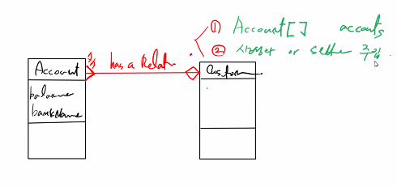
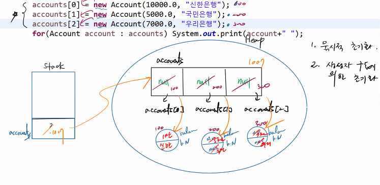
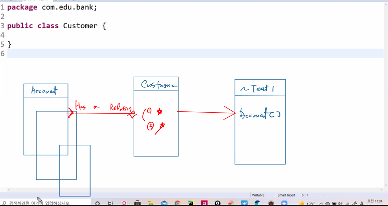
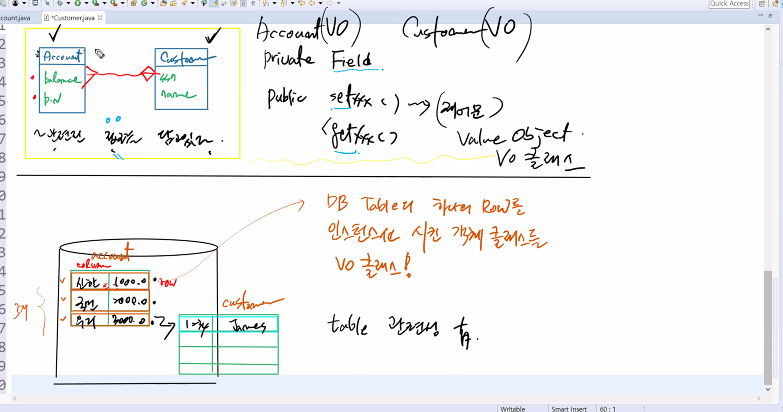
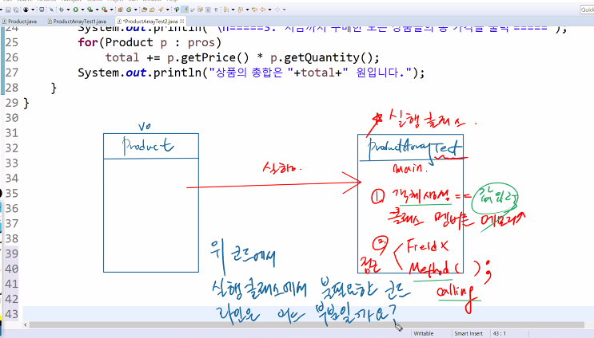
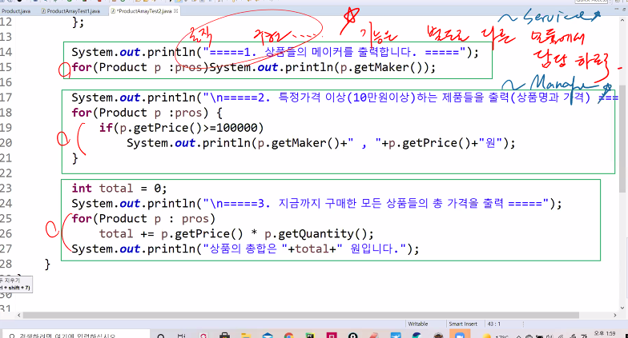
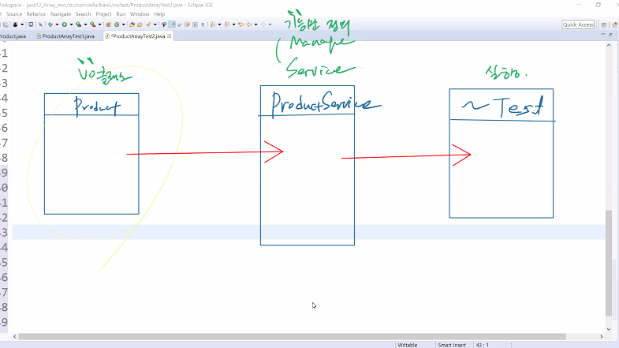
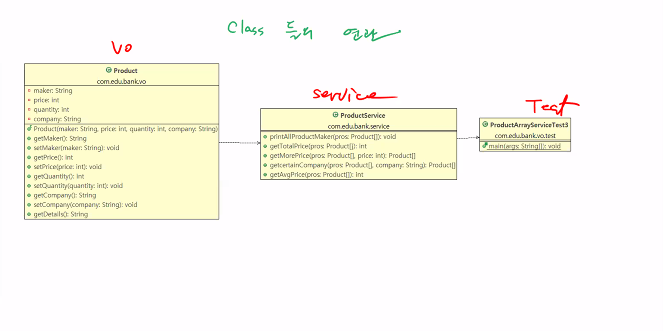

# 21.10.25. JAVA-5일차

## 배열(Array)

* 기본형
  * 알고리즘
* 클래스타입
  * oop의 정수

## 오늘의 수업 이슈

1. 클래스 데이터 타입 배열
2. Service Class
3. Inheritance

## 첫시간

1. Account 필드 선언
2. Account 필드 주입(생성자, set())

| Account                  |                         | Custom       |      | ~test                 |
| ------------------------ | ----------------------- | ------------ | ---- | --------------------- |
| balance                  | --- has a Relation ---> | F.N<br />L.N |      | Account<br />Customer |
| 저축<br />출금<br />잔액 |                         |              |      |                       |

1. Account[ ] accounts
2. 생성자 혹은 set() 주입

| Account               |                                       | Customer |
| --------------------- | ------------------------------------- | -------- |
| Balance<br />BankName | 특정한 사람이 Account를 여러개를 가짐 |          |
|                       |                                       |          |







## 중요한 부분

```java
		//3. james가 3개의 통장을 가짐.
		james.setAccounts(accounts);//Has a Relation이 이뤄짐
		
		//4. james가 가지고 있는 통장 중에서 ...신한은행 통장 하나를 받아온다.
		Account[ ] reAcc=james.getAccounts();
		Account choice = null;
		for (Account acc: reAcc) {//배열로 받고
			if(acc.getBankName().equals("신한")) choice = acc;//로컬변수 선언
				
```

## VO 클래스 설명



```java
package com.edu.bank.vo.test;

import com.edu.bank.vo.Product;

public class ProductArrayTest2 {

	public static void main(String[] args) {
		Product[ ] pros = {
				new Product("신라면", 3000, 4, "농심"),
				new Product("흥부네생수", 12000, 10, "농심"),	
				new Product("옥시크린", 23000, 1, "LG"),	
				new Product("정수기", 440000, 1, "대우")
			};
			System.out.println("=== 1. 상품들의 메이커를 출력합니다. ===");
			//
			for (Product p : pros) System.out.println(p.getMaker());
			
			System.out.println("\n=== 2. 특정 가격 이상 (10만원 이상)하는 제품들을 출력(상품명과 가격) ===");
			//
			for (Product p : pros) {
				if(p.getPrice()>=100000)
					System.out.println(p.getMaker()+", "+p.getPrice()+"원");
			}
			int total = 0;
			System.out.println("\n=== 3. 지금까지 구매한 모든 상품들의 총 가격을 출력 ===");
			//
			for (Product p : pros) {
				total += p.getPrice() * p.getQuantity();
			}
			System.out.println("상품의 총합은 "+total+"원입니다.");
	}

}

```

* 위의 코드의 문제점.







## UML을 통해 보자

클래스 들의 연관



## 반드시 해야하는 `UML`

class Diagram - objectAID Tool

* 클래스 간의 관계

usecase Diagram

