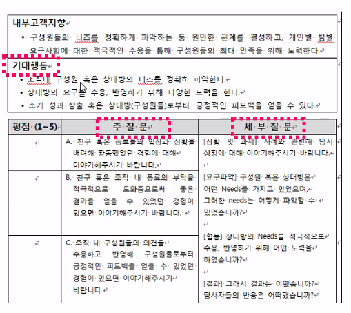
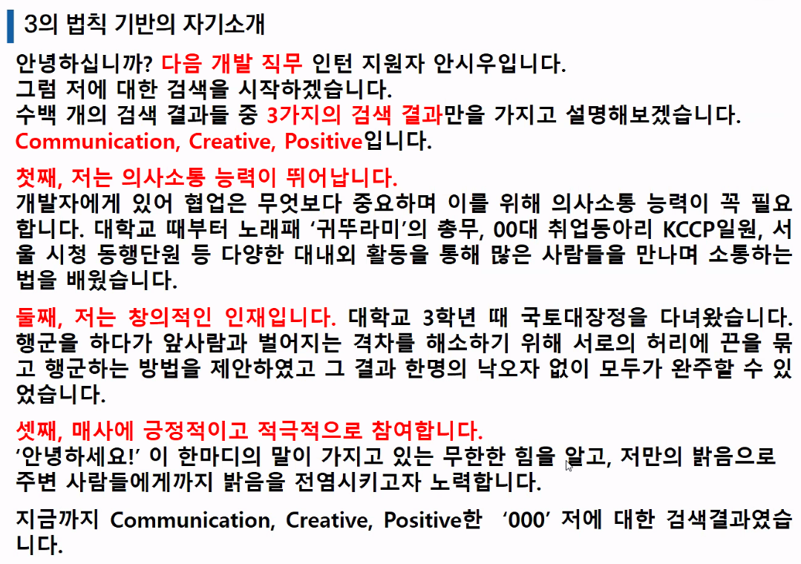

# 21.10.27. 면접 스킬 강의

> 안시우(andy) 강사님

헛소리 > 질문, 태클

재밌는 오답~!

1. 비대면 면접시 배경이 중요한가요?!

   * 원룸에 사는 남성지원자, 벽에 피씨가 있고,,,,결정적인 역할을 할 수 있음.

2. 반려동물이 집에 있는 경우, 가급적 외부에서 하게 됨.

   * 페이퍼나 주변에 환경들을 통제해서 진행되야함.

3. 면접때 사용하면 좋은 단어, 안좋은 단어

   * 긍정적이고 적극적인 단어를 사용하는 것을 권유함. 
   * 부정적인 조직관, 몸 담았던 조직에 대한 비판....하지 말기!

4. 비언어적 스킬

   * 말을 한번 끊고 가기, 
   * 아이컨택 미간 보기! - 카메라 보기
   * 앉을때 태도, 

5. 비대면 면접 시, 

   * sk는 면접키트를 줌...!지연이 없도록

   * 줌을 많이 사용함.
   * 제대로 전달이 됐는지 확인,
   * 혹시 질문 하셨나요? 제가 못들었을까요?
   * 선택권을 주는 경우가 있음. 화상면접인데 집에서 하는 경우, 회사까지 오늘 경우, - 가능하면 회사 가서 하기!!!

## 면접의 시작은? 집을 나서면서 부터

지원자의 면접장 바깥에서의 모습이 진짜 모습...!

간접 경험 : 동선에...누가 있을지 모른다. 

## 면접관들의 생각

답답한 마음...

왜 하고 있지?

1차 : **직무 적합성**(실무진 면접) - 잘할수 있는가?

* 1+1 전략 : 전공 과목을 통한 성취도 + 직무 관련 경험(프로젝트 경험)
  * `경험`이라는 암묵지를
  * 개념정의...! 기본적인 개념을 정확하게 이해하고,,,최근의 기술적인 흐름.
  * 학습능력! 열정!
  * 스타트업 자체도 오래 일할 사람을 생각하지 않음. 원하지 않음. 스톡옥션,,,2-3년 불태울 사람...!
* 다양한 경험 나열(x)
* 대표적 경험 1~2개 강조 (O)

2차 : **조직적합성**(임원 면접) - 함께할 수 있는가?

* +/- 전략 : 독종(승부근성), 인간미(협업) - 남들이 꺼려하는 것 나서서!
* 오래 일할 수 있는 인재
* 협업할 수 있는자세

일은 승부근성을 가지고 하되, 그 과정에서 신뢰, 협업을 만들어 가는 사람

## 면접 답변 정답은 없다, 하지만 오답은 있다.

* 동양그룹 사태 때, 전 재산을 잃은 할머니가 객장에 와서 난리를 피우고 있다. 당신 혼자 있다면 어떻게 하겠는가?
  * 왜 아무도 그 할머니를 위해 함께 울어줄 생각을 안했나요?

### 인재상에 따라 같은 질문이라도 정답은 달라짐

## 기업별 면접 준비

1. 질문을 외우기 보다 어떤 질문이든 그 기업이 답으로 정한 핵심 가치와 방향은 무엇인가 고민해야함.
   * 최고의 면접 준비
     * 기업 성향과 가치관 파악
     * 답변의 방향 정하기

## 업종별 면접 특징

|   업종   |                           특징                           |
| :------: | :------------------------------------------------------: |
|  제조업  |                회사 제품에 대한 높은 이해                |
| 서비스업 | 돌발상황 대처 아이템 하나 안쓰고 끝판왕을 깨는 상황 |
|  금융업  |                   논리적인 의사 전달력                   |

## 면접관 구성

| 부서   | 직급   | 인원 | 질문내용         | 역할 |
| ------ | ------ | ---- | ---------------- | ---- |
| 기술팀 | 상무급 | 3    | 전공 직무 적합도 |      |
| 인사팀 |        |      |                  | 압박 |

## 면접 프로세스

* 첫째, 여는 질문
  * 첫인사 포함 분위기를 풀기 위한 질문
  * 첫인상 좌우
  * 자신감 있는 태도와 또렷한 말투
* 둘째, 확인 질문
  * 기본 사항 확인
  * 이력서 내용 사실 관계 확인
* 셋째, 상황 질문
  * 개방형 질문
  * 살아오면서 가장 열정적으로 했던 일은?
  * 사실 + 자신의 생각
* 넷째, 심층 질문
  * 개방형 질문으로 판단이 안 설때, 추가 질문
  * 특정 상황으로 압박
  * 지원자의 속내가 드러나도록 유도

## 이력서 자기소개서 질문_확인 질문

* 인사담당자가 확인하는 내용
  * 학점이 저조한 이유 : 성실성에 대한 의문 3.5가 안되는 경우...까칠하네...!
    * 학점이 조금 기준보다는 낮지만 다양한 프로젝트로 보완하려 노력했다.
  * 공백기간 이유 및 해당 기간 동안 한일(휴학 기간 포함.)
  * 어학연수 및 교환학생 기간 대비 어학 성적
  * 건강 관련 사항
  * 군 관련 사항(남성) - 군대를 왜 미필인지?
  * 입사서류에 부모님이 이혼을 했다던지, 크게 아팠다, 큰 수술, 큰 사고, 안하는게 좋음.
* 실무담당자 혹은 임원이 확인하는 내용
  * 평가 역량 관련 개인의 경험, 경력 질문(STAR 기법으로 답변 연습)
    * 업무 수행과 관련있을 것으로 판단되는 경력 

## 자기소개

* 직무를 중심에 두고 함.
* 어디에 몸담아서 헌신을 했는지?
* `지원동기` 포함 여부 : 좋지 않음 - 이유는? 지원동기는 `자기소개`에 포함시키지 않아도 물어보게 되어 있음!!!

* 마지막으로 하고 싶은 말 - 감성에 호소하는 것이 좋음!
  * 작은것에 감동받음. 작은 이야기,,, 취업을 준비하면서 있었던 나의 작은 이야기...일상의 소소함.
  * 예시) 아침 7시에 양재역에서 버스를 타고 오전 9시 면접, 오늘 면접을 보기 위해서 새벽 5시에 일어났는데, 어머님께서 한참전에 일어나서 밥을 짓고 계셨습니다. 면접 보러가는 딸을 위해, 새벽같이 일어나셔서 밥을 지어준 어머님께 합격 소식을 전달드리고 싶습니다. 

## 역향(competency)이란?

높은 성과를 나타내는 사람들의 공통적이고 일관된 특성으로써 지식, 기술, 태도, 가치관, 사고 유형, 성격, 태도 등 다양한 요소를 가지고 있으며 행동으로 나타남.

competency = compete + competent

* 경쟁을 전제로 그중 능력을 발휘하는 힘.

## 역량 면접 질문 기법에 대한 이해 : 행동묘사 면접

* 비구조화 면접
  * 각자에게 질문이 다르기 때문에, 상호간 비교가 안됨 - 복불복
* 구조화 면접

### BEI (Behavior Event Interview)

* 과거의 행동은 미래의 행동을 타당하게 예측할 수 있다.
* 개인의 성격, 특성은 쉽게 변하지 않는다.

### past performance  -> future performance

* 팀 과제를 수행하는데, 동료들 간에 갈등이 생기면 어떻게 하시겠습니까?
  * **갈등의 해결을 위해 노력하겠다.** 이런 질문 안함
* 같은 집단 내에서 동료들 간에 갈등이 있었던 경우를 말씀해주십시오. 그 갈등해결을 위해 어떤 노력을 하셨습니까?
* 최근에 해결하기 어려운 문제에

#### 미래형으로 질문을 던지면 말빨이 좋은 사람, 과거형으로 질문을 던지면 역량이 뛰어난 사람이 뽑힌다.

## BEI시 면접관이 사용하는 3가지 질문

* 여우야여우야 뭐하니? 잠잔다.
* **상황질문** - 역량이 발휘된 사황 제시
* 밥먹는다. 무슨 반찬, 개구리 반찬
* **탐색질문**
* 살았니 죽었니?
* **추가질문**

## 탐색 질문 면접관의 질문법 : STAR 기법

* Situation : 본인이 처했던 상황에 대해 말해보세요. 행동이 발생했던 상황의 맥락
* Task : 수행했던 과제는 무엇이었나요? 행동이 발생했던 상황의 맥락
* Action : 어떻게 대응했나요? 행동에 대해 말해보세요. work smart
* Result : 결과는 어땠습니까? 성공여부와 무관하게 왜 그러한 결과가 나왔는지를 알고 있는가?

왜 너는 너의 성공의 이유에 대해서 묻는다. 얘는 숟가락 얹었구나!

수상 못한 이유가 뭐라고 생각합니까? 평가기준에 대해 정확하게 이해를 못하는 것 같습니다. 수상했던 팀들의 결과물을 보니깐 아이디어 부분도 중요하지만 현실화 부분에 대해서 더 중요하다고 생각했습니다. 

#### 학습효과!!! - 경험 정리!

김태호 PD 어떻게 면접을 잘보셨나요!? - 면접관을 옆집 아저씨라고 생각하셔라! "옆집 아저씨는 안편함"

경험정리도 STAR 기법으로!!

## 주제별 경험정리

 

| 주제                                                         | 체크사항 |      |
| ------------------------------------------------------------ | -------- | ---- |
| 1. 대인관계 또는 팀워크를 개선했던 경험                      |          |      |
| 2. 기존에 없던 것을 새롭게 만들었던 경험                     |          |      |
| 3. 기존에 있던 것을 수정 보완 발전 개선 시켰던 경험          |          |      |
| 4. 생산성을 향상시킨 경험(수치화)                            |          |      |
| 5. 뚜렷한 목표 설정 후 강하게 추진한 경험(성공/실패 사례 각각 정리) |          |      |
| 새로운 환경에 적응(도전)했던 경험                            |          |      |
| 타인 설득 또는 이끌었던 경험                                 |          |      |
| 자신의 직무를 선택하게 된 경험                               |          |      |
| 성격 장단점                                                  |          |      |
| 지원 직무와 관련된 경험                                      |          |      |

## 기존 면접과 차이점

* 자기소개 및 자신만의 장점은?
* 주량은 얼마나 되는지?
* 가장 감명깊게 읽은 책은?
* 인상깊었던 배낭 여행지는?
* 고민이 있을때는 누구와 상의하는가?
* 결혼해서 일하는 것을 남편이 반대한다면?
* 좋아하는 친구와 싫어하는 친구의 유형

네트워크에서 프로세스간 통신은 어떻게 될까요?

그럼 특정 프로세스에서 다른 웹서버의 프로세스로 통신할때 어떤 방식으로 이루어지나요?

해당과정에서 문제점은 없나요?

문제점이 있다면 어떻게 해결해야할까요?

## 자기소개서/포트폴리오 프로젝트 분석

프로젝트를 가능하면 3개 정도,,,!

프로젝트 선정 기준 : 완성도, 평가기준(관련 자격, 기술)

프로젝트별 테크스펙 정리

* 테크스펙 : 프로젝트에서 사용했던 기술, 라이브러리, 프레임워크, 개발 툴

### 왜 해당기술을 사용했나요?

### 해당기술의 동작원리는?

### 자신이 선택한 `기술 라이브러리`에 대한 장단점과 선택 이유를 프로젝트별로 정리

## 프로젝트 추가 정리 사항

트러블 슈팅

어려웠던 점

기억에 남는 점 : 이 지원자의 스트레스 내성, 어느정도 수준까지 견딜 수 있는지?

이 프로젝트에서 가장 어려웠던 점은?

가장 성과가 있었던 점은?

## 직무 지식

지원 직무에서 가장 중요시 되는 테크스펙/기술

현재 트렌드

자주 마주치는 이슈

백엔드 현업에서 트래픽에 대비하기 위한 어떤 대비책이 있는가?

어떤 구조 패턴이나 기술들이 유행인지?

왜 그런 기술들로 대체되어 가는지?

#### 근무 상황을 제시하고 어떻게 해결해 나갈지 확인

#### 정말 이 일을 하고자 하는지 확인!! - 최근에 어떤 흐름, 어떤 시사점

#### 직무 관심도 및 역량 확인

## 1분 스피치 : 자기 소개

내가 면접에서 쓸 수 있는 시간은 몇분이나 될까?

### 5분 미만 그중 1분을 자기소개! 전략적으로 잘 써야 함.

외운 것 말고 해보세요. - 일부러 떠듬떠듬..

면접은 커뮤니케이션이다. 외운 답변 지양 말을 따라서,,,

외운티가 안나야함. 즉석에서 자기소개 한다는 느낌을 줌.

눈이 우측 위로, 음 어, 어눌함을 연출해야 한다. 

외운거 말고, 자기소개를 30초만,,,! 빠른 말로, 버릴건 버려야...

### 3의 법칙

인간의 인지능력은 통상저그로 `세 가지`를 기억

1. 말할 주제와 범위, 순서

2. 첫째 주장과 근거, 예시

   둘째 주장과 근거, 예시

   셋째 주장과 근거, 예시

3. 말한 내용의 요약,

   결론 또는 맺는 말

3의 법칙은 안정적이나 식상하다.

제 역량을 3가지로 말씀드리겠습니다.

테마를 활용한 구조화로 차별화한다.

저는 끈끈한 사람입니다.

선태과 집중을 활용한다.
