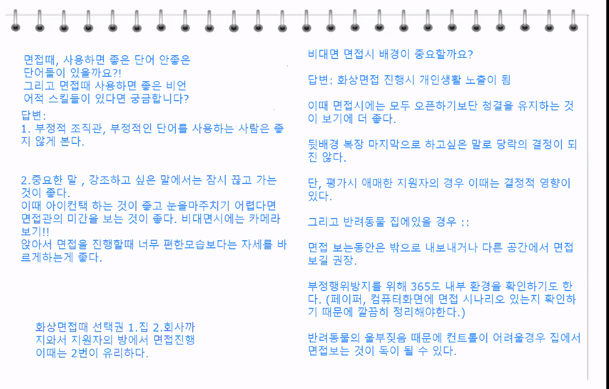

# 21.10.27. 면접 스킬 강의

> 안시우(andy) 강사님

헛소리 > 질문, 태클

재밌는 오답~!

1. 비대면 면접시 배경이 중요한가요?!

   * 원룸에 사는 남성지원자, 벽에 피씨가 있고,,,,결정적인 역할을 할 수 있음.

2. 반려동물이 집에 있는 경우, 가급적 외부에서 하게 됨.

   * 페이퍼나 주변에 환경들을 통제해서 진행되야함.

3. 면접때 사용하면 좋은 단어, 안좋은 단어

   * 긍정적이고 적극적인 단어를 사용하는 것을 권유함. 
   * 부정적인 조직관, 몸 담았던 조직에 대한 비판....하지 말기!

4. 비언어적 스킬

   * 말을 한번 끊고 가기, 
   * 아이컨택 미간 보기! - 카메라 보기
   * 앉을때 태도, 

5. 비대면 면접 시, 

   * sk는 면접키트를 줌...!지연이 없도록

   * 줌을 많이 사용함.
   * 제대로 전달이 됐는지 확인,
   * 혹시 질문 하셨나요? 제가 못들었을까요?
   * 선택권을 주는 경우가 있음. 화상면접인데 집에서 하는 경우, 회사까지 오늘 경우, - 가능하면 회사 가서 하기!!!

## 면접의 시작은? 집을 나서면서 부터

지원자의 면접장 바깥에서의 모습이 진짜 모습...!

간접 경험 : 동선에...누가 있을지 모른다. 

## 면접관들의 생각

답답한 마음...

왜 하고 있지?

1차 : **직무 적합성**(실무진 면접) - 잘할수 있는가?

* 1+1 전략 : 전공 과목을 통한 성취도 + 직무 관련 경험(프로젝트 경험)
  * `경험`이라는 암묵지를
  * 개념정의...! 기본적인 개념을 정확하게 이해하고,,,최근의 기술적인 흐름.
  * 학습능력! 열정!
  * 스타트업 자체도 오래 일할 사람을 생각하지 않음. 원하지 않음. 스톡옥션,,,2-3년 불태울 사람...!
* 다양한 경험 나열(x)
* 대표적 경험 1~2개 강조 (O)

2차 : **조직적합성**(임원 면접) - 함께할 수 있는가?

* +/- 전략 : 독종(승부근성), 인간미(협업) - 남들이 꺼려하는 것 나서서!
* 오래 일할 수 있는 인재
* 협업할 수 있는자세

일은 승부근성을 가지고 하되, 그 과정에서 신뢰, 협업을 만들어 가는 사람

## 면접 답변 정답은 없다, 하지만 오답은 있다.

* 동양그룹 사태 때, 전 재산을 잃은 할머니가 객장에 와서 난리를 피우고 있다. 당신 혼자 있다면 어떻게 하겠는가?
  * 왜 아무도 그 할머니를 위해 함께 울어줄 생각을 안했나요?

### 인재상에 따라 같은 질문이라도 정답은 달라짐

## 기업별 면접 준비

1. 질문을 외우기 보다 어떤 질문이든 그 기업이 답으로 정한 핵심 가치와 방향은 무엇인가 고민해야함.
   * 최고의 면접 준비
     * 기업 성향과 가치관 파악
     * 답변의 방향 정하기

## 업종별 면접 특징

|   업종   |                           특징                           |
| :------: | :------------------------------------------------------: |
|  제조업  |                회사 제품에 대한 높은 이해                |
| 서비스업 | 돌발상황 대처 아이템 하나 안쓰고 끝판왕을 깨는 상황 |
|  금융업  |                   논리적인 의사 전달력                   |

## 면접관 구성

| 부서   | 직급   | 인원 | 질문내용         | 역할 |
| ------ | ------ | ---- | ---------------- | ---- |
| 기술팀 | 상무급 | 3    | 전공 직무 적합도 |      |
| 인사팀 |        |      |                  | 압박 |

## 면접 프로세스

* 첫째, 여는 질문
  * 첫인사 포함 분위기를 풀기 위한 질문
  * 첫인상 좌우
  * 자신감 있는 태도와 또렷한 말투
* 둘째, 확인 질문
  * 기본 사항 확인
  * 이력서 내용 사실 관계 확인
* 셋째, 상황 질문
  * 개방형 질문
  * 살아오면서 가장 열정적으로 했던 일은?
  * 사실 + 자신의 생각
* 넷째, 심층 질문
  * 개방형 질문으로 판단이 안 설때, 추가 질문
  * 특정 상황으로 압박
  * 지원자의 속내가 드러나도록 유도

## 이력서 자기소개서 질문_확인 질문

* 인사담당자가 확인하는 내용
  * 학점이 저조한 이유 : 성실성에 대한 의문 3.5가 안되는 경우...까칠하네...!
    * 학점이 조금 기준보다는 낮지만 다양한 프로젝트로 보완하려 노력했다.
  * 공백기간 이유 및 해당 기간 동안 한일(휴학 기간 포함.)
  * 어학연수 및 교환학생 기간 대비 어학 성적
  * 건강 관련 사항
  * 군 관련 사항(남성) - 군대를 왜 미필인지?
  * 입사서류에 부모님이 이혼을 했다던지, 크게 아팠다, 큰 수술, 큰 사고, 안하는게 좋음.
* 실무담당자 혹은 임원이 확인하는 내용
  * 평가 역량 관련 개인의 경험, 경력 질문(STAR 기법으로 답변 연습)
    * 업무 수행과 관련있을 것으로 판단되는 경력 

## 자기소개

* 직무를 중심에 두고 함.
* 어디에 몸담아서 헌신을 했는지?
* `지원동기` 포함 여부 : 좋지 않음 - 이유는? 지원동기는 `자기소개`에 포함시키지 않아도 물어보게 되어 있음!!!

* 마지막으로 하고 싶은 말 - 감성에 호소하는 것이 좋음!
  * 작은것에 감동받음. 작은 이야기,,, 취업을 준비하면서 있었던 나의 작은 이야기...일상의 소소함.
  * 예시) 아침 7시에 양재역에서 버스를 타고 오전 9시 면접, 오늘 면접을 보기 위해서 새벽 5시에 일어났는데, 어머님께서 한참전에 일어나서 밥을 짓고 계셨습니다. 면접 보러가는 딸을 위해, 새벽같이 일어나셔서 밥을 지어준 어머님께 합격 소식을 전달드리고 싶습니다. 
