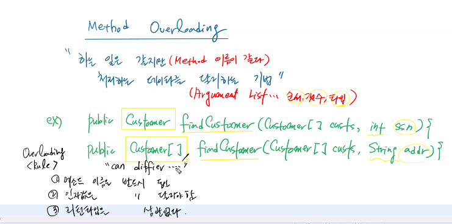
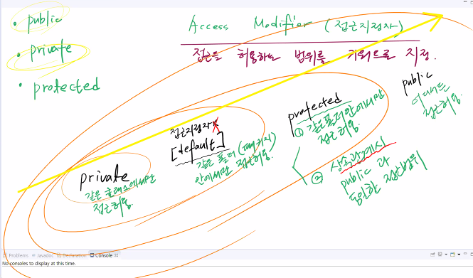
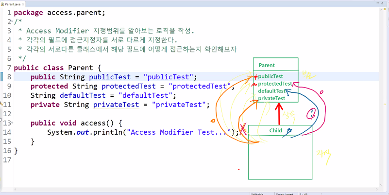
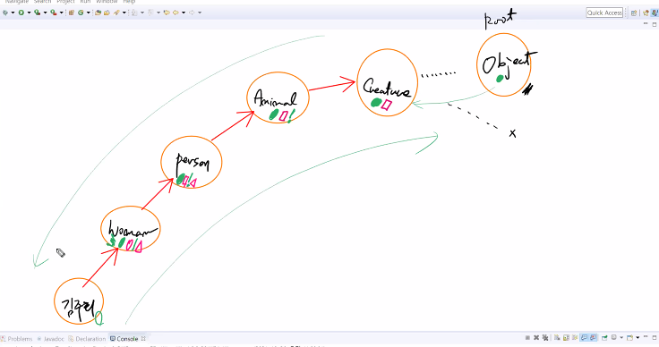
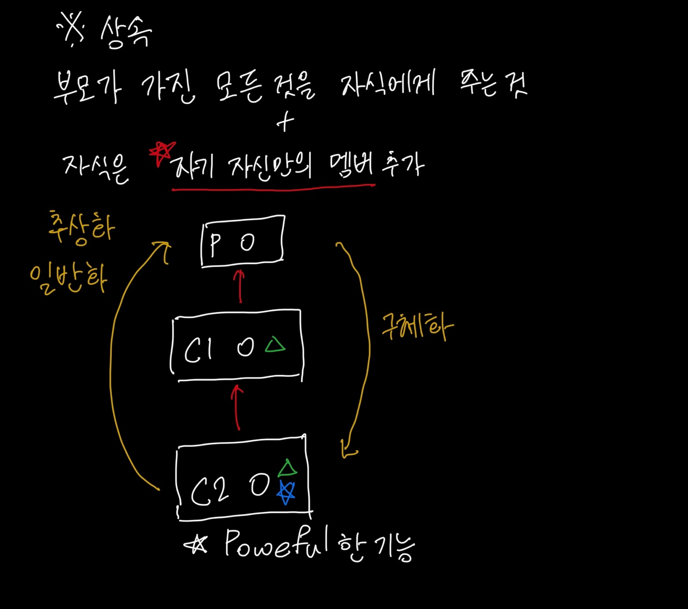
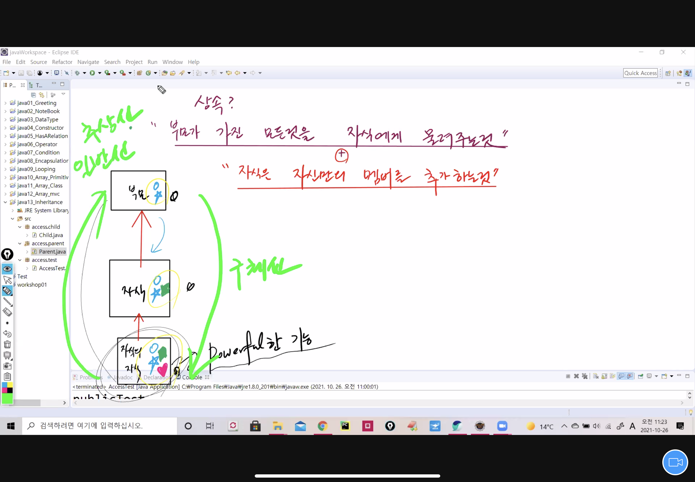
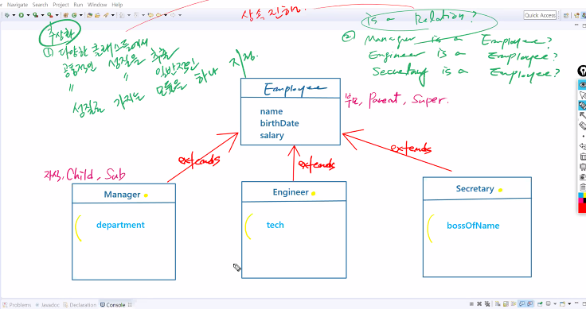
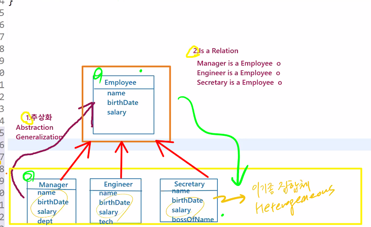
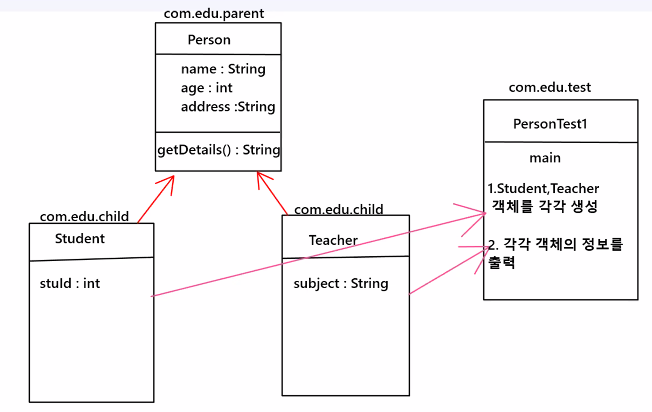
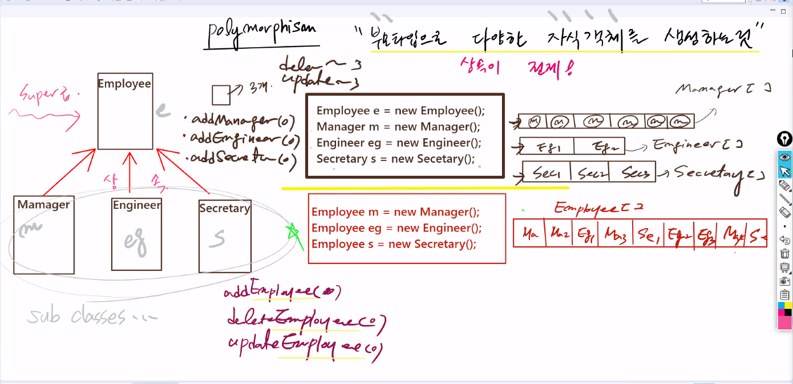

# 21.10.26. JAVA-6일차

## 오늘의 이슈

1. Method Overlaoding
2. Constructor Overloading
3. Inheritance
4. Polymotphism

## Method Overloading

[관련 문서](./miracom_edu/javaWorkspace/java12_Array_mvc/src/com/edu/bank/service/CustomerService.java)

#### : 하는 일은 같지만 처리하는 데이터를 달리하는 기법!!

* 하는 일이 같다는 것 : Method이름이 같다.
* 처리하는 데이터를 달리하는 것 : Argument List, 순서, 갯수, 타입 등등 을 달리함.
* 예시
  * 같아도 달라도 됨.

```java
	public Customer findCustomer(Customer[ ] custs, int ssn) {
		Customer customer=  null;
		for(Customer c : custs) {
			if(c.getSsn()==ssn) customer = c;
		}
		return customer;
	}	

	public Customer[ ] findAddressCustomer(Customer[ ] custs, String address) {
		Customer[ ] temp = new Customer[custs.length];
		int cnt = 0;
		for(Customer c : custs) {
			if(c.getAddress().equals(address)) temp[cnt++] = c;
		}
		return temp;
	}

```

### Over Loading 규칙

1. method 이름은 반드시 동일해야함.
2. argument list(인자값)은 반드시 달라야함.
3. return타입은 상관없다.



## Inheritance

[상속관계]()

Access Modifier (접근 지정자)

: 접근을 허용하는 범위를 키워드로 지정

* public
* private
* protected

| Private                     | [default]<br />접근 지정자가 아님. | protected                                                    | public             |
| --------------------------- | ---------------------------------- | ------------------------------------------------------------ | ------------------ |
| 같은클래스에 대한 접근 허용 | 같은 폴더(패키지)안에서만 접근허용 | 1. 같은 폴더 안에서만 접근 허용<br />2. 상속관계시 public과 동일한 접근 범위 | 어디서든 접근 허용 |



* 부모 클래스
```java
package access.parent;
/*
 * Access Modifier 지정 범위를 알아보는 로직을 작성.
 * 각각의 필드에 접근 지정자를 서로 다르게 지정한다.
 * 각각의 서로 다른 클래스에서 해당 필드에 어떻게 접근하는지 확인해보자
 */
public class Parent {
	public String publicTest = "publicTest";
	protected String protectedTest = "protectedTest";
	String dafaultTest = "dafaultTest";
	private String privateTest = "privateTest";
	
	public void access() {
		System.out.println("Acess Modifier Test...");
		
	}
}

```

| parent                                                       |
| ------------------------------------------------------------ |
| publicTest<br />protectedTest<br />defaultTest<br />privateTest |

* 자식 클래스            ↑(상속)

```java
package access.child;

import access.parent.Parent;

/*
 * Parent의 자식 클래스...
 */
public class Child extends Parent{
	@Override
	public void access() {
		System.out.println(publicTest);		//접근허용
		System.out.println(protectedTest);	//접근허용
		//System.out.println(defaultTest);	//접근불가
		//System.out.println(privateTest);	//접근불가
		
		System.out.println("상속관계시 public, protected 지정자만 접근 가능!!");
		
	}
}

```


| Child |
| ----- |
|       |



```java
package access.test;

import access.child.Child;

public class AccessTest {

	public static void main(String[] args) {
		//1. 자식이 생성되면 부모를 만들어줘야한다.(부모가 생성되지 않으면 자식이 생성되지 않는다.) O
		//2. 자식이 생성되면 부모를 만들어주지 않아도 된다. X
		// 부모생성이 먼저 전데로 진행된다...
		Child c = new Child();
	
		c.access();
	}
}
```

### 상속

: 부모가 가진 모든 것을 자식에게 물려주는 것!

### S/W 세계에서의 상속

1. 부모가 가진 모든 것을 자식에게 물려주고

2. 자식은 자신만의 멤버를 추가해야 한다.

자식으로 갈수도록 method가 더 powerful 해짐.


상속에서의 키포인트 : 

부모로 갈수록 - 추상성, 일반성

자식으로 갈수록 - 구체성


java에서 모든 근원(부모)의 class는 `object`




상속을 하던 안하던 무조건... object의 자식

[object class](https://docs.oracle.com/javase/8/docs/api/)

| `boolean` | `equals(Object obj)`Indicates whether some other object is "equal to" this one.<br />boolean을 통해 같은지 다른지 확인하는 것! |
| --------- | ------------------------------------------------------------ |
| `String`  | `toString()`Returns a string representation of the object.<br />두가지... 무조건!!! |





|            Employee             |
| :-----------------------------: |
| name<br />birthDate<br />salary |

​						↑																↑															↑

|                        Manager                        |      |                    Engineer                     |      |                       Secretary                       |
| :---------------------------------------------------: | ---- | :---------------------------------------------: | ---- | :---------------------------------------------------: |
| ◈ name<br />◈ birthDate<br />◈ salary<br />department |      | ◈ name<br />◈ birthDate<br />◈ salary<br />tech |      | ◈ name<br />◈ birthDate<br />◈ salary<br />bossOfName |

* 지금은 unrelated
* 추상화
  * 다양한 클래스들에서 공통적인 성질을 추출
  * 공통적인 성질을 일반적인 성질을 가지는 모듈을 하나 지정함.
  * is a relation?
    * manager is a Employee?
    * Engineer is a Employee?
    * Secretary is a Employee?

|            Employee             |
| :-----------------------------: |
| name<br />birthDate<br />salary |

​						↑																↑															↑

|                        Manager                        |      |                    Engineer                     |      |                       Secretary                       |
| :---------------------------------------------------: | ---- | :---------------------------------------------: | ---- | :---------------------------------------------------: |
| ◈ name<br />◈ birthDate<br />◈ salary<br />department |      | ◈ name<br />◈ birthDate<br />◈ salary<br />tech |      | ◈ name<br />◈ birthDate<br />◈ salary<br />bossOfName |




생성자는 객체 생성 시 마다 생성.

Manager m = new Manager() {  }

자식이 생성될때, 무조건 에러가 도출됨. → 자식이 생성될때, 부모 생성이 먼저 진행.

자식에서 부모에게 접근함.

자식이 생성될때 무조건 부모가 먼저 메모리에 올라감.


* 상속은 `재사용성`도 좋은데, `결합력`도 엄청 강함.

## Method Overiding

[method overiding](./miracom_edu/javaWorkspace/java13_Inheritance/src/com/edu/child/Manager.java)

부모와 자식의 선언부는 일치함. 하지만 구현부는 불일치함. : Overiding

1. 부모가 가진 method를 그대로 물려받는다.
2. 그걸 고친다. 

* Rule
* 1. 메소드 선언부는 모두 일치 - 이름, 인자값, 리턴타입.
  2. 메소드 구현부는 달라야한다. - 기능이 달라진다.
  3. 서로 다른 상속관계의 클래스에서 발생한다.

## 점심 과제

|                  Manager                  |      |                 Engineer                  |      |                    Scretary                     |
| :---------------------------------------: | ---- | :---------------------------------------: | ---- | :---------------------------------------------: |
| name<br />birthDate<br />salary<br />dept |      | name<br />birthDate<br />salary<br />tech |      | name<br />birthDate<br />salary<br />bossOfName |

* 위처럼 아무런 관계가 없는 class `이기종 집합체` : `Heterogeneous`

* **step 1.**공통적인 것을 묶어서 하나의 클래스로 묶음 : `추상화`(`Abstraction`, `Generalization`)

|            Employee             |
| :-----------------------------: |
| name<br />brithDate<br />salary |

* **step 2.** Is a Relation?
  * Manager is a Employee O
  * Engineer is a Employee O
  * Scretary is a Employee O

​						↑																↑															↑


|                  Manager                  |      |                 Engineer                  |      |                    Scretary                     |
| :---------------------------------------: | ---- | :---------------------------------------: | ---- | :---------------------------------------------: |
| name<br />birthDate<br />salary<br />dept |      | name<br />birthDate<br />salary<br />tech |      | name<br />birthDate<br />salary<br />bossOfName |

* `구체화` 과정이 우리가 더 많이 할 과정 



## 실습

> 다음은 실습 `UML`



내일은 하루 쉼 -> 내일은 면접 예정

## toString()

주소값을 물려받음.

[method overiding](./miracom_edu/javaWorkspace/java14_Inheritance/src/com/edu/parent/Person.java)

### Method Overriding의 대표적인 사례

|        | toString()                              | equals()                                                     |
| ------ | --------------------------------------- | ------------------------------------------------------------ |
| Object | 객체가 저장된 위치 값을 String으로 반환 | 객체의 주소값을 비교함으로써 이 객체가 저 객체와 같은지 다른지를 boolean으로 반환 |
| String | 객체의 문자열을 반환                    | 문자열 비교<br />같은면 true / 다르면 false를 반환           |

## 생성자 오버로딩Constructor Overloading

생성자 이름은 같아야하지만 argument list는 달라야함.

## 상수를 기본값으로 지정함.


## Polymotphism : 다형성

> 부모타입으로 다양한 자식객체를 생성하는 것!

##### 상속이 전제 되어야 함.

|          Employee `e`           |
| :-----------------------------: |
| name<br />brithDate<br />salary |

​						↑																↑															↑


|                Manager `m`                |      |               Engineer `eg`               |      |                  Scretary `s`                   |
| :---------------------------------------: | ---- | :---------------------------------------: | ---- | :---------------------------------------------: |
| name<br />birthDate<br />salary<br />dept |      | name<br />birthDate<br />salary<br />tech |      | name<br />birthDate<br />salary<br />bossOfName |

* Employee e = new Employee();
* Manager m = new Manager();
* Engineer eg = new Engineer();
* Secretary e = new Secretary();
* 이렇듯 자기 타입으로 만들게 되면,,, 6명의 매니저를 넣는다. 매니저 타입에 6명을 넣어아 함.
* 엔지니어를 두명 담는다. 엔지니어 객체가 2개 엔지니어 타입에 2명을 넣어야 함.
* 비서도 세명을 담는다. 비서 객체가 비서 타입 배열에 3명이 담긴다. 
* VO갯수만큼 나옴. addManager() addEngineer(), addSecretary() - 3배씩 나옴....
* 코드가 어마어마하게 길어짐...수정의 양도 증가!

부모타입으로 자식이 만들어짐...

polymorphism으로 객체 생성하기!

* Employee m = new Manager();
* Employee eg = new Engineer();
* Employee s = new Secretary();
* 이기종 간의 배열이 Employee[ ] 타입의 배열로 만들어짐.
* addEmployee() 이거 하나로 끝남!
* deleteEmployee()
* updateEmployee()
* 전부다 employee로 끝남

#### `상속`과 `다형성`이 있어야 가능함.

sub classes...이기종간의 핸들링(management)하기 위해서는...!

한단계 위 Super()급!!!!!!



## 다음 수업 부턴 Lv.3

