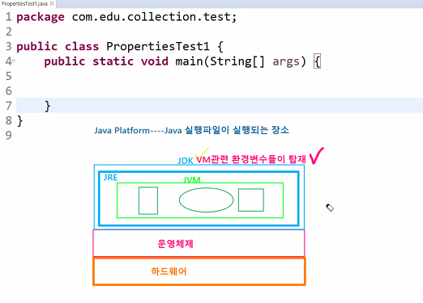
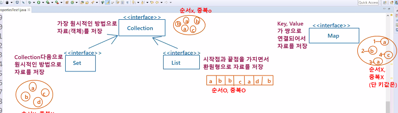
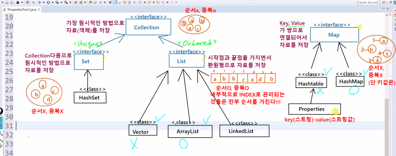
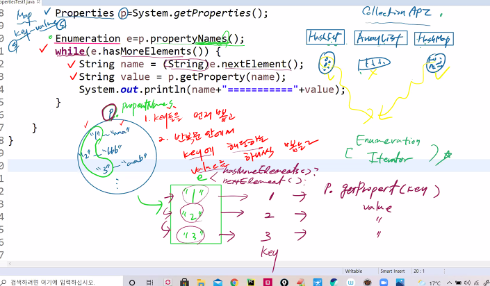
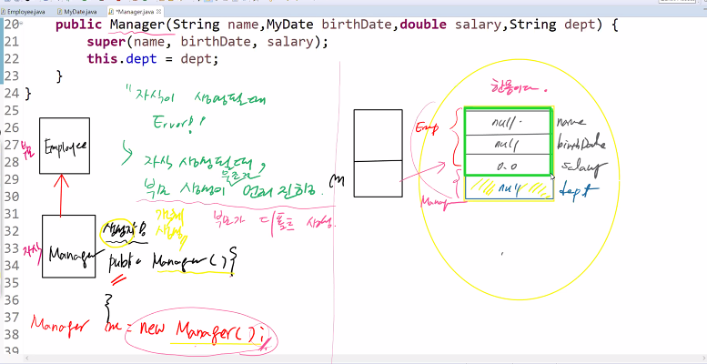
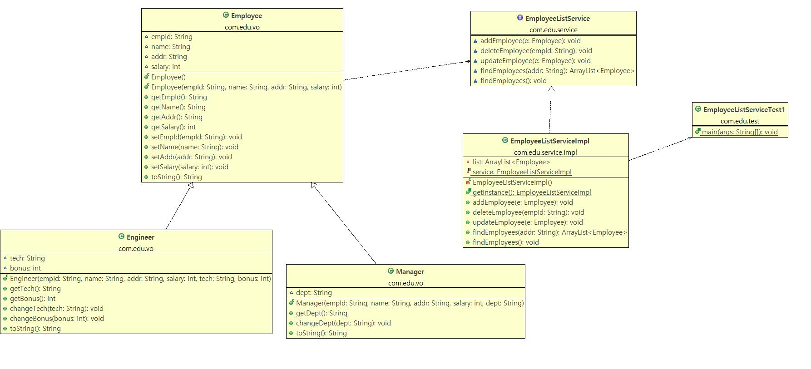
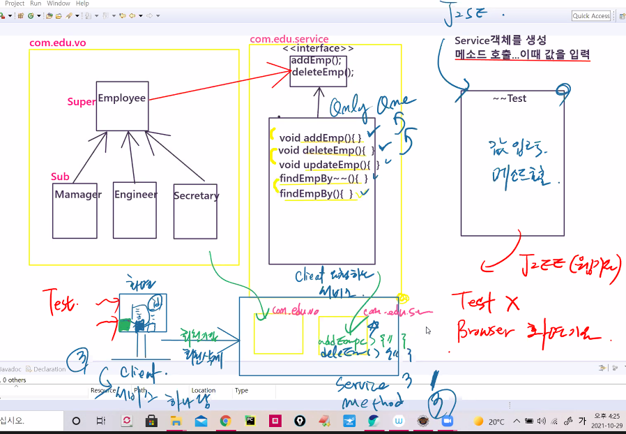

# 21.10.29. JAVA-8일차

## 업계 현황

1. 최근 AI와 머신러닝의 급부상으로 개발자 수요가 많아짐
2. 연봉이 많이 오름.
3. 

## 1029 이슈

1. Collection API
2. Exception

## Java Platform

> java 실핼파일이 실행되는 장소

|                      < Java Platform >                       |
| :----------------------------------------------------------: |
| `JDK` : vm 관련 환경변수들이 탑재가 됨.<br />[`JRE`<br />[`JVM`<br />[`스택(Stack)`, `힙(Heap)`, `클래스영역(Class area)`]]] |
|                           운영체제                           |
|                           하드웨어                           |



```java
package com.edu.collection.test;

import java.util.Enumeration;
import java.util.Properties;

public class PropertiesTest1 {
	public static void main(String[] args) {
		//ies는 다 가져옴. 인자 값이 들어있는 것은 나가리
		Properties p = System.getProperties();
		
		Enumeration e = p.propertyNames();
		while(e.hasMoreElements()) {
			String name = (String)e.nextElement();
			String value = p.getProperty(name);
			System.out.println(name+"=========="+value);
		}//while
	}//main
}//class

```

* System.getProperties();
  * 여러 개의 객체가 이미 만들어져 있고, 그것을 가지고 온다는 의미
* = System.getProperties();
  * `=` : 어딘가에 담아야한다는 의미
* Properties p = System.getProperties();
  * `Properties p` 에 할당(담아야 함.)
* 어디에서 생겼는지 모르면 어떻게 뽑아낼지 모름.
  * 데이터들을 어떤 특징으로 담았는지 모른다는 이야기 --> 데이터를 어떻게 뽑아내야 할지 알 수 없음.
* 부모를 찾아라!!

### 객체를 받는 특징

순서가 있음. |	|	|	|	|	|	|	|	|	|

중복이 없음. : 파이썬 튜플 = 자바에서는 set

짝을 이룸. pairing

### collection API

: 여러개의 객체들을 담아내는 인터페이스들의 특징

* 가장 큰 특징은 `Interface`

|                       << Interface >>                        |
| :----------------------------------------------------------: |
| `Collection` : 가장 원시적인 방법으로 객체를 저장하는 특징 - 순서 X / 중복 O |

​										↑- **unique**																			↑ **ordered**(순서가 있는)

|                       << Interface >>                        |      |                       << Interface >>                        |
| :----------------------------------------------------------: | ---- | :----------------------------------------------------------: |
| `Set` : <br />`Collection`다음으로 원시적인 저장법을 가짐.<br />순서 X / 중복 O |      | `List` : <br />시작점과 끝점을 가지면서 환 원형으로 자료를 저장.<br />순서 O 중복 O |


#### 저장 방식이 다름.

|                       << Interface >>                        |
| :----------------------------------------------------------: |
| `Map` :<br />Key, Value가 쌍(pair)으로 연결되어서 자료를 저장<br />순서 X/ 중복 X (단, value는 중복 O) |



* List

| 0    | 1    | 2    | 3    | 4    | 5    | 6    | 7    | ...  | n    |
| ---- | ---- | ---- | ---- | ---- | ---- | ---- | ---- | ---- | ---- |
| a    | b    | c    | d    | e    | f    | g    |      |      |      |

내부적으로 인덱스를 관리 되는 것들은 전부 순서를 가진다!!!

|                       << Interface >>                        |
| :----------------------------------------------------------: |
| `Collection` : 가장 원시적인 방법으로 객체를 저장하는 특징 - 순서 X / 중복 O |

​										↑- **unique**																			↑ **ordered**(순서가 있는)

|                       << Interface >>                        |      |                       << Interface >>                        |
| :----------------------------------------------------------: | ---- | :----------------------------------------------------------: |
| `Set` : <br />`Collection`다음으로 원시적인 저장법을 가짐.<br />순서 X / 중복 O |      | `List` : <br />시작점과 끝점을 가지면서 환 원형으로 자료를 저장.<br />순서 O 중복 O |

​					↑																		↑								↑ 								↑

| <<class>> |      | <<class>> |      | <<class>> |      | <<class>>  |
| :-------: | ---- | :-------: | ---- | :-------: | ---- | :--------: |
|  HashSet  |      |  Vector   |      | ArrayList |      | LinkedList |

#### 

|                       << Interface >>                        |
| :----------------------------------------------------------: |
| `Map` :<br />Key, Value가 쌍(pair)으로 연결되어서 자료를 저장<br />순서 X/ 중복 X (단, value는 중복 O) |

| <<class>> |      | <<class>> |
| :-------: | ---- | :-------: |
| HashTable |      |  HashMap  |

​										↑

|        Properties         |      |      |      |      |
| :-----------------------: | ---- | ---- | ---- | ---- |
| key(String)-value(String) |      |      |      |      |



## 동기화 이슈

하나의 쓰레드가 작업을 하는 동안에는 다른 쓰레드가 작업을 못하도록 lock을 걸어둠.

동시 접근 하는 문제를 막음.

A 계좌 

|      |      |      |      |      |
| :--: | ---- | :--: | ---- | :--: |
| $100 |      | $100 |      | $100 |

​																																							↓ 출금 O

B 계좌																																				Locking

​																																							↓  입금 X

|      |
| :--: |
| $100 |

Lock - synchronized


### vector는 Lock이 걸림

| A    | B    | C    | D    | E    | F    |      |      |
| ---- | ---- | ---- | ---- | ---- | ---- | ---- | ---- |

지금은 잘 쓰지 않음. 데이터 입출력 정확도는 굉장히 높지만,,,

엄청난 lock때문에,, 무거움. 성능에 직결되고 성능이 저하됨. 속도가 느려짐.

ArrayList - 99%

|        Vector        |                          ArrayList                           |
| :------------------: | :----------------------------------------------------------: |
| 무거워서 성능이 낮음 | 속도빠르다.<br />데이터 안정성<br />직접 동기화 처리를 걸어야함. |

Vector와 ArrayList


## LinkedList

|  A   |  →   |  B   |  →   |  C   |  →   |  D   |  →   |
| :--: | :--: | :--: | :--: | :--: | :--: | :--: | :--: |


|  A   |  →   |  B   |  →   | C 삭제 |  →   |  D   |  →   |
| :--: | :--: | :--: | :--: | :----: | :--: | :--: | :--: |

* 비 순차적인 데이터의 삭제 추가에 용이함.


vector - arrayList

HashTable - HashMap

요즘엔 HashMap, ArrayList만 사용

## 코드 분석

```java
//부모가 Map
Properties p = System.getProperties();
		
Enumeration e = p.propertyNames();
while(e.hasMoreElements()) {
    String name = (String)e.nextElement();
    String value = p.getProperty(name);
```

collection API : `HashSet`, `ArrayList`, `HashMap`  - 데이터를 저장하는 방식

데이터를 추출할때, `Enumeration`, `Iterator`

#### ① `key`들을 먼저 뽑고, ② 반복문 안에서 `key`에 해당하는 `value`를 하나씩 뽑으면 됨.

* hasMoreElements()? 있니?
* nextElement() 뽑아내기!
* 이때, String으로 설정! object거등요.
*  p.getProperty(name);
  * value 추출



* SM : 구체적인 개발업무에 투입 되지 않음. / 큰 조직체계
  * 대기업
  * AWS
* SI - 외주 충당 / 바로 프로그래밍!!
  * solution : 
  * 스타트업 : 돈을 굉장히 많이 줌. 

전문강에게 물어봄. 신뢰하지 말라...!

현업 `멘토`가 붙음. 

절대로 사람이 할일이 아니다. SI는 절대로 가지 말라!

대기업 ? 멋진 친구...! 회사 옮겨서 옮겨서...

조금더 좋은 조건, 뛰어난 능력이 있는 사람들 - 

## Set

| Modifier and Type        | Method and Description                                       |
| :----------------------- | :----------------------------------------------------------- |
| `boolean`                | `add(E e)`Adds the specified element to this set if it is not already present (optional operation). |
| `boolean`                | `addAll(Collection<? extends E> c)`Adds all of the elements in the specified collection to this set if they're not already present (optional operation). |
| `void`                   | `clear()`Removes all of the elements from this set (optional operation). |
| `boolean`                | `contains(Object o)`Returns `true` if this set contains the specified element. |
| `boolean`                | `containsAll(Collection<?> c)`Returns `true` if this set contains all of the elements of the specified collection. |
| `boolean`                | `equals(Object o)`Compares the specified object with this set for equality. |
| `int`                    | `hashCode()`Returns the hash code value for this set.        |
| `boolean`                | `isEmpty()`Returns `true` if this set contains no elements.  |
| `Iterator<E>`            | `iterator()`Returns an iterator over the elements in this set. |
| `boolean`                | `remove(Object o)`Removes the specified element from this set if it is present (optional operation). |
| `boolean`                | `removeAll(Collection<?> c)`Removes from this set all of its elements that are contained in the specified collection (optional operation). |
| `boolean`                | `retainAll(Collection<?> c)`Retains only the elements in this set that are contained in the specified collection (optional operation). |
| `int`                    | `size()`Returns the number of elements in this set (its cardinality). |
| `default Spliterator<E>` | `spliterator()`Creates a `Spliterator` over the elements in this set. |
| `Object[]`               | `toArray()`Returns an array containing all of the elements in this set. |
| `<T> T[]`                | `toArray(T[] a)`Returns an array containing all of the elements in this set; the runtime type of the returned array is that of the specified array. |

## List

| Modifier and Type        | Method and Description                                       |
| :----------------------- | :----------------------------------------------------------- |
| `boolean`                | `add(E e)`<br />Appends the specified element to the end of this list (optional operation).<br /> 맨 마지막에 추가 |
| `void`                   | `add(int index, E element)`<br />Inserts the specified element at the specified position in this list (optional operation).<br />여기에 추가 |
| `boolean`                | `addAll(Collection<? extends E> c)`<br />Appends all of the elements in the specified collection to the end of this list, in the order that they are returned by the specified collection's iterator (optional operation). |
| `boolean`                | `addAll(int index, Collection<? extends E> c)`<br />Inserts all of the elements in the specified collection into this list at the specified position (optional operation). |
| `void`                   | `clear()`Removes all of the elements from this list (optional operation). |
| `boolean`                | `contains(Object o)`Returns `true` if this list contains the specified element. |
| `boolean`                | `containsAll(Collection<?> c)`Returns `true` if this list contains all of the elements of the specified collection. |
| `boolean`                | `equals(Object o)`Compares the specified object with this list for equality. |
| `E`                      | `get(int index)`<br />Returns the element at the specified position in this list. |
| `int`                    | `hashCode()`Returns the hash code value for this list.       |
| `int`                    | `indexOf(Object o)`Returns the index of the first occurrence of the specified element in this list, or -1 if this list does not contain the element. |
| `boolean`                | `isEmpty()`Returns `true` if this list contains no elements. |
| `Iterator<E>`            | `iterator()`Returns an iterator over the elements in this list in proper sequence. |
| `int`                    | `lastIndexOf(Object o)`Returns the index of the last occurrence of the specified element in this list, or -1 if this list does not contain the element. |
| `ListIterator<E>`        | `listIterator()`Returns a list iterator over the elements in this list (in proper sequence). |
| `ListIterator<E>`        | `listIterator(int index)`Returns a list iterator over the elements in this list (in proper sequence), starting at the specified position in the list. |
| `E`                      | `remove(int index)`Removes the element at the specified position in this list (optional operation). |
| `boolean`                | `remove(Object o)`Removes the first occurrence of the specified element from this list, if it is present (optional operation). |
| `boolean`                | `removeAll(Collection<?> c)`Removes from this list all of its elements that are contained in the specified collection (optional operation). |
| `default void`           | `replaceAll(UnaryOperator<E> operator)`Replaces each element of this list with the result of applying the operator to that element. |
| `boolean`                | `retainAll(Collection<?> c)`Retains only the elements in this list that are contained in the specified collection (optional operation). |
| `E`                      | `set(int index, E element)`Replaces the element at the specified position in this list with the specified element (optional operation). |
| `int`                    | `size()`Returns the number of elements in this list.         |
| `default void`           | `sort(Comparator<? super E> c)`Sorts this list according to the order induced by the specified [`Comparator`](https://docs.oracle.com/javase/8/docs/api/java/util/Comparator.html). |
| `default Spliterator<E>` | `spliterator()`Creates a [`Spliterator`](https://docs.oracle.com/javase/8/docs/api/java/util/Spliterator.html) over the elements in this list. |
| `List<E>`                | `subList(int fromIndex, int toIndex)`Returns a view of the portion of this list between the specified `fromIndex`, inclusive, and `toIndex`, exclusive. |
| `Object[]`               | `toArray()`Returns an array containing all of the elements in this list in proper sequence (from first to last element). |
| `<T> T[]`                | `toArray(T[] a)`Returns an array containing all of the elements in this list in proper sequence (from first to last element); the runtime type of the returned array is that of the specified array. |

## map

* `set`이나 `list`는 add가 있는데, `map`은 add가 없음.
* 왜냐하면 `set`과 `list`와는 완전 다름.

| Modifier and Type     | Method and Description                                       |
| :-------------------- | :----------------------------------------------------------- |
| `void`                | `clear()`Removes all of the mappings from this map (optional operation). |
| `default V`           | `compute(K key, BiFunction<? super K,? super V,? extends V> remappingFunction)`Attempts to compute a mapping for the specified key and its current mapped value (or `null` if there is no current mapping). |
| `default V`           | `computeIfAbsent(K key, Function<? super K,? extends V> mappingFunction)`If the specified key is not already associated with a value (or is mapped to `null`), attempts to compute its value using the given mapping function and enters it into this map unless `null`. |
| `default V`           | `computeIfPresent(K key, BiFunction<? super K,? super V,? extends V> remappingFunction)`If the value for the specified key is present and non-null, attempts to compute a new mapping given the key and its current mapped value. |
| `boolean`             | `containsKey(Object key)`Returns `true` if this map contains a mapping for the specified key. |
| `boolean`             | `containsValue(Object value)`Returns `true` if this map maps one or more keys to the specified value. |
| `Set<Map.Entry<K,V>>` | `entrySet()`Returns a [`Set`](https://docs.oracle.com/javase/8/docs/api/java/util/Set.html) view of the mappings contained in this map. |
| `boolean`             | `equals(Object o)`Compares the specified object with this map for equality. |
| `default void`        | `forEach(BiConsumer<? super K,? super V> action)`Performs the given action for each entry in this map until all entries have been processed or the action throws an exception. |
| `V`                   | `get(Object key)`<br />Returns the value to which the specified key is mapped, or `null` if this map contains no mapping for the key. |
| `default V`           | `getOrDefault(Object key, V defaultValue)`Returns the value to which the specified key is mapped, or `defaultValue` if this map contains no mapping for the key. |
| `int`                 | `hashCode()`Returns the hash code value for this map.        |
| `boolean`             | `isEmpty()`Returns `true` if this map contains no key-value mappings. |
| `Set<K>`              | **`keySet()`**<br />Returns a [`Set`](https://docs.oracle.com/javase/8/docs/api/java/util/Set.html) view of the keys contained in this map.<br />`set`의 특징은 `unique` `map`의 `key`도 `unique` |
| `default V`           | `merge(K key, V value, BiFunction<? super V,? super V,? extends V> remappingFunction)`If the specified key is not already associated with a value or is associated with null, associates it with the given non-null value. |
| `V`                   | **`put(K key, V value)`**<br />Associates the specified value with the specified key in this map (optional operation). |
| `void`                | `putAll(Map<? extends K,? extends V> m)`Copies all of the mappings from the specified map to this map (optional operation). |
| `default V`           | `putIfAbsent(K key, V value)`If the specified key is not already associated with a value (or is mapped to `null`) associates it with the given value and returns `null`, else returns the current value. |
| `V`                   | `remove(Object key)`Removes the mapping for a key from this map if it is present (optional operation). |
| `default boolean`     | `remove(Object key, Object value)`Removes the entry for the specified key only if it is currently mapped to the specified value. |
| `default V`           | `replace(K key, V value)`Replaces the entry for the specified key only if it is currently mapped to some value. |
| `default boolean`     | `replace(K key, V oldValue, V newValue)`Replaces the entry for the specified key only if currently mapped to the specified value. |
| `default void`        | `replaceAll(BiFunction<? super K,? super V,? extends V> function)`Replaces each entry's value with the result of invoking the given function on that entry until all entries have been processed or the function throws an exception. |
| `int`                 | `size()`Returns the number of key-value mappings in this map. |
| `Collection<V>`       | `values()`Returns a [`Collection`](https://docs.oracle.com/javase/8/docs/api/java/util/Collection.html) view of the values contained in this map. |



```java
public class HashMapTest4 {
	public static void main(String[] args) {
		
		Map<String, Integer> map = new HashMap<>();
		map.put("강호동", 90);
		map.put("서장훈", 95);
		map.put("이수근", 100);
		map.put("김희철", 90);
		map.put("김영철", 92);
		
		//1. map에 저장된 모든 키값을 받아온다...Set에 담아서 return
		Set<String> set = map.keySet();
		
		//2. Set에 담겨진 key값을 뽑아낸다...iterator()함수 적용
		Iterator<String> it = set.iterator();
		while (it.hasNext()) {
			String name = it.next();
			int score = map.get(name);
		}
    }
```

```java
//2-1. 향상된 for문 : index로 돌리는 향상된 for문 성능이 더 좋음.
for (String name : set) {
    int score = map.get(name);
    System.out.println(name+" :: "+score);
}
```

## 오늘의 과제



## j2ee - j2se



```java
/*
 * VO클래스들을 핸들링하는 기능들만 모아놓은 서비스 클래스
 * 서비스 인터페이스를 상속받아서 작성했다.
 * 
 * 이런 서비스 클래스는 클라이언트에서 요청이 아무리 많이 들어와도
 * 클래스 인스턴스는 단 하나 서버상에 만들어 놓고
 * 요청을 처리하는 것은 서비스 클래스에 메소드가 요청을 받아서 처리한다.
 * 즉, Singletone Pattern으로 작성
 * 
 * 해당 서비스클래스는 이후 JDBC 기술에서 Database 어플리케이션이 될 것이다.
 * 
 * 싱글톤 작성 패턴
 * 1. private static객체를 일단 하나 생성
 * 2. private 생성자...다른 곳에서 생성을 하지 못하도록 막아둔다.
 * 3. public static 생성한 객체를 받아 쓸 수 있도록 열어둔다.
 */
```


## 이야기

1. 수업 마무리 되는 날짜 : 11월 26일
2. 이때 강사는 모든 수업을 마무리하고
3. 훈련생들은 ...그동안 배운 것을 바탕으로 portfolio가 나옴.
4. 멀티캠퍼스 측에도 말씀을 드릴 예정.
5. 관통!? java가 마무리, 이번 주말에 자바를 어떻게 정리? 
   1. java - 과제를드렸는데, 여러개의 배열 핸들링하는 과제
   2. 상속을 안했을때, employee, manager, ...
   3. 상속 다형성을 썼을때, 어떻게 변하는지 정리를 하는것,
   4. 상속과 다형성을 써서 list에 저장하는 것...
6. 코드가 점점 발전 하는 과정을 정리하는 것! 페이퍼 2-3장...!
7. `기술 면접 대비`랑 연결됨.! - 자신의 고민이 자연스럽게 나오게 됨.
8. 이과제에서 이과제로 갈때, 어떻게 코드가 달라졌는지..ㅠㅠㅠ 이렇게 기술면접을 준비하는 과정이 될 수 있음.!
