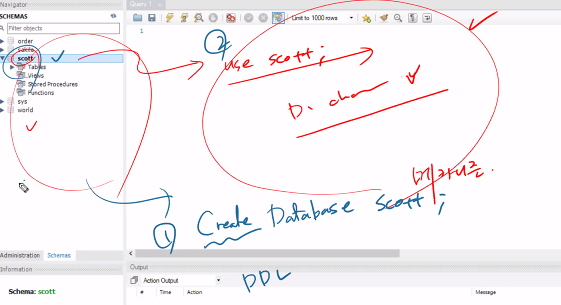

# 21.11.02. JDBC-1일차

## contents📑

* [JDBC세팅](##JDBC-세팅)
* 

## JDBC 세팅[📑](##contents)

1. eclipse 열기 - file - switch workspace - jdbcWorkspace 디렉토리 설정
2. open perspective - java로 세팅
3. window - preferences - General 확장 후 - Workspace 탭 - Text file encoding에서 Other : UTF-8

## JAVA Environment

#### `JDBC`는 `2tier` 기술

* DAO : Database Access Object
* DAOImpl


## Database 종류

| 정형DB<br />관계형 데이터베이스      | MySQL(조금 더 유연, 통계함수가 잘 되어있음), Oracle, MS SQL<br />(sql 문법을 공유)<br />MariaDB (간단하고 굉장히 가벼움.) |
| ------------------------------------ | ------------------------------------------------------------ |
| 비정형DB<br />이미지 파일, 소리 등등 | `MongoDB(NoSQL)` - 빅데이터 영향                             |


* 데이터 베이스 보기

```mysql
mysql> show databases;
+--------------------+
| Database           |
+--------------------+
| information_schema |
| mysql              |
| performance_schema |
| sakila             |
| sys                |
| world              |
+--------------------+
6 rows in set (0.01 sec)
```

* 데이터베이스가 6개

* mysql 사용

```mysql
mysql> use mysql;
Database changed
```


* 데이터베이스 생성

```mysql
mysql> Create database scott;
Query OK, 1 row affected (0.00 sec)

mysql> show databases;
+--------------------+
| Database           |
+--------------------+
| information_schema |
| mysql              |
| performance_schema |
| sakila             |
| scott              |
| sys                |
| world              |
+--------------------+
7 rows in set (0.00 sec)
```

* scott database 사용

```mysql
mysql> use scott;
Database changed
```

* 테이블 만들기.
  *  `source` : 만들어놓은 쿼리문을 한번에 로딩하는 명령어

```mysql
mysql> source C:\Users\kimminsung\OneDrive\miracom_institute\miracom_javaEduSummary\miracom_edu\util\scott.sql
Query OK, 0 rows affected, 1 warning (0.05 sec)

Query OK, 0 rows affected, 1 warning (0.01 sec)

Query OK, 4 rows affected (0.00 sec)
Records: 4  Duplicates: 0  Warnings: 0

Query OK, 0 rows affected, 1 warning (0.03 sec)

Query OK, 14 rows affected (0.00 sec)
Records: 14  Duplicates: 0  Warnings: 0

ERROR 1064 (42000): You have an error in your SQL syntax; check the manual that corresponds to your MySQL server version for the right syntax to use near 'NULLempno
) ENGINE=InnoDB DEFAULT CHARSET=utf8' at line 4
ERROR 1146 (42S02): Table 'scott.salgrade' doesn't exist
Query OK, 14 rows affected (0.05 sec)
Records: 14  Duplicates: 0  Warnings: 0
```

* `desc` : 테이블의 구조를 한번에 보는 명령어

```mysql
mysql> desc emp;
+----------+-------------+------+-----+---------+-------+
| Field    | Type        | Null | Key | Default | Extra |
+----------+-------------+------+-----+---------+-------+
| EMPNO    | int(11)     | NO   | PRI | NULL    |       |
| ENAME    | varchar(10) | YES  |     | NULL    |       |
| JOB      | varchar(9)  | YES  |     | NULL    |       |
| MGR      | int(11)     | YES  |     | NULL    |       |
| HIREDATE | datetime    | YES  |     | NULL    |       |
| SAL      | double      | YES  |     | NULL    |       |
| COMM     | double      | YES  |     | NULL    |       |
| DEPTNO   | int(11)     | YES  | MUL | NULL    |       |
+----------+-------------+------+-----+---------+-------+
8 rows in set (0.00 sec)

mysql> desc dept;
+--------+-------------+------+-----+---------+-------+
| Field  | Type        | Null | Key | Default | Extra |
+--------+-------------+------+-----+---------+-------+
| DEPTNO | int(11)     | NO   | PRI | NULL    |       |
| DNAME  | varchar(14) | YES  |     | NULL    |       |
| LOC    | varchar(13) | YES  |     | NULL    |       |
+--------+-------------+------+-----+---------+-------+
3 rows in set (0.00 sec)
```

* `SELECT` : 테이블의 데이터 불러오기

```mysql
mysql> SELECT * FROM emp;
+-------+--------+-----------+------+---------------------+------+------+--------+
| EMPNO | ENAME  | JOB       | MGR  | HIREDATE            | SAL  | COMM | DEPTNO |
+-------+--------+-----------+------+---------------------+------+------+--------+
|  7369 | SMITH  | CLERK     | 7902 | 1980-12-17 00:00:00 |  800 | NULL |     20 |
|  7499 | ALLEN  | SALESMAN  | 7698 | 1981-02-20 00:00:00 | 1600 |  300 |     30 |
|  7521 | WARD   | SALESMAN  | 7698 | 1981-02-22 00:00:00 | 1250 |  500 |     30 |
|  7566 | JONES  | MANAGER   | 7839 | 1981-04-02 00:00:00 | 2975 | NULL |     20 |
|  7654 | MARTIN | SALESMAN  | 7698 | 1981-09-28 00:00:00 | 1250 | 1400 |     30 |
|  7698 | BLAKE  | MANAGER   | 7839 | 1981-05-01 00:00:00 | 2850 | NULL |     30 |
|  7782 | CLARK  | MANAGER   | 7839 | 1981-06-09 00:00:00 | 2450 | NULL |     10 |
|  7788 | SCOTT  | ANALYST   | 7566 | 1987-04-19 00:00:00 | 3000 | NULL |     20 |
|  7839 | KING   | PRESIDENT | NULL | 1981-11-17 00:00:00 | 5000 | NULL |     10 |
|  7844 | TURNER | SALESMAN  | 7698 | 1981-09-08 00:00:00 | 1500 |    0 |     30 |
|  7876 | ADAMS  | CLERK     | 7788 | 1987-05-23 00:00:00 | 1100 | NULL |     20 |
|  7900 | JAMES  | CLERK     | 7698 | 1981-12-03 00:00:00 |  950 | NULL |     30 |
|  7902 | FORD   | ANALYST   | 7566 | 1981-12-03 00:00:00 | 3000 | NULL |     20 |
|  7934 | MILLER | CLERK     | 7782 | 1982-01-23 00:00:00 | 1300 | NULL |     10 |
+-------+--------+-----------+------+---------------------+------+------+--------+
14 rows in set (0.00 sec)
```

서브쿼리, SELECT 문을 잘 사용해야함.


#### `NULL` 이 의미하는 것은?

1. 0을 의미한다.
2. 값이 없다.
3. 나름 의미가 있음. - **자격없음** / **미확정** 둘중 하나의 의미를 가지고 있음. 

King은 사장이기때문에 MGR의 자격이 없음.

보너스는 영업사원인 경우, JOB에서 갈림. - 자격은 있는데, 영업을 못함.

부서가 영업 인경우만 보너스를 받을지 알아야 함....

미확정일 경우는 신입사원 혹은 인턴일 경우,,,

1. 연봉 랭킹?
2. 입사년도가 가장 빠른 사원?
3. 연봉은 입사년도 순이 아니다. 능력위주다...!
4. Scott은 영입해왔다. -  데이터를 볼줄알아야....

* projection 원하는 컬럼 값만 가져오기.
  * row는 그대로인데, 컬럼명만 취해서 가져옴.

```mysql
mysql> SELECT ename, job, sal, deptno FROM emp;
+--------+-----------+------+--------+
| ename  | job       | sal  | deptno |
+--------+-----------+------+--------+
| SMITH  | CLERK     |  800 |     20 |
| ALLEN  | SALESMAN  | 1600 |     30 |
| WARD   | SALESMAN  | 1250 |     30 |
| JONES  | MANAGER   | 2975 |     20 |
| MARTIN | SALESMAN  | 1250 |     30 |
| BLAKE  | MANAGER   | 2850 |     30 |
| CLARK  | MANAGER   | 2450 |     10 |
| SCOTT  | ANALYST   | 3000 |     20 |
| KING   | PRESIDENT | 5000 |     10 |
| TURNER | SALESMAN  | 1500 |     30 |
| ADAMS  | CLERK     | 1100 |     20 |
| JAMES  | CLERK     |  950 |     30 |
| FORD   | ANALYST   | 3000 |     20 |
| MILLER | CLERK     | 1300 |     10 |
+--------+-----------+------+--------+
14 rows in set (0.00 sec)
```

* 이 반대가 `SELECTION` : 조건을 부여해서 원하는 ROW만 가져오는 것.

```mysql
mysql> SELECT * FROM emp
    -> WHERE deptno=10;
+-------+--------+-----------+------+---------------------+------+------+--------+
| EMPNO | ENAME  | JOB       | MGR  | HIREDATE            | SAL  | COMM | DEPTNO |
+-------+--------+-----------+------+---------------------+------+------+--------+
|  7782 | CLARK  | MANAGER   | 7839 | 1981-06-09 00:00:00 | 2450 | NULL |     10 |
|  7839 | KING   | PRESIDENT | NULL | 1981-11-17 00:00:00 | 5000 | NULL |     10 |
|  7934 | MILLER | CLERK     | 7782 | 1982-01-23 00:00:00 | 1300 | NULL |     10 |
+-------+--------+-----------+------+---------------------+------+------+--------+
3 rows in set (0.00 sec)
```

* 부서 번호가 10번인 row만 가져오기

#### [문제] Emp 테이블에서, 업무가 영업사원인 사원을 검색하는데 이때 사원번호, 이름, 업무, 급여만 출력되도록 쿼리문을 작성하시오.

```mysql
mysql> SELECT empno, ename, job, sal FROM emp
    -> WHERE job='SALESMAN';
+-------+--------+----------+------+
| empno | ename  | job      | sal  |
+-------+--------+----------+------+
|  7499 | ALLEN  | SALESMAN | 1600 |
|  7521 | WARD   | SALESMAN | 1250 |
|  7654 | MARTIN | SALESMAN | 1250 |
|  7844 | TURNER | SALESMAN | 1500 |
+-------+--------+----------+------+
4 rows in set (0.00 sec)
```

#### [문제] 현재 emp 테이블에서 총 부서번호가 몇개있는지 확인하고 싶음. 

```mysql
mysql> SELECT deptno FROM emp;
+--------+
| deptno |
+--------+
|     10 |
|     10 |
|     10 |
|     20 |
|     20 |
|     20 |
|     20 |
|     20 |
|     30 |
|     30 |
|     30 |
|     30 |
|     30 |
|     30 |
+--------+
14 rows in set (0.00 sec)
```

* 중복 제거할때 쓰는 키워드 `distinct` (SELECT 절 바로 뒤에 나옴)

```mysql
mysql> SELECT DISTINCT deptno FROM emp;
+--------+
| deptno |
+--------+
|     10 |
|     20 |
|     30 |
+--------+
3 rows in set (0.00 sec)
```

## SQL 개요


* 데이터베이스 스키마 생성, 자료의 검색, 수정 그리고 데이터베이스 객체 접근 관리등을 위해 고안된 언어
* 다수의 데이터베이스 관련 프로그램의 표준언어
* SQL 명령어의 종류
  * DML(Data Manipuation Language) : 데이터 조작어로 검색 및 수정하기 위한 수단 제공
    * 검색 : SELECT, 추가 : INSERT, 수정 : UPDATE, 삭제 : DELETE, MERGE
  * DDL(Data Definition Language) : 데이터 구조를 생성, 변경, 삭제 등의 기능을 제공
    * 생성 : CREATE, ALTER, 삭제 : DROP, RENAME
  * DCL(Data Control Language) : 데이터에 대한 권한 관리 및 트랜잭션 제어
    * GRANT, REVOKE

### `schema` = `database`

## MySQL workbench



