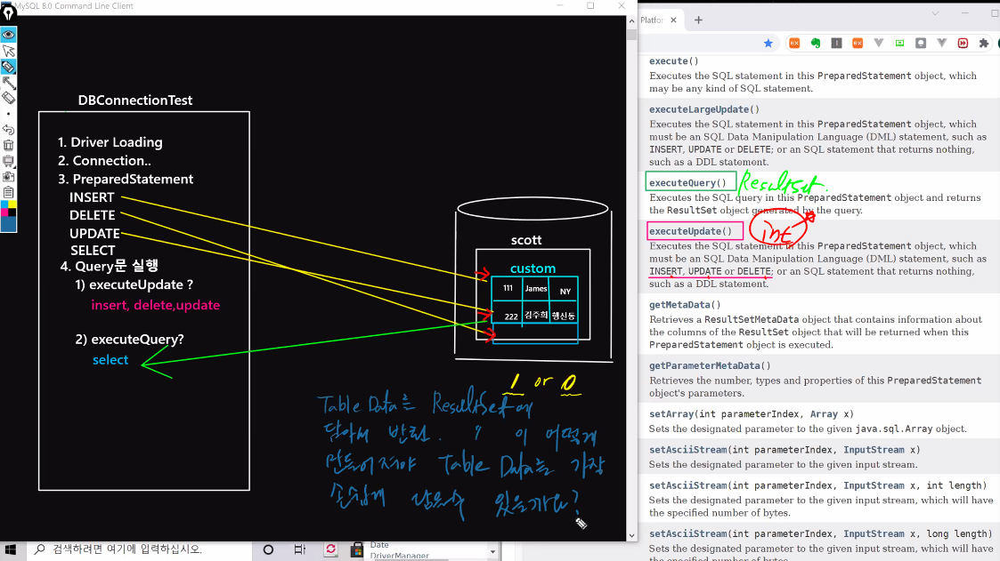

# 21.11.02. JDBC-1일차

## contents📑

* [JDBC세팅](##JDBC-세팅)
* 

## JDBC 세팅[📑](##contents)

1. eclipse 열기 - file - switch workspace - jdbcWorkspace 디렉토리 설정
2. open perspective - java로 세팅
3. window - preferences - General 확장 후 - Workspace 탭 - Text file encoding에서 Other : UTF-8

## JAVA Environment

#### `JDBC`는 `2tier` 기술

* DAO : Database Access Object
* DAOImpl


## Database 종류

| 정형DB<br />관계형 데이터베이스      | MySQL(조금 더 유연, 통계함수가 잘 되어있음), Oracle, MS SQL<br />(sql 문법을 공유)<br />MariaDB (간단하고 굉장히 가벼움.) |
| ------------------------------------ | ------------------------------------------------------------ |
| 비정형DB<br />이미지 파일, 소리 등등 | `MongoDB(NoSQL)` - 빅데이터 영향                             |


* 데이터 베이스 보기

```mysql
mysql> show databases;
+--------------------+
| Database           |
+--------------------+
| information_schema |
| mysql              |
| performance_schema |
| sakila             |
| sys                |
| world              |
+--------------------+
6 rows in set (0.01 sec)
```

* 데이터베이스가 6개

* mysql 사용

```mysql
mysql> use mysql;
Database changed
```


* 데이터베이스 생성

```mysql
mysql> Create database scott;
Query OK, 1 row affected (0.00 sec)

mysql> show databases;
+--------------------+
| Database           |
+--------------------+
| information_schema |
| mysql              |
| performance_schema |
| sakila             |
| scott              |
| sys                |
| world              |
+--------------------+
7 rows in set (0.00 sec)
```

* scott database 사용

```mysql
mysql> use scott;
Database changed
```

* 테이블 만들기.
  *  `source` : 만들어놓은 쿼리문을 한번에 로딩하는 명령어

```mysql
mysql> source C:\Users\kimminsung\OneDrive\miracom_institute\miracom_javaEduSummary\miracom_edu\util\scott.sql
Query OK, 0 rows affected, 1 warning (0.05 sec)

Query OK, 0 rows affected, 1 warning (0.01 sec)

Query OK, 4 rows affected (0.00 sec)
Records: 4  Duplicates: 0  Warnings: 0

Query OK, 0 rows affected, 1 warning (0.03 sec)

Query OK, 14 rows affected (0.00 sec)
Records: 14  Duplicates: 0  Warnings: 0

ERROR 1064 (42000): You have an error in your SQL syntax; check the manual that corresponds to your MySQL server version for the right syntax to use near 'NULLempno
) ENGINE=InnoDB DEFAULT CHARSET=utf8' at line 4
ERROR 1146 (42S02): Table 'scott.salgrade' doesn't exist
Query OK, 14 rows affected (0.05 sec)
Records: 14  Duplicates: 0  Warnings: 0
```

* `desc` : 테이블의 구조를 한번에 보는 명령어

```mysql
mysql> desc emp;
+----------+-------------+------+-----+---------+-------+
| Field    | Type        | Null | Key | Default | Extra |
+----------+-------------+------+-----+---------+-------+
| EMPNO    | int(11)     | NO   | PRI | NULL    |       |
| ENAME    | varchar(10) | YES  |     | NULL    |       |
| JOB      | varchar(9)  | YES  |     | NULL    |       |
| MGR      | int(11)     | YES  |     | NULL    |       |
| HIREDATE | datetime    | YES  |     | NULL    |       |
| SAL      | double      | YES  |     | NULL    |       |
| COMM     | double      | YES  |     | NULL    |       |
| DEPTNO   | int(11)     | YES  | MUL | NULL    |       |
+----------+-------------+------+-----+---------+-------+
8 rows in set (0.00 sec)

mysql> desc dept;
+--------+-------------+------+-----+---------+-------+
| Field  | Type        | Null | Key | Default | Extra |
+--------+-------------+------+-----+---------+-------+
| DEPTNO | int(11)     | NO   | PRI | NULL    |       |
| DNAME  | varchar(14) | YES  |     | NULL    |       |
| LOC    | varchar(13) | YES  |     | NULL    |       |
+--------+-------------+------+-----+---------+-------+
3 rows in set (0.00 sec)
```

* `SELECT` : 테이블의 데이터 불러오기

```mysql
mysql> SELECT * FROM emp;
+-------+--------+-----------+------+---------------------+------+------+--------+
| EMPNO | ENAME  | JOB       | MGR  | HIREDATE            | SAL  | COMM | DEPTNO |
+-------+--------+-----------+------+---------------------+------+------+--------+
|  7369 | SMITH  | CLERK     | 7902 | 1980-12-17 00:00:00 |  800 | NULL |     20 |
|  7499 | ALLEN  | SALESMAN  | 7698 | 1981-02-20 00:00:00 | 1600 |  300 |     30 |
|  7521 | WARD   | SALESMAN  | 7698 | 1981-02-22 00:00:00 | 1250 |  500 |     30 |
|  7566 | JONES  | MANAGER   | 7839 | 1981-04-02 00:00:00 | 2975 | NULL |     20 |
|  7654 | MARTIN | SALESMAN  | 7698 | 1981-09-28 00:00:00 | 1250 | 1400 |     30 |
|  7698 | BLAKE  | MANAGER   | 7839 | 1981-05-01 00:00:00 | 2850 | NULL |     30 |
|  7782 | CLARK  | MANAGER   | 7839 | 1981-06-09 00:00:00 | 2450 | NULL |     10 |
|  7788 | SCOTT  | ANALYST   | 7566 | 1987-04-19 00:00:00 | 3000 | NULL |     20 |
|  7839 | KING   | PRESIDENT | NULL | 1981-11-17 00:00:00 | 5000 | NULL |     10 |
|  7844 | TURNER | SALESMAN  | 7698 | 1981-09-08 00:00:00 | 1500 |    0 |     30 |
|  7876 | ADAMS  | CLERK     | 7788 | 1987-05-23 00:00:00 | 1100 | NULL |     20 |
|  7900 | JAMES  | CLERK     | 7698 | 1981-12-03 00:00:00 |  950 | NULL |     30 |
|  7902 | FORD   | ANALYST   | 7566 | 1981-12-03 00:00:00 | 3000 | NULL |     20 |
|  7934 | MILLER | CLERK     | 7782 | 1982-01-23 00:00:00 | 1300 | NULL |     10 |
+-------+--------+-----------+------+---------------------+------+------+--------+
14 rows in set (0.00 sec)
```

서브쿼리, SELECT 문을 잘 사용해야함.


#### `NULL` 이 의미하는 것은?

1. 0을 의미한다.
2. 값이 없다.
3. 나름 의미가 있음. - **자격없음** / **미확정** 둘중 하나의 의미를 가지고 있음. 

King은 사장이기때문에 MGR의 자격이 없음.

보너스는 영업사원인 경우, JOB에서 갈림. - 자격은 있는데, 영업을 못함.

부서가 영업 인경우만 보너스를 받을지 알아야 함....

미확정일 경우는 신입사원 혹은 인턴일 경우,,,

1. 연봉 랭킹?
2. 입사년도가 가장 빠른 사원?
3. 연봉은 입사년도 순이 아니다. 능력위주다...!
4. Scott은 영입해왔다. -  데이터를 볼줄알아야....

* projection 원하는 컬럼 값만 가져오기.
  * row는 그대로인데, 컬럼명만 취해서 가져옴.

```mysql
mysql> SELECT ename, job, sal, deptno FROM emp;
+--------+-----------+------+--------+
| ename  | job       | sal  | deptno |
+--------+-----------+------+--------+
| SMITH  | CLERK     |  800 |     20 |
| ALLEN  | SALESMAN  | 1600 |     30 |
| WARD   | SALESMAN  | 1250 |     30 |
| JONES  | MANAGER   | 2975 |     20 |
| MARTIN | SALESMAN  | 1250 |     30 |
| BLAKE  | MANAGER   | 2850 |     30 |
| CLARK  | MANAGER   | 2450 |     10 |
| SCOTT  | ANALYST   | 3000 |     20 |
| KING   | PRESIDENT | 5000 |     10 |
| TURNER | SALESMAN  | 1500 |     30 |
| ADAMS  | CLERK     | 1100 |     20 |
| JAMES  | CLERK     |  950 |     30 |
| FORD   | ANALYST   | 3000 |     20 |
| MILLER | CLERK     | 1300 |     10 |
+--------+-----------+------+--------+
14 rows in set (0.00 sec)
```

* 이 반대가 `SELECTION` : 조건을 부여해서 원하는 ROW만 가져오는 것.

```mysql
mysql> SELECT * FROM emp
    -> WHERE deptno=10;
+-------+--------+-----------+------+---------------------+------+------+--------+
| EMPNO | ENAME  | JOB       | MGR  | HIREDATE            | SAL  | COMM | DEPTNO |
+-------+--------+-----------+------+---------------------+------+------+--------+
|  7782 | CLARK  | MANAGER   | 7839 | 1981-06-09 00:00:00 | 2450 | NULL |     10 |
|  7839 | KING   | PRESIDENT | NULL | 1981-11-17 00:00:00 | 5000 | NULL |     10 |
|  7934 | MILLER | CLERK     | 7782 | 1982-01-23 00:00:00 | 1300 | NULL |     10 |
+-------+--------+-----------+------+---------------------+------+------+--------+
3 rows in set (0.00 sec)
```

* 부서 번호가 10번인 row만 가져오기

#### [문제] Emp 테이블에서, 업무가 영업사원인 사원을 검색하는데 이때 사원번호, 이름, 업무, 급여만 출력되도록 쿼리문을 작성하시오.

```mysql
mysql> SELECT empno, ename, job, sal FROM emp
    -> WHERE job='SALESMAN';
+-------+--------+----------+------+
| empno | ename  | job      | sal  |
+-------+--------+----------+------+
|  7499 | ALLEN  | SALESMAN | 1600 |
|  7521 | WARD   | SALESMAN | 1250 |
|  7654 | MARTIN | SALESMAN | 1250 |
|  7844 | TURNER | SALESMAN | 1500 |
+-------+--------+----------+------+
4 rows in set (0.00 sec)
```

#### [문제] 현재 emp 테이블에서 총 부서번호가 몇개있는지 확인하고 싶음. 

```mysql
mysql> SELECT deptno FROM emp;
+--------+
| deptno |
+--------+
|     10 |
|     10 |
|     10 |
|     20 |
|     20 |
|     20 |
|     20 |
|     20 |
|     30 |
|     30 |
|     30 |
|     30 |
|     30 |
|     30 |
+--------+
14 rows in set (0.00 sec)
```

* 중복 제거할때 쓰는 키워드 `distinct` (SELECT 절 바로 뒤에 나옴)

```mysql
mysql> SELECT DISTINCT deptno FROM emp;
+--------+
| deptno |
+--------+
|     10 |
|     20 |
|     30 |
+--------+
3 rows in set (0.00 sec)
```

## SQL 개요


* 데이터베이스 스키마 생성, 자료의 검색, 수정 그리고 데이터베이스 객체 접근 관리등을 위해 고안된 언어
* 다수의 데이터베이스 관련 프로그램의 표준언어
* SQL 명령어의 종류
  * DML(Data Manipuation Language) : 데이터 조작어로 검색 및 수정하기 위한 수단 제공
    * 검색 : SELECT, 추가 : INSERT, 수정 : UPDATE, 삭제 : DELETE, MERGE
  * DDL(Data Definition Language) : 데이터 구조를 생성, 변경, 삭제 등의 기능을 제공
    * 생성 : CREATE, ALTER, 삭제 : DROP, RENAME
  * DCL(Data Control Language) : 데이터에 대한 권한 관리 및 트랜잭션 제어
    * GRANT, REVOKE

### `schema` = `database`

## MySQL workbench


### 문제 2. EMP 테이블에서, 이름, 월급, 연봉을 출력, 이때 연봉순으로 내림차순 정렬
```mysql
mysql> SELECT ename, sal, sal*12 + comm FROM emp ORDER BY sal*12 + comm DESC;
+--------+------+---------------+
| ename  | sal  | sal*12 + comm |
+--------+------+---------------+
| ALLEN  | 1600 |         19500 |
| TURNER | 1500 |         18000 |
| MARTIN | 1250 |         16400 |
| WARD   | 1250 |         15500 |
| SMITH  |  800 |          NULL |
| JONES  | 2975 |          NULL |
| BLAKE  | 2850 |          NULL |
| CLARK  | 2450 |          NULL |
| SCOTT  | 3000 |          NULL |
| KING   | 5000 |          NULL |
| ADAMS  | 1100 |          NULL |
| JAMES  |  950 |          NULL |
| FORD   | 3000 |          NULL |
| MILLER | 1300 |          NULL |
+--------+------+---------------+
14 rows in set (0.00 sec)
```


### 2. Alias 를 지정 (as를 사용) 

```mysql
mysql> SELECT ename, sal, sal*12 + comm FROM emp ORDER BY sal*12 + comm DESC;
+--------+------+---------------+
| ename  | sal  | sal*12 + comm |
+--------+------+---------------+
| ALLEN  | 1600 |         19500 |
| TURNER | 1500 |         18000 |
| MARTIN | 1250 |         16400 |
| WARD   | 1250 |         15500 |
| SMITH  |  800 |          NULL |
| JONES  | 2975 |          NULL |
| BLAKE  | 2850 |          NULL |
| CLARK  | 2450 |          NULL |
| SCOTT  | 3000 |          NULL |
| KING   | 5000 |          NULL |
| ADAMS  | 1100 |          NULL |
| JAMES  |  950 |          NULL |
| FORD   | 3000 |          NULL |
| MILLER | 1300 |          NULL |
+--------+------+---------------+
14 rows in set (0.00 sec)
```


### 2-2. as를 빼고
```mysql
SELECT ename, sal, sal*12 + comm as "Annual Salary"
FROM emp
ORDER BY sal*12 + comm DESC;
```

### 2-3. 원래는 한칸을 띄우고 바로 별칭을 붙이면 된다.
```mysql
```

## null의 처리


```mysql
mysql> SELECT ename, sal, sal * 12 + ifnull(comm , 0) AnnualSalary FROM emp ORDER BY sal*12 + comm DESC;
+--------+------+--------------+
| ename  | sal  | AnnualSalary |
+--------+------+--------------+
| ALLEN  | 1600 |        19500 |
| TURNER | 1500 |        18000 |
| MARTIN | 1250 |        16400 |
| WARD   | 1250 |        15500 |
| SMITH  |  800 |         9600 |
| JONES  | 2975 |        35700 |
| BLAKE  | 2850 |        34200 |
| CLARK  | 2450 |        29400 |
| SCOTT  | 3000 |        36000 |
| KING   | 5000 |        60000 |
| ADAMS  | 1100 |        13200 |
| JAMES  |  950 |        11400 |
| FORD   | 3000 |        36000 |
| MILLER | 1300 |        15600 |
+--------+------+--------------+
14 rows in set (0.00 sec)
```

## DML

1) INSERT INTO table명 VALUES(0,0,0,0);
2) DELETE FROM table명 WHERE EMPNO=7768;
	DELETE FROM table명; // table의 모든 데이터가 다 삭제...주의!
3) UPDATE table명 SET sal=2000 WHERE ename='SMITH';
4) SELECT * FROM table명; //모든 데이터를 가져옴
	SELECT * FROM table명 WHERE deptno=10;

## java에 적용


```mysql
mysql> use scott;
Database changed

mysql> CREATE TABLE custom;
ERROR 1113 (42000): A table must have at least 1 column
```

* 적어도 하나의 컬럼이 있어야...

```mysql
mysql> CREATE TABLE custom(
    -> num int primary key,
    -> name varchar(20) not null,
    -> addr varchar(100) not null);
Query OK, 0 rows affected (0.02 sec)
```

* custom 테이블의 구조를 보고싶다.

```mysql
mysql> desc custom;
+-------+--------------+------+-----+---------+-------+
| Field | Type         | Null | Key | Default | Extra |
+-------+--------------+------+-----+---------+-------+
| num   | int(11)      | NO   | PRI | NULL    |       |
| name  | varchar(20)  | NO   |     | NULL    |       |
| addr  | varchar(100) | NO   |     | NULL    |       |
+-------+--------------+------+-----+---------+-------+
3 rows in set (0.00 sec)
```

* custom테이블에서 num, name, addrs 컬럼을 보고 싶다.

```mysql
mysql> SELECT num, name, addr FROM custom;
Empty set (0.00 sec)
```

* 데이터를 넣어본다.

```mysql
mysql> INSERT INTO custom (num, name, addr) VALUES (111, 'James','NY');
Query OK, 1 row affected (0.00 sec)

mysql> INSERT INTO custom (num, name, addr) VALUES (222, 'Jane','Texas');
Query OK, 1 row affected (0.00 sec)
```

* 넣은 결과를 본다.

```mysql
mysql> SELECT * FROM custom;
+-----+-------+-------+
| num | name  | addr  |
+-----+-------+-------+
| 111 | James | NY    |
| 222 | Jane  | Texas |
+-----+-------+-------+
2 rows in set (0.00 sec)
```

* Jane의 주소를 뉴욕으로

```mysql
mysql> UPDATE custom SET addr = 'NY' WHERE num=222;
Query OK, 1 row affected (0.00 sec)
Rows matched: 1  Changed: 1  Warnings: 0

mysql> SELECT * FROM custom;
+-----+-------+------+
| num | name  | addr |
+-----+-------+------+
| 111 | James | NY   |
| 222 | Jane  | NY   |
+-----+-------+------+
2 rows in set (0.00 sec)
```

* jane 삭제

```mysql
mysql> DELETE FROM custom WHERE num=222;
Query OK, 1 row affected (0.00 sec)

mysql> SELECT * FROM custom;
+-----+-------+------+
| num | name  | addr |
+-----+-------+------+
| 111 | James | NY   |
+-----+-------+------+
1 row in set (0.00 sec)
```

## JDBC


jre, jdk 두 곳 lib에 드라이버 jar를 넣어야함.

DB 주소

```java
package jdbc.test1;

import java.sql.Connection;
import java.sql.DriverManager;
import java.sql.SQLException;

/*
 * JDBC 4단계 작업
 * 1. 드라이버 로딩
 * 2. DB서버 연결
 * 3. PreparedStatement 생성
 * 4. 쿼리문 실행
 */
public class DBConnectionTest {
	DBConnectionTest(){
		//1. 드라이버 로딩...Fully Qualified Class Name
		try {
			Class.forName("com.mysql.cj.jdbc.Driver");
			System.out.println("1. 드라이버 로딩 성공...");
			
			//2. DB 서버와 연결 시작
			String url = "jdbc:mysql://127.0.0.1:3306/scott?serverTimezone=UTC&useUnicode=yes&characterEncoding=UTF-8";
			Connection conn = DriverManager.getConnection(url, "root", "1234");
			System.out.println("2. 서버 연결 성공");
			
		} catch (ClassNotFoundException e) {
			System.out.println("드라이버 로딩 실패...");
			e.printStackTrace();
		} catch(SQLException e) {
			System.out.println("서버 연결 실패...");
		}
		
		
	}
	public static void main(String[] args) {
		new DBConnectionTest();
	}

}

```

## JDBC 드라이버 로딩 - DB 서버 연결

| Modifier and Type            | Method and Description                                       |
| :--------------------------- | :----------------------------------------------------------- |
| `static void`                | `deregisterDriver(Driver driver)`Removes the specified driver from the `DriverManager`'s list of registered drivers. |
| `static Connection`          | `getConnection(String url)`Attempts to establish a connection to the given database URL. |
| `static Connection`          | `getConnection(String url, Properties info)`Attempts to establish a connection to the given database URL. |
| `static Connection`          | `getConnection(String url, String user, String password)`Attempts to establish a connection to the given database URL. |
| `static Driver`              | `getDriver(String url)`Attempts to locate a driver that understands the given URL. |
| `static Enumeration<Driver>` | `getDrivers()`Retrieves an Enumeration with all of the currently loaded JDBC drivers to which the current caller has access. |
| `static int`                 | `getLoginTimeout()`Gets the maximum time in seconds that a driver can wait when attempting to log in to a database. |
| `static PrintStream`         | `getLogStream()`**Deprecated.** Use `getLogWriter`           |
| `static PrintWriter`         | `getLogWriter()`Retrieves the log writer.                    |
| `static void`                | `println(String message)`Prints a message to the current JDBC log stream. |
| `static void`                | `registerDriver(Driver driver)`Registers the given driver with the `DriverManager`. |
| `static void`                | `registerDriver(Driver driver, DriverAction da)`Registers the given driver with the `DriverManager`. |
| `static void`                | `setLoginTimeout(int seconds)`Sets the maximum time in seconds that a driver will wait while attempting to connect to a database once the driver has been identified. |
| `static void`                | `setLogStream(PrintStream out)`**Deprecated.** Use `setLogWriter` |
| `static void`                | `setLogWriter(PrintWriter out)`Sets the logging/tracing `PrintWriter` object that is used by the `DriverManager` and all drivers. |

| `PreparedStatement` | `prepareStatement(String sql)`Creates a `PreparedStatement` object for sending parameterized SQL statements to the database. |
| ------------------- | ------------------------------------------------------------ |
| `PreparedStatement` | `prepareStatement(String sql, int autoGeneratedKeys)`Creates a default `PreparedStatement` object that has the capability to retrieve auto-generated keys. |
| `PreparedStatement` | `prepareStatement(String sql, int[] columnIndexes)`Creates a default `PreparedStatement` object capable of returning the auto-generated keys designated by the given array. |
| `PreparedStatement` | `prepareStatement(String sql, int resultSetType, int resultSetConcurrency)`Creates a `PreparedStatement` object that will generate `ResultSet` objects with the given type and concurrency. |
| `PreparedStatement` | `prepareStatement(String sql, int resultSetType, int resultSetConcurrency, int resultSetHoldability)`Creates a `PreparedStatement` object that will generate `ResultSet` objects with the given type, concurrency, and holdability. |
| `PreparedStatement` | `prepareStatement(String sql, String[] columnNames)`Creates a default `PreparedStatement` object capable of returning the auto-generated keys designated by the given array. |

| `ResultSet` | `executeQuery()`Executes the SQL query in this `PreparedStatement` object and returns the `ResultSet` object generated by the query. |
| ----------- | ------------------------------------------------------------ |
| `int`       | `executeUpdate()`Executes the SQL statement in this `PreparedStatement` object, which must be an SQL Data Manipulation Language (DML) statement, such as `INSERT`, `UPDATE` or `DELETE`; or an SQL statement that returns nothing, such as a DDL statement. |

* insert 쿼리

| `ResultSet` | `executeQuery()`Executes the SQL query in this `PreparedStatement` object and returns the `ResultSet` object generated by the query. |
| ----------- | ------------------------------------------------------------ |
| `int`       | `executeUpdate()`Executes the SQL statement in this `PreparedStatement` object, which must be an SQL Data Manipulation Language (DML) statement, such as `INSERT`, `UPDATE` or `DELETE`; or an SQL statement that returns nothing, such as a DDL statement. |



* `ResultSet`


