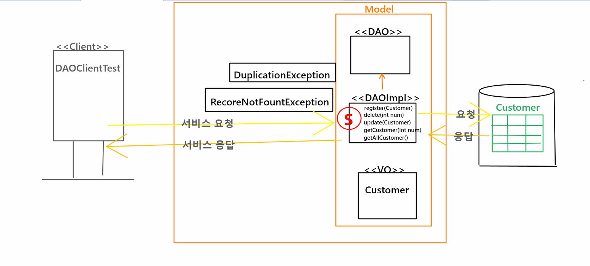

# 21.11.04. JDBC-2일차

## Contents📑

* 


### for문과 whie문의 차이

* `for` : 반복하는 횟수를 이미 알고 있을때,
* `while` :  있을때 까지, 데이터가 소진될때까지 뽑아낼때!

```mysql
mysql> use scott;
Database changed

mysql> desc custom;
+-------+--------------+------+-----+---------+-------+
| Field | Type         | Null | Key | Default | Extra |
+-------+--------------+------+-----+---------+-------+
| num   | int(11)      | NO   | PRI | NULL    |       |
| name  | varchar(20)  | NO   |     | NULL    |       |
| addr  | varchar(100) | NO   |     | NULL    |       |
+-------+--------------+------+-----+---------+-------+
3 rows in set (0.01 sec)

mysql> SELECT num, name, addr FROM custom;
+-----+-------+-------+
| num | name  | addr  |
+-----+-------+-------+
| 111 | James | NY    |
| 222 | Jane  | Texas |
| 333 | Tom   | NY    |
+-----+-------+-------+
3 rows in set (0.00 sec)
```

```java
package jdbc.test2;

import java.sql.Connection;
import java.sql.DriverManager;
import java.sql.PreparedStatement;
import java.sql.SQLException;

/*
 * JDBC 4단계
 * :
 * 1. 드라이버 로딩
 * 2. DB서버와 연결
 * 3. PreparedStatement 객체 생성
 * 4. 쿼리문...
 * 		int executeUpdate("") -- INSERT, DELETE, UPDATE  -- 0 / 1
 * 		ResultSet executeQuery("") -- SELECT 
 * 			BOE
 * 			ResultSet
 * 			EOE
 */
public class DBConnectionTest {
	DBConnectionTest() throws ClassNotFoundException, SQLException {
		Class.forName("com.mysql.cj.jdbc.Driver"); //FQCN
		System.out.println("1. Driver Loading....");
		
		String url = "jdbc:mysql://127.0.0.1:3306/scott?serverTimezone=UTC&useUnicode=yes&characterEncoding=UTF-8";
		Connection conn = DriverManager.getConnection(url, "root", "1234");
		System.out.println("2. DB Server Connect ....");
		
		String query = "INSERT INTO custom (num, name, addr) VALUES(?,?,?)";
		PreparedStatement ps = conn.prepareStatement(query);
		System.out.println("3. PreparedStatement Creating....");
		
		//?에 값을 바인딩
		ps.setInt(1, 444);
		ps.setString(2, "Juliet");
		ps.setString(3, "LA");
		
		System.out.println(ps.executeUpdate()+" row INSERT OK...!");
		
	}
	
	public static void main(String[] args) throws ClassNotFoundException,SQLException{
		new DBConnectionTest();

	}

}
```

* 추가됨.

```mysql
mysql> SELECT num, name, addr FROM custom;
+-----+--------+-------+
| num | name   | addr  |
+-----+--------+-------+
| 111 | James  | NY    |
| 222 | Jane   | Texas |
| 333 | Tom    | NY    |
| 444 | Juliet | LA    |
+-----+--------+-------+
4 rows in set (0.00 sec)
```

## 쿼리문 닫아주기

```java
package jdbc.test2;

import java.sql.Connection;
import java.sql.DriverManager;
import java.sql.PreparedStatement;
import java.sql.ResultSet;
import java.sql.SQLException;

/*
 * JDBC 5단계
 * :
 * 1. 드라이버 로딩
 * 2. DB서버와 연결
 * 3. PreparedStatement 객체 생성 -- 이때, 쿼리문 인자값으로 들어간다.
 * 		값 바인딩
 * 4. 쿼리문...
 * 		int executeUpdate("") -- INSERT, DELETE, UPDATE  -- 0 / 1
 * 		ResultSet executeQuery("") -- SELECT 
 * 			BOE
 * 			ResultSet
 * 			EOE
 * 
 * 5. 자원을 닫아준다.
 * 		close...열은 순서 반대로 닫아준다.
 * 		Connection --> PreparedStatement --> ResultSet
 * 		
 * 		ResultSet 닫고 --> PreparedStatement닫고 --> Connection닫고
 */
public class DBConnectionTest {
	DBConnectionTest() throws ClassNotFoundException, SQLException {
		Connection conn = null;
		PreparedStatement ps = null;
		PreparedStatement ps1 = null;
		ResultSet rs = null;
			
		try {
		Class.forName("com.mysql.cj.jdbc.Driver"); //FQCN
		System.out.println("1. Driver Loading....");
		
		String url = "jdbc:mysql://127.0.0.1:3306/scott?serverTimezone=UTC&useUnicode=yes&characterEncoding=UTF-8";
		conn = DriverManager.getConnection(url, "root", "1234");
		System.out.println("2. DB Server Connect ....");
		
		/*String query = "INSERT INTO custom (num, name, addr) VALUES(?,?,?)";
		ps = conn.prepareStatement(query);
		System.out.println("3. PreparedStatement Creating....");
		
		//?에 값을 바인딩
		ps.setInt(1, 444);
		ps.setString(2, "Juliet");
		ps.setString(3, "LA");
		
		System.out.println(ps.executeUpdate()+" row INSERT OK...!");
		*/
		
		//delete문을 작성...
		String query1 = "DELETE FROM custom WHERE num-?";
		ps1 = conn.prepareStatement(query1);
		ps1.setInt(1, 444);
		System.out.println(ps1.executeUpdate()+" row DELETE OK!!");
		
		// 현재 DB테이블에 있는 데이터를 다 가져와서 출력...SELECT
		String query = "SELECT * FROM custom WHERE num=?";
		ps = conn.prepareStatement(query);
		
		ps.setInt(1, 444);
		
		rs = ps.executeQuery();
		if(rs.next()) {
			int num = rs.getInt("num");//컬럼명 혹은 1
			System.out.println(rs.getInt("num")+", "+rs.getString("name")+", "+rs.getString("addr"));
			}
		}finally {
			rs.close();
			ps.close();
			ps1.close();
			conn.close();
		}
	}
	public static void main(String[] args) throws ClassNotFoundException,SQLException{
		new DBConnectionTest();

	}

}

```

## JDBC 5단계

1. 드라이버 로딩

2. DB서버와 연결

3. PreparedStatement 객체 생성 -- 이때, 쿼리문 인자값으로 들어간다.

   * 값 바인딩

4. 쿼리문...

   int executeUpdate("") -- INSERT, DELETE, UPDATE  -- 0 / 1

   ResultSet executeQuery("") -- SELECT 

   BOE

   ResultSet

   EOE

5. 자원을 닫아준다.

   close...열은 순서 반대로 닫아준다.

   Connection --> PreparedStatement --> ResultSet

   ResultSet 닫고 --> PreparedStatement닫고 --> Connection닫고


### DAO --> Business Logic(아주 중요한 로직)


## 모듈화

* `interface`로 처리
* properties로 처리

### 스텝 바이 스텝!

1. 모듈화
2. 심플MVC

## 모델


