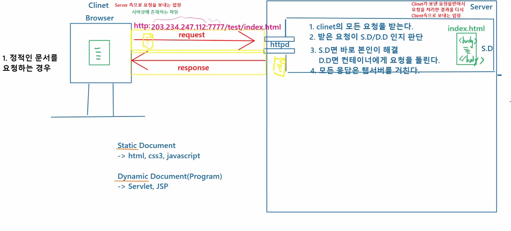
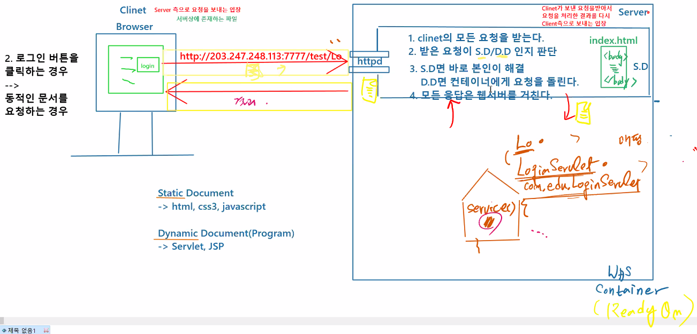
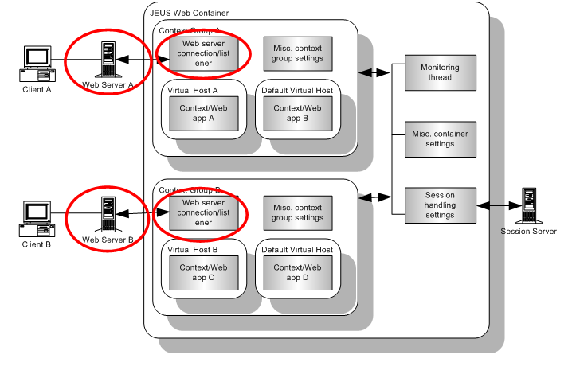
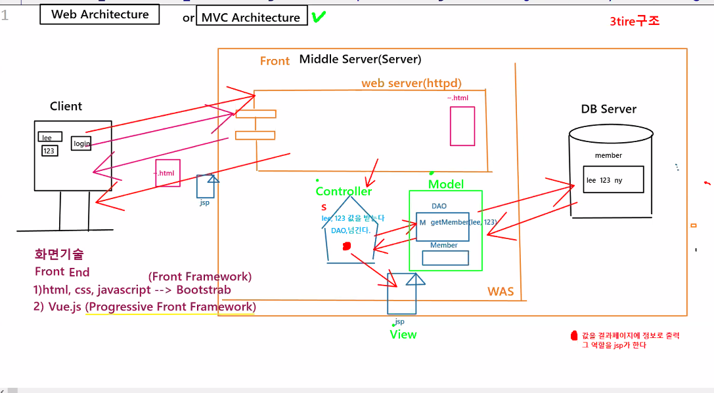

# 21.11.09. web-2일차

## content📑

1. webServer vs WAS
2. Web Architecture
3. Servlet API
4. Sevlet으로 html폼값 받아서 처리하기

## 1. webServer vs WAS

### 정적인 문서를 요청하는 경우

### 동적인 문서를 요청하는 경우

`tomcat` = webServer + WAS

## 2. Web Architecture 

