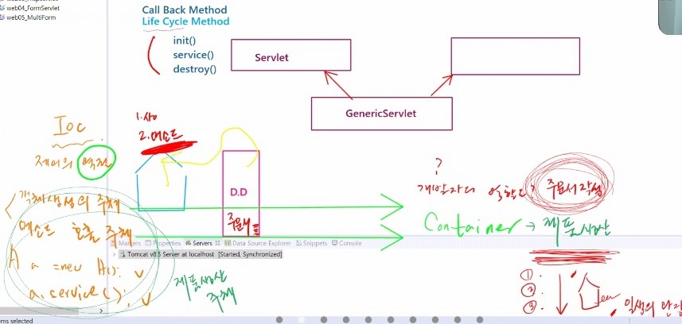

# 21.11.10. web-3일차

## contents📑

1. Sevlet LifeCycle
2. SevletConfig
3. ServletContext

## deployment descriptor

배포하겠다.

web

xml은 가장 보편적인 

xml은 태그 자체가 메타 데이터를 가짐.

form.html 옮기기

## get 방식

"Get it" : 페이지를 줘!

* 단순한 페이지 연결이 목적...데이터전달이기보다는...
* id, num...이런 간단한 데이터도 연결되는 페이지에 전달하게 경우가 발생
* 이때, 주소창에 그대로 함께 전달하게 됨.
* url?이름=값&이름2=값2....
  1. 많은 양의 데이터를 전달할 경우 맞지 않다.
  2. 보안상 중요한 데이터인 경우 사용하면 안됨.
  3. 전달하는 데이터의 크기와 양에 제한이 있다.

## post 방식

"Post Office"

* 데이터 전달이 목적 : 이런이런 데이터를 서버에 전달할테디..서버는 이 데이터를 받아서 처리한 결과를 나한테(client) 다시 돌려줘
* 주소창에 줄줄이 사탕으로 전달되는 것이 아니라
* 객체에 담겨서 서버로 날라간다...데이터가 노출되지 않는다.
  1) 많은 양의 데이터를 전달 할때 사용
  2) 보안상 노출되면 안되는 데이터는 post방식으로 전달
  3) 전달하는 데이터의 크기와 양에 제한이 없다.

