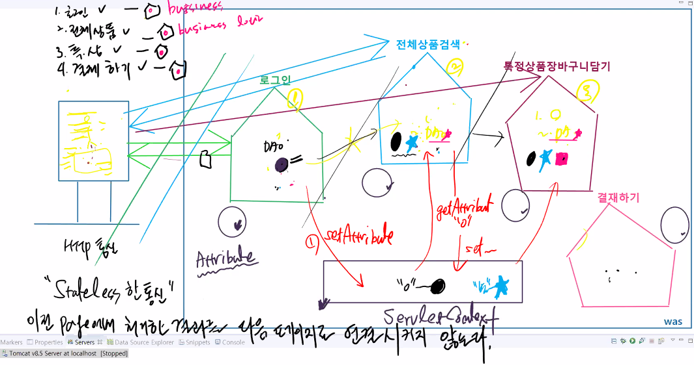
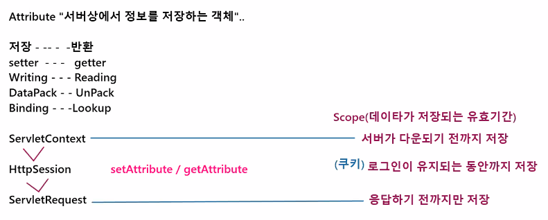
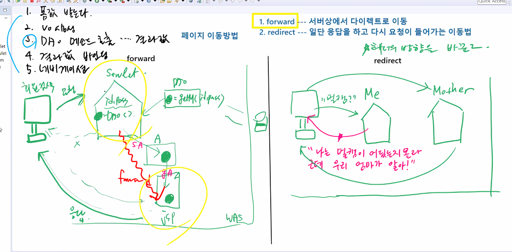
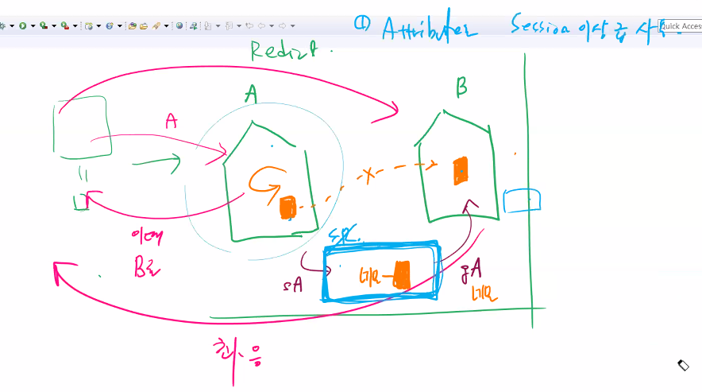
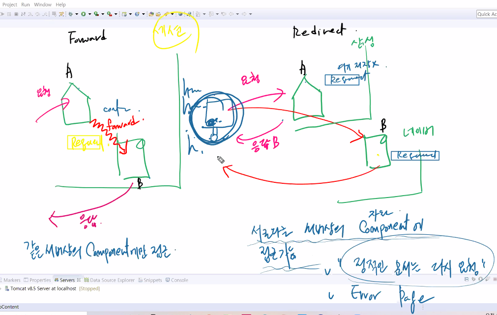
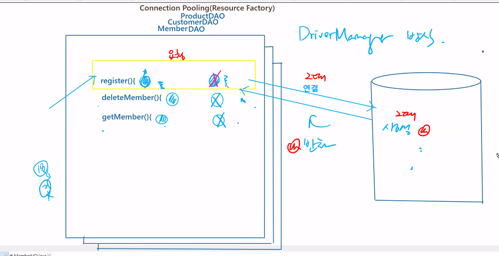
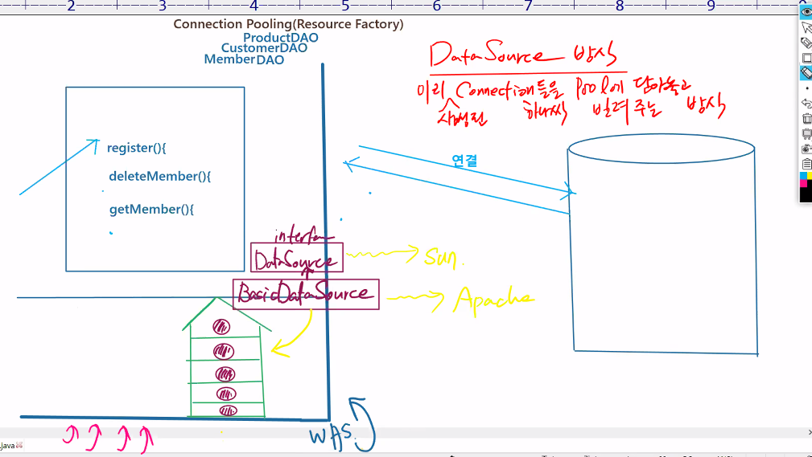
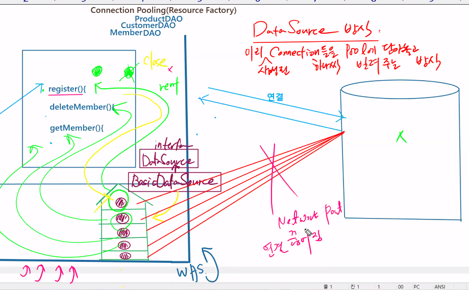
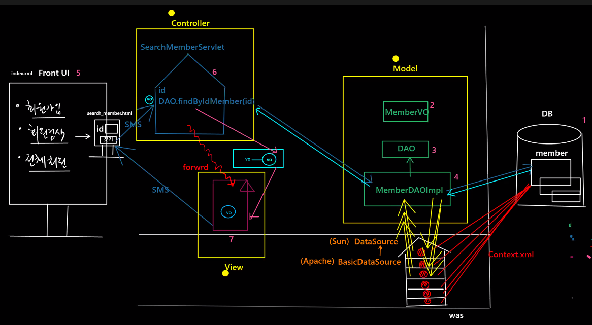
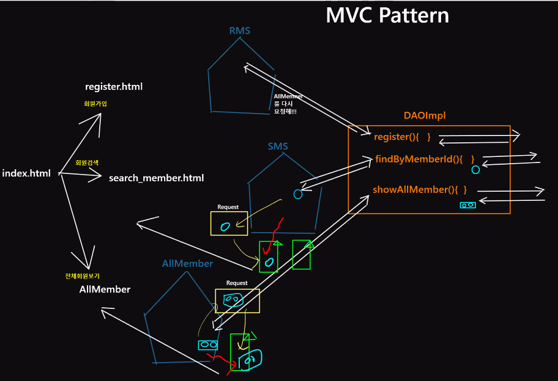

# 21.11.11. web-4일차



## `Attribute`

: 서버상에서 정보를 저장하는 객체


| 저장     | 반환    |
| -------- | ------- |
| setter   | getter  |
| Writing  | Reading |
| DataPack | UnPack  |
| Binding  | Lookup  |

* ServletContext
* HttpSession : `setAttribute` / `getAttribute`
* ServletRequest

Scope(데이터가 저장되는 유효기간)

서버가 다운되기 전까지 저장

로그인이

응답하기 전까지만 저장













* connectionFactory
* ReSourceFatory




1. 테이블이 만들어져 있어야한다.

```mysql
mysql> create table member(
    -> id varchar(20) primary key,
    -> password varchar(30) not null,
    -> name varchar(30),
    -> address varchar(100));
Query OK, 0 rows affected (0.02 sec)

mysql> INSERT INTO member VALUES('111','111','James','NY');
Query OK, 1 row affected (0.01 sec)

mysql> SELECT * FROM member;
+-----+----------+-------+---------+
| id  | password | name  | address |
+-----+----------+-------+---------+
| 111 | 111      | James | NY      |
+-----+----------+-------+---------+
1 row in set (0.00 sec)
```


2. 

## MVC 패턴





