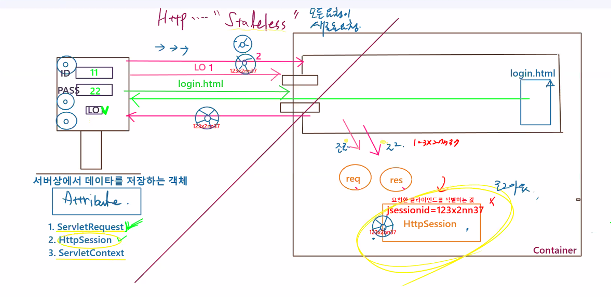
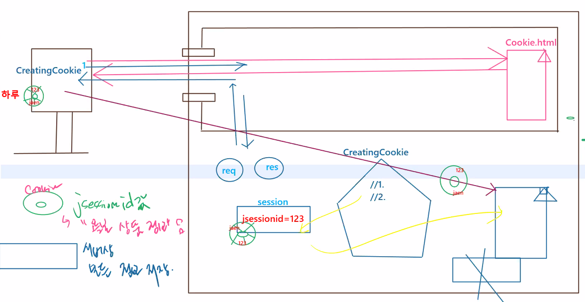
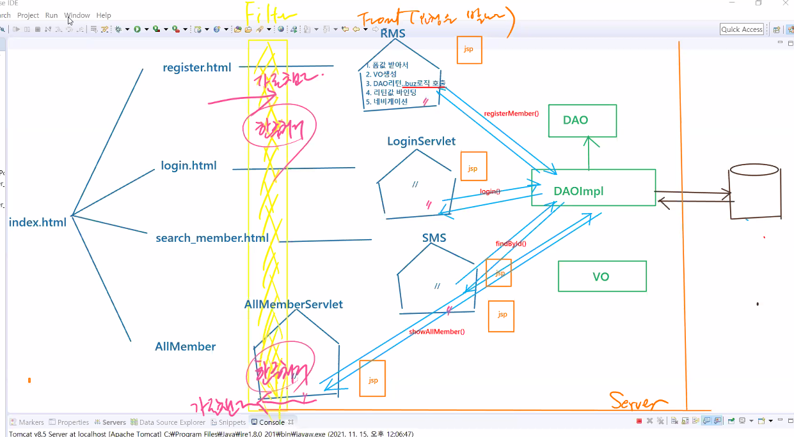
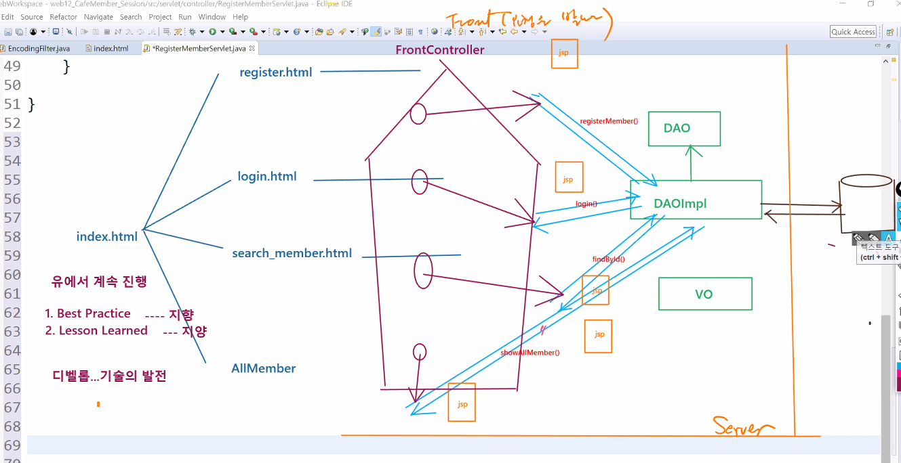
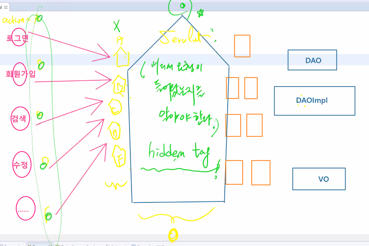
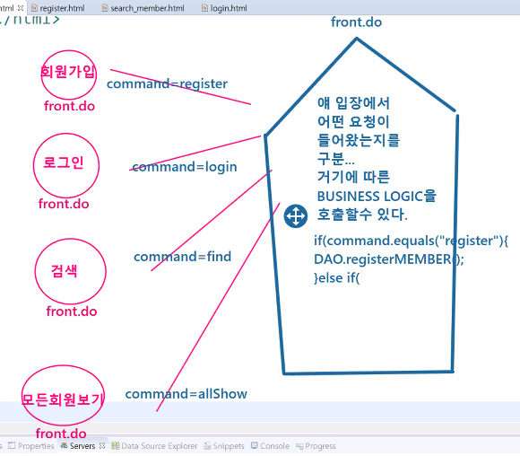
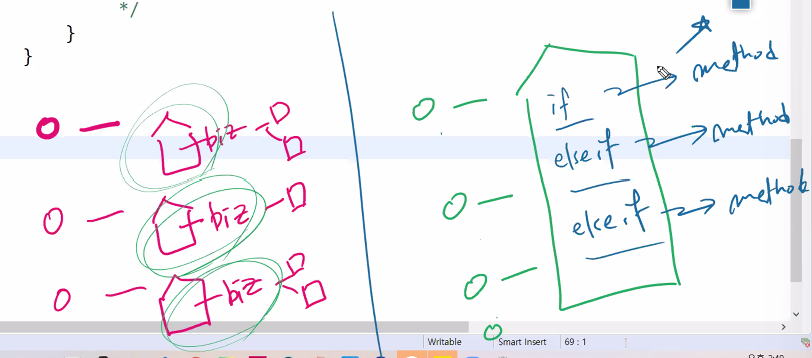

# 21.11.15. web-5일차

## 1115 이슈

1. Session Management with Cookie
2. Filter
3. JSTL
4. FrontController

## 1. Session Management with Cookie

- public class **Cookie**
- extends java.lang.Object
- implements java.lang.Cloneable

Creates a cookie, **a small amount of information** sent by a servlet to a Web browser, saved by the browser, and later sent back to the server. A cookie's value can uniquely identify a client, so cookies are commonly used for session management.

* **a small amount of information**은 객체 저장이 안된다는 것을 의미
* servlet에 의해서 web browser로 보내짐.

| **Method Summary** |                                                              |
| ------------------ | ------------------------------------------------------------ |
| ` void`            | `[addCookie](https://tomcat.apache.org/tomcat-5.5-doc/servletapi/javax/servlet/http/HttpServletResponse.html#addCookie(javax.servlet.http.Cookie))(Cookie cookie)`      Adds the specified cookie to the response. |

* 실습

## 2. JSTL(JavaServer Pages Standard Tag Library)

* JSP에 있는 프로그램을 태그로 바꿔주는 것

