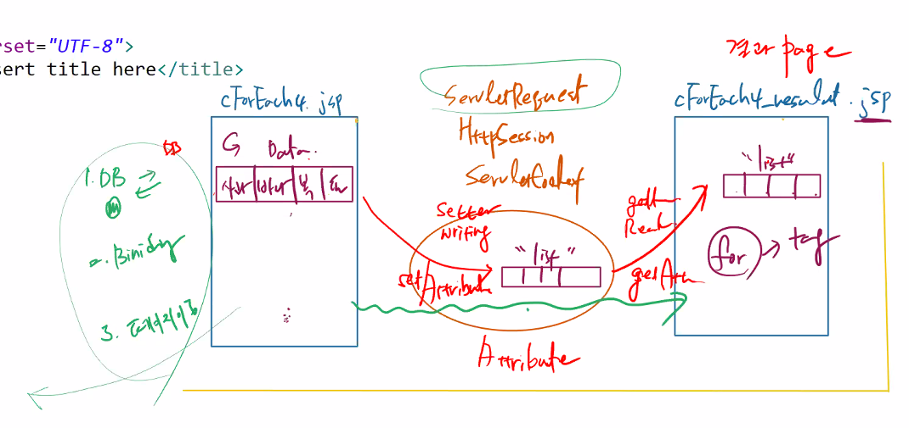
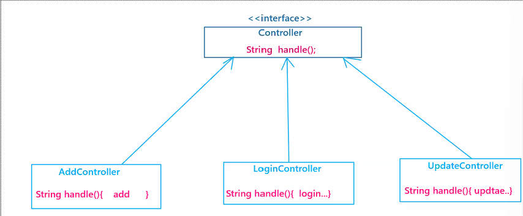
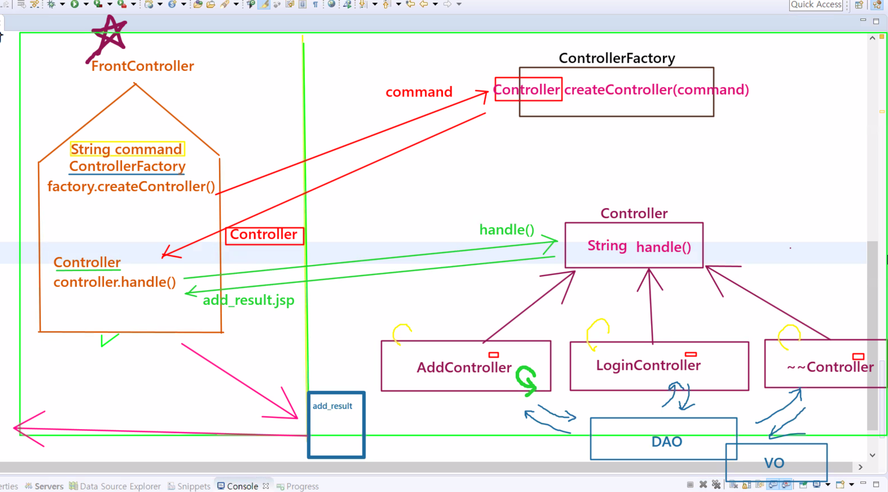

# 21.11.16. web-6일차

## 1116이슈

1. JSTL
2. Factory Method Pattern - `web` 종료
3. Framework Module화

## 1_JSTL

* 실행 전 설정 사항

```jsp
<!-- 이 부분은 tomcat에 포함되어 있지 않다. -->
<!-- prefix는 코어를 의미하는 c로 uri를 포함시켜야함. -->
<%@ taglib prefix="c" uri="http://java.sun.com/jsp/jstl/core" %>
```

* c:if

```jsp
<c:if test="${param.num=='100'}">
	<h1>오늘 100만원 입급하셨습니다.</h1>
</c:if>
<c:if test="${param.num=='200'}">
	<h1>오늘 200만원 입급하셨습니다.</h1>
```

1. 조건문
   * c:if
   * c:choose
2. 반복문
   * c:each

### 1_2 c:choose

```jsp
<h2>c:choose 사용하기</h2>
<c:choose>
	<c:when test="${param.num=='1'}">
		<b>안녕하세요...반갑습니다.</b>
	</c:when>
	<c:when test="${param.num=='2'}">
		<b>그럭저럭 잘 지내고 있습니다.</b>
	</c:when>
	<c:otherwise>
		<b>여기는 여의도 사무실이 아닙니다. 다시 문의 하세요.</b>
	</c:otherwise>
</c:choose>

```

## 1_3 c:forEach



```jsp
```

## 2_ FactoryMethodPattern





