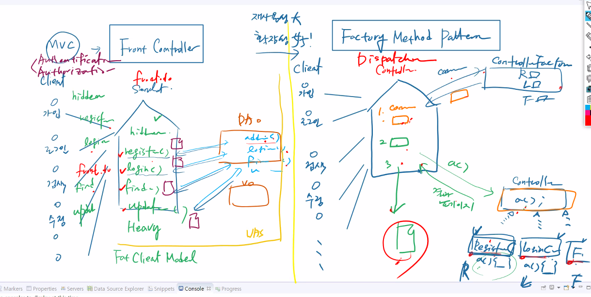
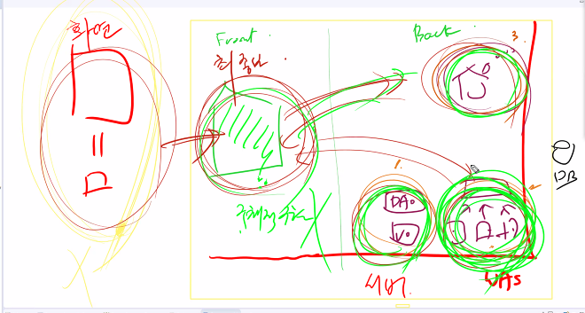
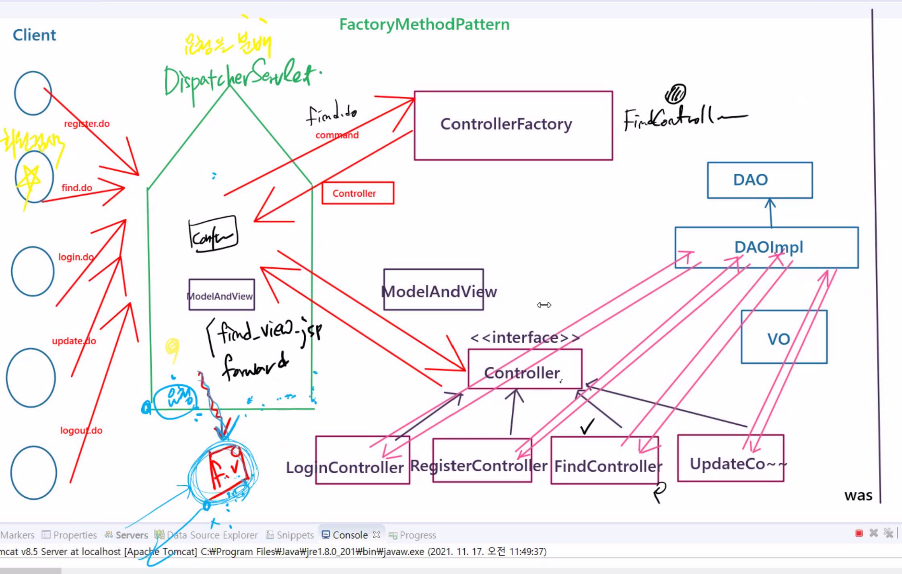
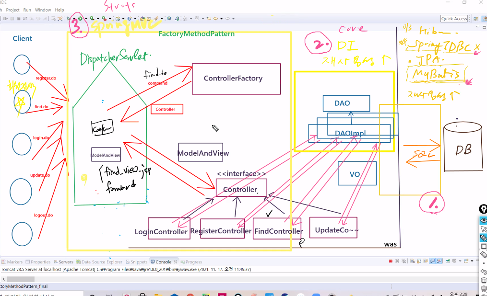
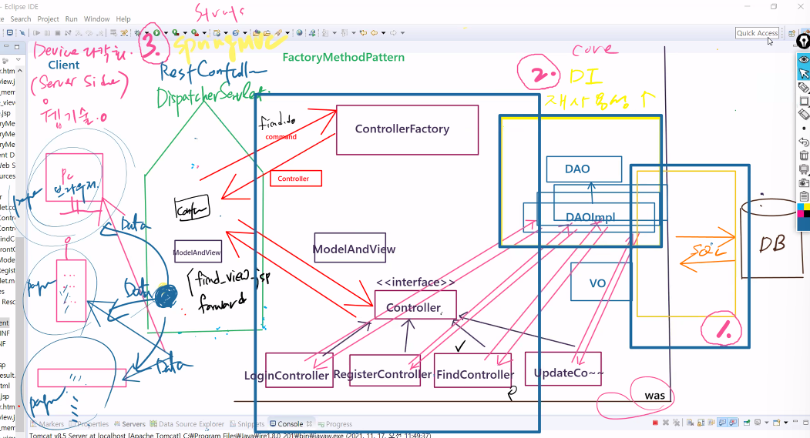
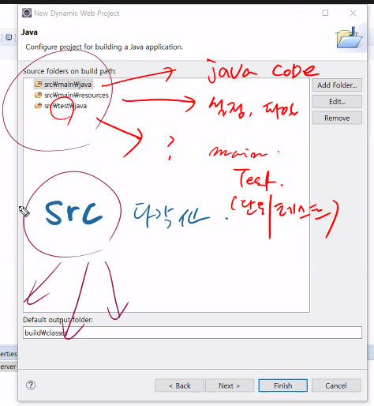
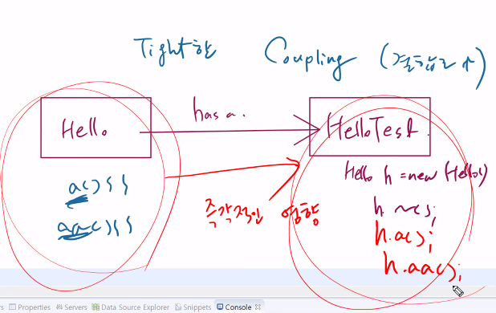
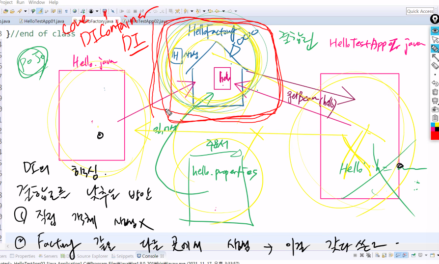
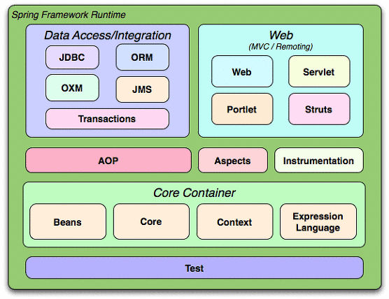

# 21.11.17. spring-1일차

## 1117 이슈

1. Factory Method Pattern
2. Framework Module
3. DI

## 어제의 복습

* src의 다각화



* 네비게이션의 문제

```java
		request.getRequestDispatcher(path).forward(request, response);
```

* 페이지 이동방법은 한가지로만 한다.
* 서블릿이 하나돌아가기때문에, hidden을 command 값을 하나하나 다 붙여줘야함.







## spring



## DI(Dependency Injection)




## Coupling

* 타이트한 커플링





## Spring Framework Module



