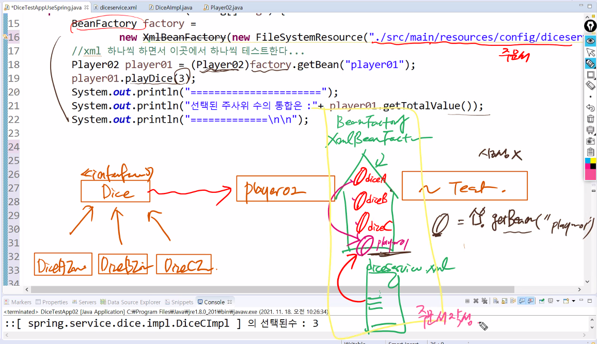
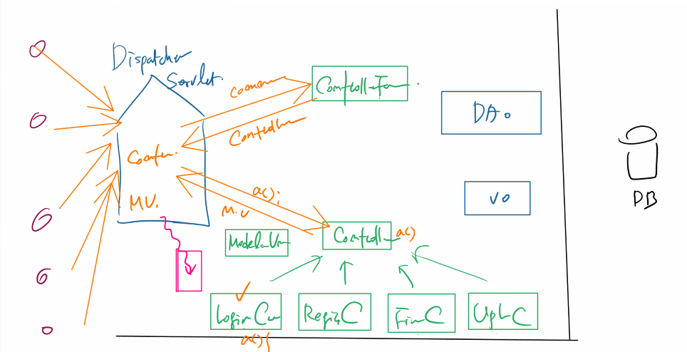
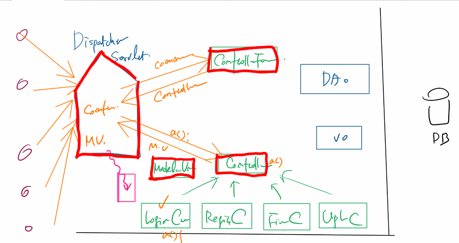
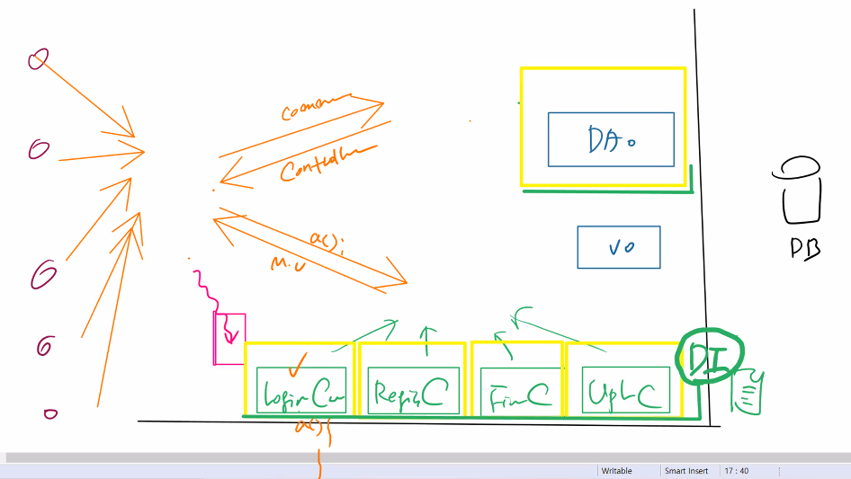
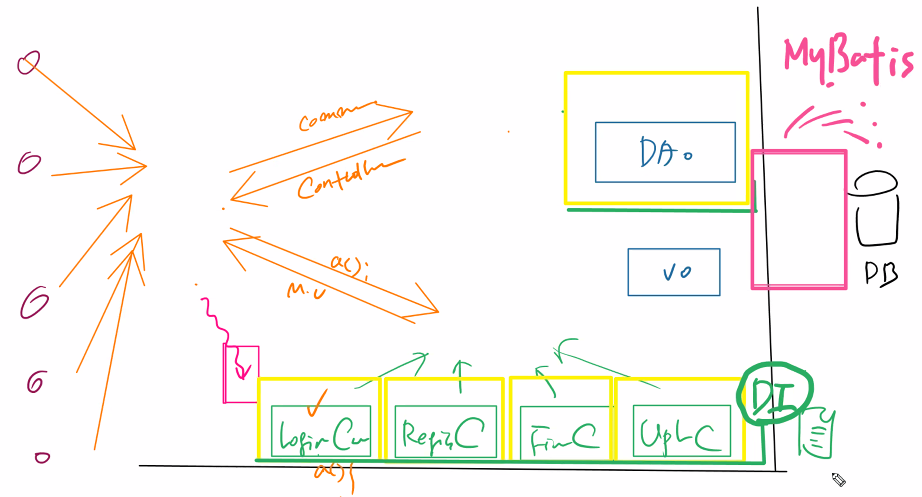
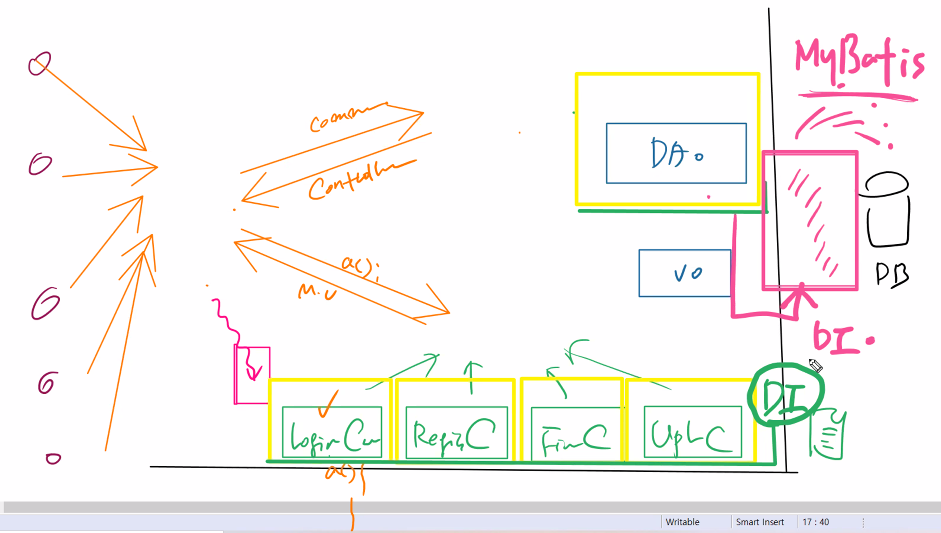
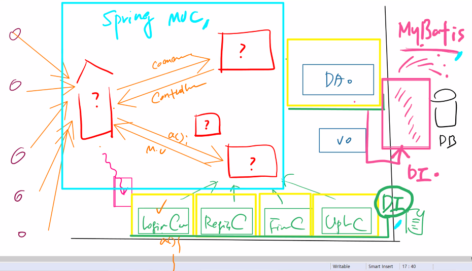
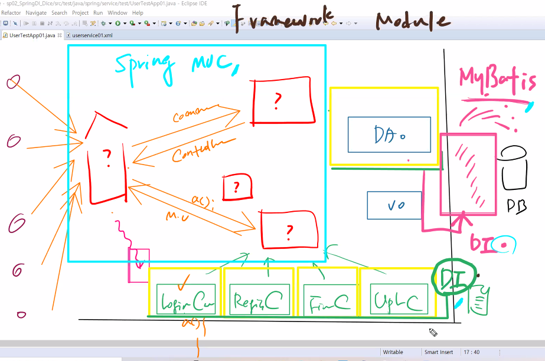
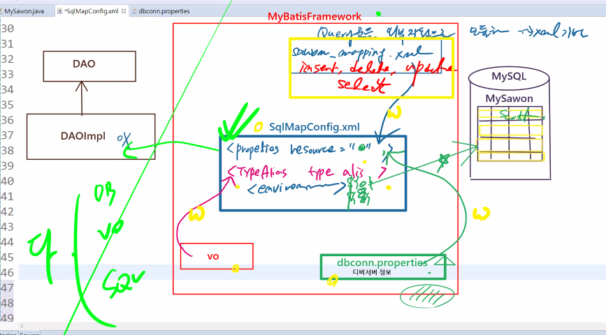

# 21.11.18. spring-2일차

## 1118 수업이슈

















## MyBatis

1. DB에 있는 테이블을 먼저 만든다.

```mysql
mysql> create table mysawon(
    -> num int(10) auto_increment primary key,
    -> id varchar(10) not null,
    -> pwd varchar(20),
    -> name varchar(20),
    -> age int(3),
    -> hiredate date,
    -> constraint mysawon_id_uq unique(id));
Query OK, 0 rows affected (0.03 sec)

mysql> desc mysawon;
+----------+-------------+------+-----+---------+----------------+
| Field    | Type        | Null | Key | Default | Extra          |
+----------+-------------+------+-----+---------+----------------+
| num      | int(10)     | NO   | PRI | NULL    | auto_increment |
| id       | varchar(10) | NO   | UNI | NULL    |                |
| pwd      | varchar(20) | YES  |     | NULL    |                |
| name     | varchar(20) | YES  |     | NULL    |                |
| age      | int(3)      | YES  |     | NULL    |                |
| hiredate | date        | YES  |     | NULL    |                |
+----------+-------------+------+-----+---------+----------------+
6 rows in set (0.01 sec)
```

2. vo를 만든다.

```java
package com.edu.mybatis.vo;

public class MySawon {
	private int num, age; //컬럼명과 동일
	private String id, pwd, name, hiredate; //컬럼명과 동일
	
    //	Framework 기술 사용시 반드시 기본 생성자가 있어야 한다!!!
	//  명시적 생성자가 없다면 그 안에는 자동으로 기본 생성자가 들어가 있다.
	public MySawon() {}
	public int getNum() {
		return num;
	}
	public void setNum(int num) {
		this.num = num;
	}
	public int getAge() {
		return age;
	}
	public void setAge(int age) {
		this.age = age;
	}
	public String getId() {
		return id;
	}
	public void setId(String id) {
		this.id = id;
	}
	public String getPwd() {
		return pwd;
	}
	public void setPwd(String pwd) {
		this.pwd = pwd;
	}
	public String getName() {
		return name;
	}
	public void setName(String name) {
		this.name = name;
	}
	public String getHiredate() {
		return hiredate;
	}
	public void setHiredate(String hiredate) {
		this.hiredate = hiredate;
	}
	
	@Override
	public String toString() {
		return "MySawon [num=" + num + ", age=" + age + ", id=" + id + ", pwd=" + pwd + ", name=" + name + ", hiredate="
				+ hiredate + "]";
	}	
}

```

3. xml을 만든다.
   * 무조건 이렇게 시작!

```xml
<?xml version="1.0" encoding="UTF-8" ?>
<!DOCTYPE configuration
 PUBLIC "-//mybatis.org//DTD Config 3.0//EN"
 "http://mybatis.org/dtd/mybatis-3-config.dtd">
```

```xml
<?xml version="1.0" encoding="UTF-8" ?>
<!DOCTYPE configuration
 PUBLIC "-//mybatis.org//DTD Config 3.0//EN"
 "http://mybatis.org/dtd/mybatis-3-config.dtd">
 <!-- MyBatis에서 핵심이 되는 설정 문서... -->
 <configuration>
 <!-- 1. DB정보  Wiring -->
 <properties resource="config/dbconn.properties"/>
 <!-- 2. vo정보 Wiring -->
 <typeAliases>
 	<!-- 가장좋은 알리아스는 MySawon을 mySawon으로 -->
 	<typeAlias type="com.edu.mybatis.vo.MySawon" alias="mySawon"/>
 </typeAliases>
 <!-- 3. JDBC 환경 구축 -->
 <environments default="DEVELOPMENT">
 	<environment id="DEVELOPMENT">
 		<transactionManager type="JDBC"/>
 		<dataSource type="UNPOOLED">
 			<property name="driver" value="${jdbc.mysql.driver}"/>
 			<property name="url" value="${jdbc.mysql.url}"/>
 			<property name="username" value="${jdbc.mysql.username}"/>
 			<property name="password" value="${jdbc.mysql.password}"/>
 		</dataSource>
 	</environment>
 </environments>
 </configuration>
```

* 도식화

