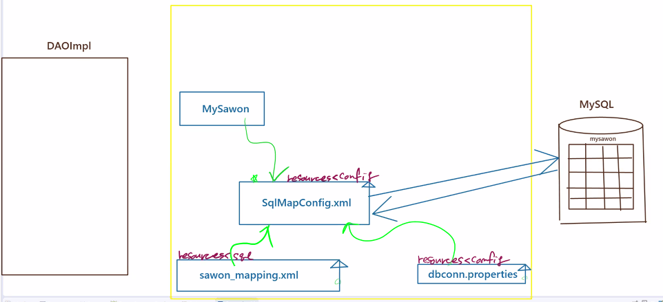
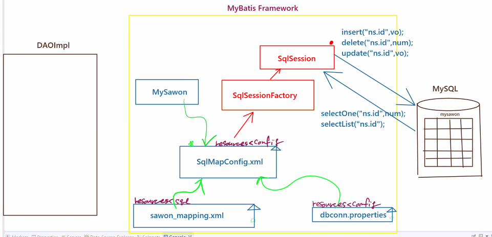

# 21.11.19.  spring-3일차

## 1118 수업 이슈

1. mySql

## mybatis 복습



* `MySawon` : vo - 테이블에 대한 정보를 담음.
* `dbconn.properties`
  * `properties` : 파편적인 정보들을 `map`방식으로 모아둔 것을 이야기 함.
* `sawon_mapping.xml`
* `SqlMapConfig.xml` : 핵심이 되는 문서
  * DB 서버에 대한 정보를 가지고 있음. 
  * vo도 연결할 수 있음.



* `SqlSessionFactory` : `SqlMapConfig.xml`에서 생성된 모든 것을 가져감.
* `SqlSession` : 결론적으로 얻어가기 위한것
  * 쿼리문을 실행하는 session을 가지고 있음. (INSERT, DELETE, UPDATE ... )

### 소스 코드

* `SqlMapConfig.xml` 

```xml
<?xml version="1.0" encoding="UTF-8" ?>
<!DOCTYPE configuration
 PUBLIC "-//mybatis.org//DTD Config 3.0//EN"
 "http://mybatis.org/dtd/mybatis-3-config.dtd">
 <!-- MyBatis에서 핵심이 되는 설정 문서... -->
 <configuration>
 <!-- 1. DB정보  Wiring -->
 <properties resource="config/dbconn.properties"/>
 <!-- 2. vo정보 Wiring -->
 <typeAliases>
 	<!-- 가장좋은 알리아스는 MySawon을 mySawon으로 -->
 	<typeAlias type="com.edu.mybatis.vo.MySawon" alias="mySawon"/>
 </typeAliases>
 <!-- 3. JDBC 환경 구축 -->
 <environments default="DEVELOPMENT">
 	<environment id="DEVELOPMENT">
 		<transactionManager type="JDBC"/>
 		<dataSource type="UNPOOLED">
 			<property name="driver" value="${jdbc.mysql.driver}"/>
 			<property name="url" value="${jdbc.mysql.url}"/>
 			<property name="username" value="${jdbc.mysql.username}"/>
 			<property name="password" value="${jdbc.mysql.password}"/>
 		</dataSource>
 	</environment>
 </environments>
 <!-- 4. SQL Mapper -->
 <mappers>
 	<mapper resource="sql/mysawon_mapping.xml"/>
 </mappers>
 </configuration>
```


* `SqlSessionFactory` , `SqlSession` 

```java
package com.edu.mybatis.test;

import java.io.Reader;

import org.apache.ibatis.io.Resources;
import org.apache.ibatis.session.SqlSession;
import org.apache.ibatis.session.SqlSessionFactory;
import org.apache.ibatis.session.SqlSessionFactoryBuilder;

import com.edu.mybatis.vo.MySawon;

/*
 * MyBatis 프레임워크의 가장 핵심이 되는 설정 문서를 만들었다.
 * SqlMapConfig.xml
 * 
 * 이제 MyBatis프레임워크에서 제공하는 라이브러리 클래스를 이용해서
 * SqlMapConfig.xml을 읽어들이고
 * 쿼리문을 동작시켜보도록 하자.
 */
public class MySawonTestApp01 {

	public static void main(String[] args) throws Exception{
		// 1. 화면의 폼을 통해서 vo를 생성한다는 가정으로...
		MySawon vo = new MySawon();
		vo.setId("ddd");
		vo.setPwd("1224");
		vo.setName("도로시");
		vo.setAge(22);
		
		//2. 핵심이 되는 설정문서를 읽어들인다.
		Reader r = Resources.getResourceAsReader("config/SqlMapConfig.xml");
		
		//3. MyBatis 라이브러리..순서는 천천히 외우시면 됩니다.
		SqlSessionFactory factory = new SqlSessionFactoryBuilder().build(r);
		
		//session 여기에 쿼리문 실행하는 기능이 다 들어있다.
		SqlSession session = factory.openSession();
		
		session.insert("sawonMapper.sawonAdd", vo);
		session.commit();
		
		session.close();
		
		System.out.println(vo.getName()+" 님이 회원등록 성공^^");
	}
}
```


* `mysawon_mapping.xml`

```xml
<?xml version="1.0" encoding="UTF-8" ?>
<!DOCTYPE mapper
 PUBLIC "-//mybatis.org//DTD Mapper 3.0//EN"
 "http://mybatis.org/dtd/mybatis-3-mapper.dtd">
 <mapper namespace="sawonMapper">
	<insert id="sawonAdd" parameterType="mySawon">
		INSERT
		INTO mysawon (id, pwd, name, age, hiredate)
		VALUE (#{id}, #{pwd},#{name},#{age},curdate())
	</insert>
 
 </mapper>
```


## MySql 정리

* SELECT문

```xml
 	<select id="sawonList" resultType="mySawon"> <!-- conection에 제너릭이 들어감. -->
 		SELECT
 		num, id, name, age, hiredate
 		FROM mysawon
 		ORDER BY num DESC
 	</select>
```

* mybatis 세션

```java
package com.edu.mybatis.test;

import java.io.Reader;
import java.util.List;

import org.apache.ibatis.io.Resources;
import org.apache.ibatis.session.SqlSession;
import org.apache.ibatis.session.SqlSessionFactory;
import org.apache.ibatis.session.SqlSessionFactoryBuilder;

import com.edu.mybatis.vo.MySawon;
/*
 * SELECT문을 실행시키는 Test
 */
public class MySawonTestApp02 {

	public static void main(String[] args) throws Exception{
		//1. 핵심이 되는 설정문서를 읽어들인다.
		Reader r = Resources.getResourceAsReader("config/SqlMapConfig.xml");
		
		//2. MyBatis 라이브러리..순서는 천천히 외우시면 됩니다.
		SqlSessionFactory factory = new SqlSessionFactoryBuilder().build(r);
		
		//3. session 여기에 쿼리문 실행하는 기능이 다 들어있다.
		SqlSession session = factory.openSession();
		
		List<MySawon> list = session.selectList("sawonMapper.sawonList"); // namespace.
		for (MySawon vo :list) {
			System.out.println(vo);
		}
	}
}
/*
 * 						SqlSessionFactory --> SqlSession
 * 									SqlSession
 * 	sql query									execute method
 * INSERT INTO ~			===			insert("namespace이름.id, vo);
 * DELETE FROM ~			===			delete("namespace이름.id, PK);
 * UPDATE table ~			===			update("namespace이름.id, vo);
 * ------------------------------------------------------------------------------------
 * SELECT * FROM			===			List<T> selectList("namespace이름.id");
 * 										List<T> selectList("namespace이름.id", "서울");
 * SELECT * FROM where		===			Object	selectOne("namespace이름.id", PK);
 */
```


## myBatis

```mysql
mysql> desc users
    -> ;
+-----------+-------------+------+-----+---------+-------+
| Field     | Type        | Null | Key | Default | Extra |
+-----------+-------------+------+-----+---------+-------+
| user_id   | varchar(10) | NO   | PRI | NULL    |       |
| user_name | varchar(10) | NO   |     | NULL    |       |
| password  | varchar(10) | NO   |     | NULL    |       |
| age       | int(3)      | YES  |     | NULL    |       |
| grade     | int(3)      | YES  |     | NULL    |       |
| reg_date  | date        | YES  |     | NULL    |       |
+-----------+-------------+------+-----+---------+-------+
6 rows in set (0.01 sec)

mysql> SELECT * FROM users;
+-----------+-----------+-----------+------+-------+------------+
| user_id   | user_name | password  | age  | grade | reg_date   |
+-----------+-----------+-----------+------+-------+------------+
| mybatis01 | 홍길동iba | mybatis01 |   10 |     1 | 2019-10-08 |
| mybatis02 | 이순신iba | mybatis02 |   20 |     2 | 2019-10-07 |
| mybatis03 | 김유신iba | mybatis03 |   30 |     3 | 2019-10-02 |
| user01    | 홍길동    | user01    |   10 |     1 | 2019-10-11 |
| user02    | 이순신    | user02    |   20 |     2 | 2019-10-12 |
| user03    | 김유신    | user03    |   30 |     3 | 2019-10-09 |
+-----------+-----------+-----------+------+-------+------------+
6 rows in set (0.00 sec)
```

* SqlMapConfig.xml

```xml
<?xml version="1.0" encoding="UTF-8" ?>
<!DOCTYPE configuration PUBLIC "-//mybatis.org//DTD Config 3.0//EN"
	"http://mybatis.org/dtd/mybatis-3-config.dtd">
<configuration>
	<!-- 1. db정보를 가지고 온다. -->
	<properties resource="config/dbconn.properties"/>
	
	
	<!-- 2. vo를 alias.... -->
	<typeAliases>
		<typeAlias type="ibatis.services.domain.User" alias="user"/>
	</typeAliases>
	
	
	<!-- 3. jdbc 환경 구축 -->
	<environments default="mulcam">
		<environment id="mulcam" >
			<transactionManager type="JDBC"/>
			<dataSource type="UNPOOLED">
				<property name="driver" value="${jdbc.mysql.driver}"/>
				<property name="url" value="${jdbc.mysql.url}"/>
				<property name="username" value="${jdbc.mysql.username}"/>
				<property name="password" value="${jdbc.mysql.password}"/>
			
			</dataSource>
		</environment>
	</environments>
	<!-- sql mapper -->
	<mappers>
		<mapper resource="sql/mybatis-userservice-mapping.xml"/>
		<mapper resource="sql/mybatis-userservice-mapping01.xml"/>
	</mappers>
</configuration>
```

### SELECTALL

* mybatis-userservice-mapping.xml

```xml
<?xml version="1.0" encoding="UTF-8" ?>
<!DOCTYPE mapper PUBLIC "-//mybatis.org//DTD Mapper 3.0//EN"
	"http://mybatis.org/dtd/mybatis-3-mapper.dtd">

<!--	
	mybatis-userservice-mapping.xml : SQL 를 갖는 설정화일 (MetaData) 
	- MyBatis Framework 은 XML MetaData를 사용 SQL구문을 관리하며,
	  (SQL은 xml 을 통해 적절히 캡슐화 되어 애플리케이선 의 외부로 분리함)
	- SQL문의 입력(?) / 출력(?)을 매핑한다.  <== 아래의 select element 참조
 -->
 
<!-- SQL definition -->
<mapper namespace="UserMapper">
	<!--
		ㅇ Application 에서 User.getUserList id 로 아래의 SQL 을 참조 할 수 있다.    
	 -->
	 
	 <!-- 
	 	입력(?) / 출력(?) 관리의 이해
	 	- 아래의 query 수행 후 결과 resultType attribute 에 선언된 UserVO 객체 Field
	 	  ( property )에 자동연결(?,자동 바인딩)
	 	- SQL/Query 의 별칭(Alias)와 UserVO객체의 Field 의 변수이름이 동일한 것 확인.  
	  -->
<!-- selectUserList -->
<!-- 
	select 에서 컬럼명과 필드명이 다르면 값을 못받아온다.. 알리야스를 사용해서 이 문제를 해결한다.
	select 절에서의 컬럼이름은 vo alias 이름과 상호 호환된다.
	user_id ====   setUserId() | getUserId()     X
	userId  ====   setUserId() | getUserId()     O
	
	DB 테이블의 colunm명과 vo 클래스의 field명을 일치시키는 것이 좋다.
	만약, 컬럼명과 필드명이 일치하지 않는 경우에는
	컬럼의 alias를 필드명으로 해주어야 값이 null로 나오는 것을 방지 할 수 있다.
-->
 	<select id="getUserList" resultType="user"> <!-- conection에 제너릭이 들어감. -->
 		SELECT
 		user_id AS userId, <!-- AS를 이용하여 field명을 통일화 -->
 		user_name AS userName, 
 		password, 
 		age, 
 		grade, 
 		reg_date AS regDate
 		FROM users
 	</select>
	
</mapper>
```

* MyBatisTestApp.java

```java
package ibatis.services.user.test;

import ibatis.services.domain.User;

import java.io.Reader;
import java.util.List;

import org.apache.ibatis.io.Resources;
import org.apache.ibatis.session.SqlSession;
import org.apache.ibatis.session.SqlSessionFactory;
import org.apache.ibatis.session.SqlSessionFactoryBuilder;


/**
 * FileName : MyBATISTestApp.java
  * ㅇ JBDCTestApp.java 와 비교 이해.
  * ㅇ mybatis Framework 에서 제공하는 API을 사용 users table 의 정보 SELECT   
 */
public class MyBatisTestApp {
	///Main method
	public static void main(String[] args) throws Exception{
		
		Reader reader=Resources.getResourceAsReader("config/SqlMapConfig.xml");		
		
		//==> 2. Reader 객체를 이용 xml metadata 에 설정된 각정 정보를 접근, 사용가능한 
		//==>    읽어들인 reader를 바탕으로 SqlSessionFactory를 리턴받는다.
		SqlSessionFactory factory=new SqlSessionFactoryBuilder().build(reader);
		
		//==> 3.factory의 openSession()을 통해서 SqlSession을 리턴 받는다.
		SqlSession session=factory.openSession();
		///////////////////////////////////////////////////////////////////////		
		List<User> list=session.selectList("UserMapper.getUserList");
		System.out.println("#####################################");
		System.out.println(":: 회원정보 출력");
		
		for (User user : list) {
			System.out.println(user) ;
		}
		System.out.println("#####################################");
	}// end of main
}//end of class

/*
 * ■ MyBATISTestApp / JDBCTestApp 를 통한 MyBATIS Framework 의 이해
 * ㅇ SQL,커넥션,트랜잭선 를 메타데이타 캡술화였으며, 
 *     :: 참조 => SqlMapConfig.xml / mybatis-userservice-mapping.xml
 * ㅇ JDBC철차 :  Connection => Statement => ResultSet
 *      resource 관리 : close
 *      query 수행 결과 비지니스객체(VO) 바인딩 JDBC API 를 사용하여 수행시 반복적으로 반드시
 *      수행하는 일련의 과정을 수행함.
 *      :: 참조 =>List<User> list = session.selectList("User.getUserList");
 *  
 *  ■ MyBATIS Framework 의 장점
 *  ㅇ 작고 간단하다 ( mybatis-3.2.8.jar / 약 400kb / 다른 라이브러리와 의존관계 없다. )
 *  ㅇ 기존 애플리케이션/테이터베이스 변경 불필요 
 *      (SQL Mapper(Data Mapper) =>SQL 과 비지니스 객체와의 바인딩)
 *  ㅇ 생산성 / 성능 / 작업의 분배 (소스코드와 SQL 의 분리)
 *  ㅇ 관심사의 분리 
 *       ( DBMS 에 독립적인 API제공 및 JDBC API가 아닌 비지니스 객체만 가지고 작업가능)
 *        
  *  ■ MyBATIS Framework 은 JDBC 절차를 간결화한 lib 이다
  *     ( JDBC를 절차 은익한 lib)        
*/

```

### SELECTONE

* mybatis-userservice-mapping01.xml

```xml
<?xml version="1.0" encoding="UTF-8" ?>
<!DOCTYPE mapper PUBLIC "-//mybatis.org//DTD Mapper 3.0//EN"
	"http://mybatis.org/dtd/mybatis-3-mapper.dtd">

<!-- 
	id = getUser, findUserId에 해당하는 SELECT문을 작성하는 쿼리문
	1. #{VALUE}
	parameterType에 연결된 단순 파라미터 값을 받을때, 사용하는 문법
	#{} 안에 들어가는 VALUE는 상징적인 값으로 아무 변수 이름을 넣어도 상관없다.
	
	2. parameterType이 vo의 alias인 경우,
		#{userId} #{password}
		vo의 getUserId() getPassword와 연결되는 getter문법이다.
 -->
 
<!-- SQL definition -->
<mapper namespace="UserMapper01">
	<select id="getUser" parameterType="string" resultType="user">
 		SELECT
 		user_id AS userId,
 		user_name AS userName, 
 		password, 
 		age, 
 		grade, 
 		reg_date AS regDate
 		FROM users
 		WHERE user_id LIKE #{VALUE}
	</select>
	<select id="findUserId" parameterType="user" resultType="string">
		SELECT
		user_name
		FROM
		users
		WHERE user_id = #{userId} <!-- user.getUserId() -->
		AND password = #{password}
	</select>
</mapper>
```

* MyBatisTestApp01.java

```java
<?xml version="1.0" encoding="UTF-8" ?>
<!DOCTYPE mapper PUBLIC "-//mybatis.org//DTD Mapper 3.0//EN"
	"http://mybatis.org/dtd/mybatis-3-mapper.dtd">

<!-- 
	id = getUser, findUserId에 해당하는 SELECT문을 작성하는 쿼리문
	1. #{VALUE}
	parameterType에 연결된 단순 파라미터 값을 받을때, 사용하는 문법
	#{} 안에 들어가는 VALUE는 상징적인 값으로 아무 변수 이름을 넣어도 상관없다.
	
	2. parameterType이 vo의 alias인 경우,
		#{userId} #{password}
		vo의 getUserId() getPassword와 연결되는 getter문법이다.
 -->
 
<!-- SQL definition -->
<mapper namespace="UserMapper01">
	<select id="getUser" parameterType="string" resultType="user">
 		SELECT
 		user_id AS userId,
 		user_name AS userName, 
 		password, 
 		age, 
 		grade, 
 		reg_date AS regDate
 		FROM users
 		WHERE user_id LIKE #{VALUE}
	</select>
	<select id="findUserId" parameterType="user" resultType="string">
		SELECT
		user_name
		FROM
		users
		WHERE user_id = #{userId} <!-- user.getUserId() -->
		AND password = #{password}
	</select>
</mapper>
```

