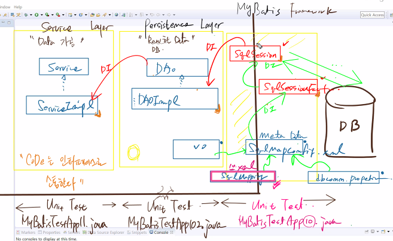
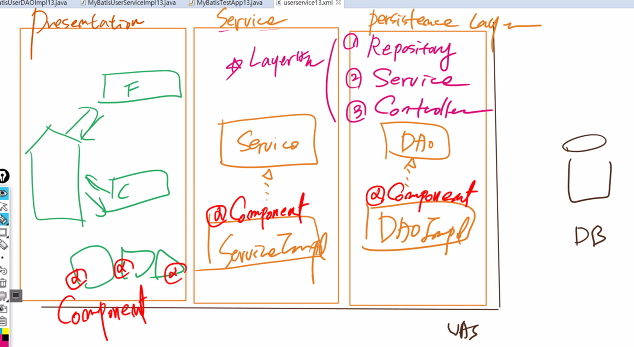
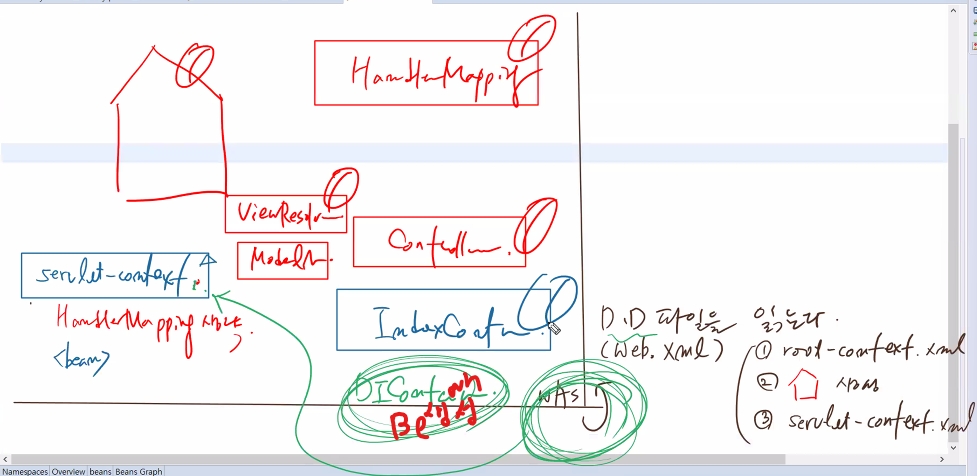
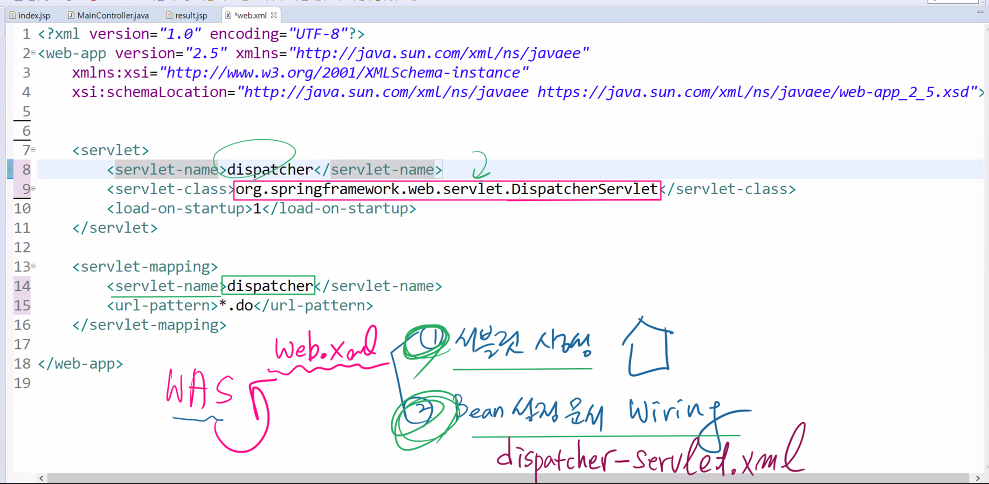

# 21.11.23. spring-5일차

## 어제 복습



## 1123 수업 이슈

1. MyBatis DI 연결
   * Annotation
2. Spring MVC - Maven
3. Spring MVC - MyBatis - DI

## MyBatis를 DI로 연결

* userservice12.xml

```xml
<?xml version="1.0" encoding="UTF-8"?>

<!-- MyBatis와 DI 연결 -->
<beans xmlns="http://www.springframework.org/schema/beans"
	xmlns:xsi="http://www.w3.org/2001/XMLSchema-instance"
	xmlns:context="http://www.springframework.org/schema/context"
	xsi:schemaLocation="http://www.springframework.org/schema/beans http://www.springframework.org/schema/beans/spring-beans.xsd
	http://www.springframework.org/schema/context http://www.springframework.org/schema/context/spring-context-4.0.xsd">
	
	<context:property-placeholder location="classpath:config/dbconn.properties"/>
	
	<!-- 1. DataSouce API Bean -->
	<bean id="dataSource" class="org.apache.commons.dbcp.BasicDataSource">
		<property name="driverClassName" value="${jdbc.mysql.driver}"/>
		<property name="url" value="${jdbc.mysql.url}"/>
		<property name="username" value="${jdbc.mysql.username}"/>
		<property name="password" value="${jdbc.mysql.password}"/>
	</bean>
	
	<!-- 2. MyBatis API Bean :: SqlSessionFactoryBean -->
	<bean id="sqlSessionFactoryBean" class="org.mybatis.spring.SqlSessionFactoryBean">
		<property name="configLocation" value="classpath:config/SqlMapConfig.xml"/>
		<property name="dataSource" ref="dataSource"/>
	</bean>
	
	<!-- 3. MyBatis API Bean :: SqlSession -->
	<bean id="sqlSession" class="org.mybatis.spring.SqlSessionTemplate">
		<!-- 생성자 주입 -->
		<constructor-arg ref="sqlSessionFactoryBean"/>
	</bean>
	<!-- 4. DAOImpl12 사용자 정의 Bean -->
	<bean id="myBatisUserDAOImpl12" class="ibatis.services.user.impl.MyBatisUserDAOImpl12">
		<property name="sqlSession" ref="sqlSession"/>
	</bean>
	
	<!-- 5. ServiceImpl12 사용자 정의 -->
	<bean id="myBatisUserServiceImpl12" class="ibatis.services.user.impl.MyBatisUserServiceImpl12">
		<property name="userDAO" ref="myBatisUserDAOImpl12"></property>
	</bean>
</beans>
```

#### Annotation -> xml 빈 설정문서 (주문서)

간단해진다.

## presentation layer



## maven 기반

com

 - edu
   - XXXXX
   - spring
     - mybatis
     - 
 - marketing

1. 패키지를 3층 이상 넣기
2. src의 다각화

## MAven 기반이란?

1. project 생성시 package 계층을 최소 3개 이상 요구!

   ex) com.edu.spring

   group id artifact id

2. src 다각화 

   java code

   설정문서

   unittest code

3. 라이브러리를 일일이 추가 하지 않아도 됨.

   pom.xml

4. sts 기능을 추가하면 spring configuration File을 생성할 수 있음.

## 레이어 정리




## WAS 설정 - web.xml



1. 서블릿 생성
2. Bean 설정 문서 Wiring

