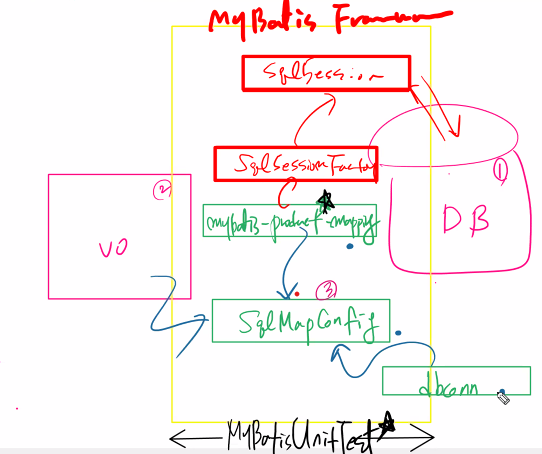
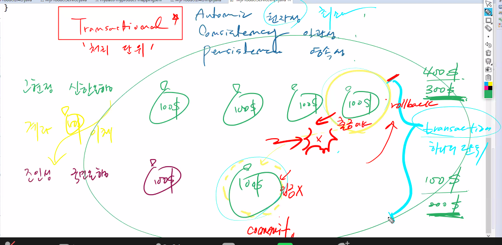

# 21.11.24. spring-6일차

## 과제


## sp04_SpringMVC_Product

### mybatis 까지


### MyBatisFramework 완성



## 트랜잭션 처리



```java
@Service
@Transactional
public class MyProductServiceImpl implements MyProductService {
	
	@Autowired
	private MyProductDAO myProductDAO;
	
	@Transactional
	@Override
	public void addProduct(MyProduct vo) throws Exception {
		myProductDAO.addProduct(vo);
	}
```

* 트랜잭션 처리는 Service Layer에서 한다.
