21.11.25. spring-7일차

## 지금까지의 복습

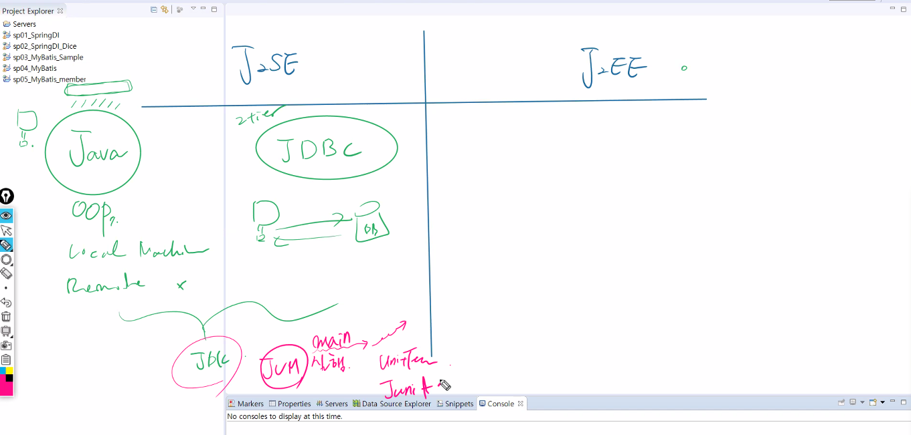

* JAVA과정
  * java + oop
  * JDBC

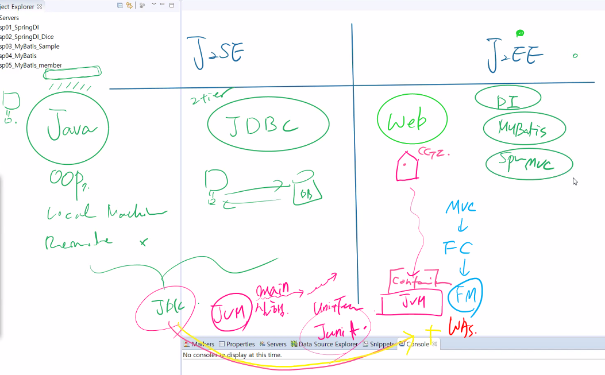

* J2EE

  * web
    * JVM+ WAS
    * MVC -> FC --> FM

  * DI
  * MyBatis
  * SpringMVC

### DI Container

* BeanFactory
* Application Context
* WebApplication Context

## 순서

### MyBatis 단위테스트

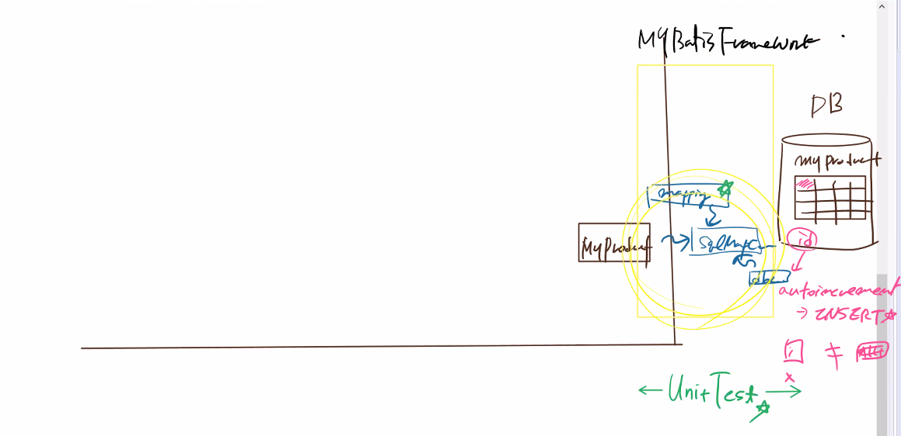

* 이후

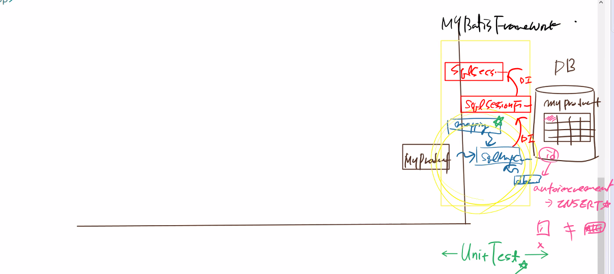

### MyBatis의 unit Test 후

* Persistence Layer 설정
* Service Layer 설정

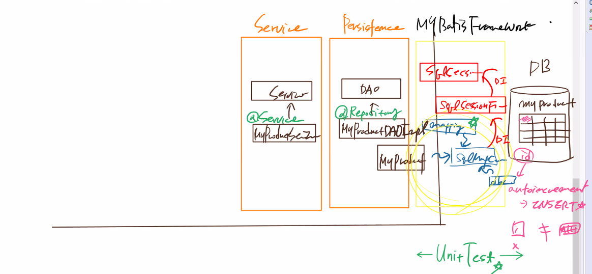

### 화면 설계

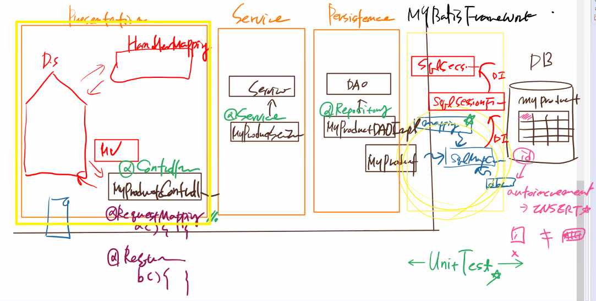

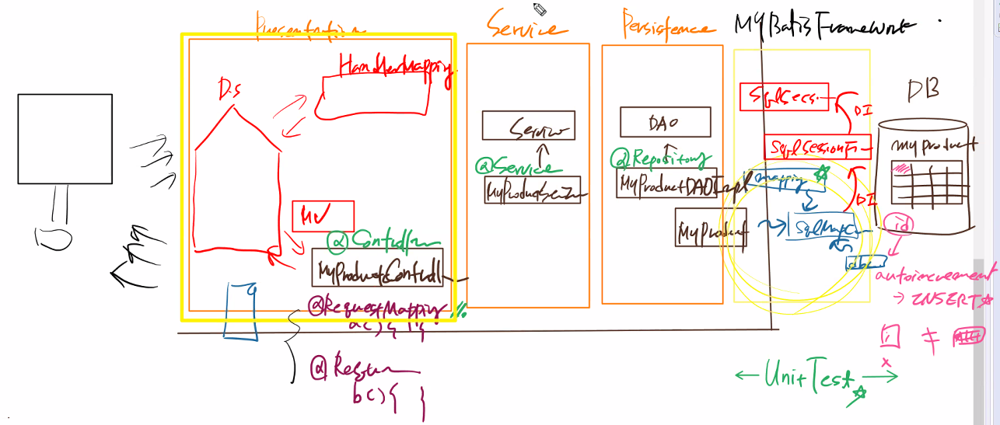

### 비즈니스 로직 설명

* 2 Architecture Layer

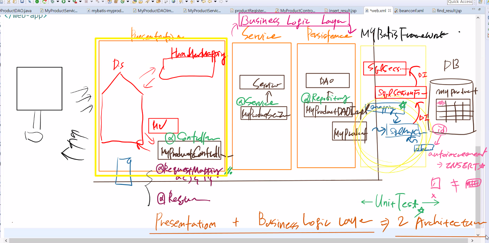

### 개발 순서

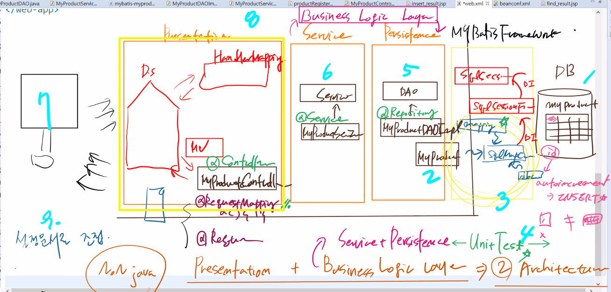

## 화면 형성

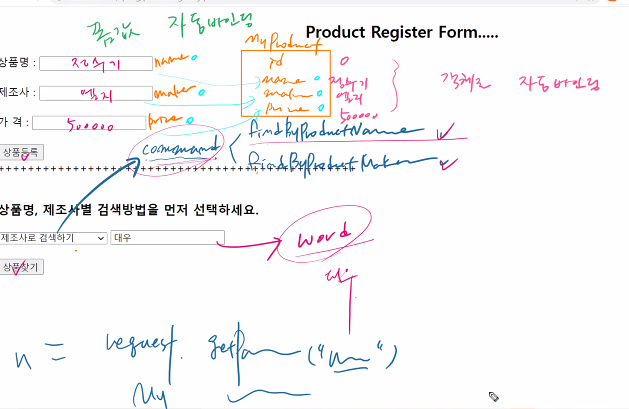

* 자동바인딩

```jsp
<%@ page language="java" contentType="text/html; charset=UTF-8"
    pageEncoding="UTF-8"%>
<!DOCTYPE html>
<html>
<head>
<meta charset="UTF-8">
<title>Insert title here</title>
</head>
<body>
<h2 align="center">Product Register Form.....</h2>
<form action="myProduct.do" method="post">
상품명 : <input type="text" name="name"><br><br>
제조사 : <input type="text" name="maker"><br><br>
가  격 : <input type="text" name="price"><br><br>
<input type="submit" value="상품등록">
</form>
++++++++++++++++++++++++++++++++++++++++++++++++

```
```java
package com.edu.spring.controller;

import java.util.List;

import org.springframework.beans.factory.annotation.Autowired;
import org.springframework.stereotype.Controller;
import org.springframework.web.bind.annotation.RequestMapping;
import org.springframework.web.servlet.ModelAndView;

import com.edu.spring.domain.MyProduct;
import com.edu.spring.model.MyProductService;

@Controller
public class MyProductController {
	
	@Autowired
	private MyProductService myProductService;
	
	@RequestMapping("myProduct.do")
	public ModelAndView insert(MyProduct pvo) throws Exception{
		System.out.println("DB입력 전..."+pvo.getId());
		myProductService.addProduct(pvo); //DAO --> sqlSession --> DB에 insert
		System.out.println("DB입력 후..."+pvo.getId());
		//ServletRequset에 바인딩 되어지고 insert_result.jsp에 forward되어진다.
		return new ModelAndView("insert_result", "info", pvo);
	}
	

```
```java
<br><br>
<h3>상품명, 제조사별 검색방법을 먼저 선택하세요.</h3>
<form action="myProductSearch.do">
<select name="command">
	<option value="===아래에서 선택하세요 ==="></option>
	<option value="findByProductName">상품명으로 검색하기</option>
	<option value="findByProductMaker">제조사로 검색하기</option>
	<option value="findByProductId">상품 아이디로 검색하기</option>
</select>
<input type="text" name="word"><br><br>
<input type="submit" value="상품찾기">
</form>
</body>
</html>
```
```java
	@RequestMapping("myProductSearch.do")
	public ModelAndView search(String word, String command) throws Exception{
		ModelAndView mv = null;
		if(command.equals("findByProductName")) {
			List<MyProduct> list = myProductService.findProductByName(word);
			mv = new ModelAndView("find_result", "list", list);
		}
		
		return mv;

		}
		
	}
```
## web.xml이 무얼하는지?

```xml
<?xml version="1.0" encoding="UTF-8"?>
<web-app version="2.5" xmlns="http://java.sun.com/xml/ns/javaee"
	xmlns:xsi="http://www.w3.org/2001/XMLSchema-instance"
	xsi:schemaLocation="http://java.sun.com/xml/ns/javaee https://java.sun.com/xml/ns/javaee/web-app_2_5.xsd">

	<servlet>
		<servlet-name>appServlet</servlet-name>
		<servlet-class>org.springframework.web.servlet.DispatcherServlet</servlet-class>
		<init-param>
			<param-name>contextConfigLocation</param-name>
			<param-value>classpath:beans/beanconf.xml</param-value>
		</init-param>
		<load-on-startup>1</load-on-startup>
	</servlet>
		
	<servlet-mapping>
		<servlet-name>appServlet</servlet-name>
		<url-pattern>*.do</url-pattern>
	</servlet-mapping>
	
	<!-- 한글처리 -->
	<filter>
		<filter-name>encodingFilter</filter-name>
		<filter-class>org.springframework.web.filter.CharacterEncodingFilter</filter-class>
		<init-param>
			<param-name>encoding</param-name>
			<param-value>utf-8</param-value>
		</init-param>
	</filter>
	<filter-mapping>
		<filter-name>encodingFilter</filter-name>
		<url-pattern>/*</url-pattern>
	</filter-mapping>

</web-app>

```

1. dispatcherservlet을 만듦.
2. beanservlet을 만듦.

## WAS의 역할

1. DD를 읽는다.
   * `web.xml`
2. Bean설정문서를 연결
   * wiring 한다. : `beanconf.xml` 을 WAS가 찾는다.


### 설정문서가 만들어지는 과정

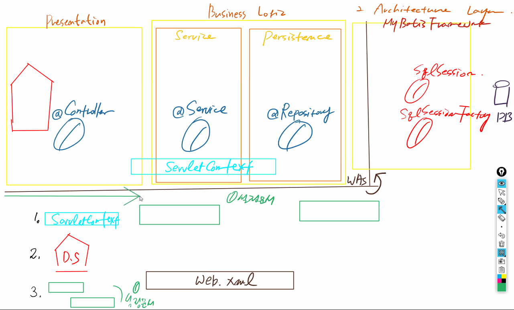

1. Servlet Context를 만든다.
2. Dispatcher
3. 설정문서를 만든다.
4. 설정 문서 wiring

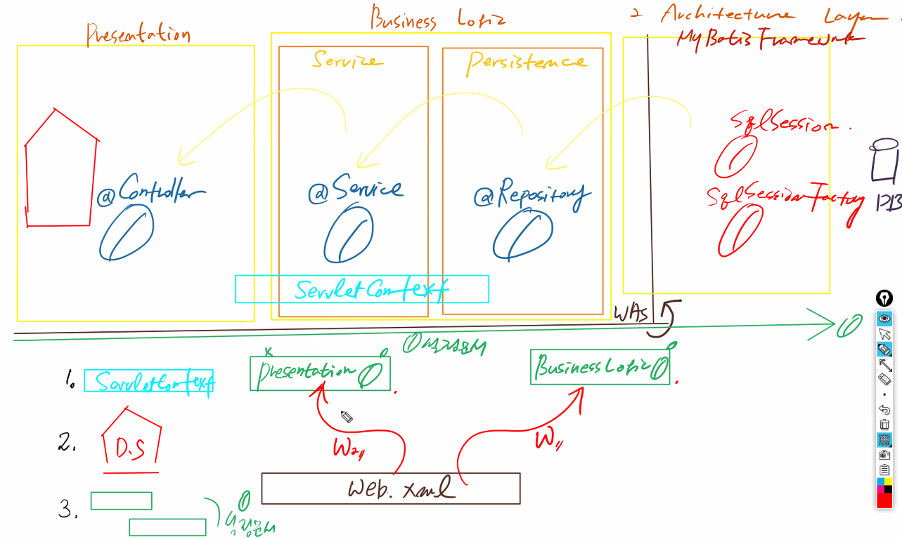

5. 모듈화의 기준 (우리는 레이어 기준)

   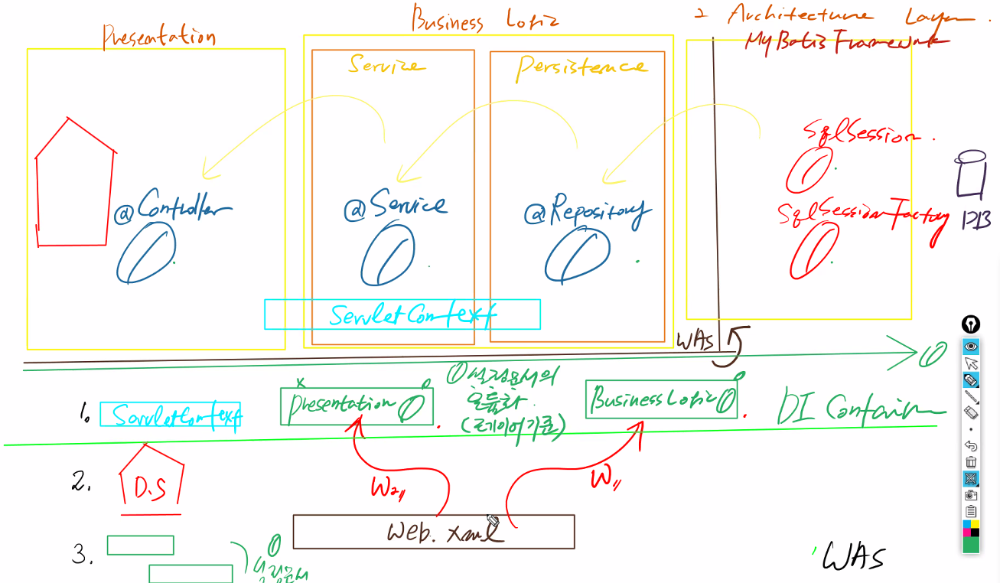

## sp05_SpringMVC_fruits

### 1. 테이블 생성

```mysql
Create table item(
item_id  int(5),
item_name varchar(20),
price int(6),
description varchar(500),
picture_url varchar(20),
primary key(item_id));


INSERT INTO item VALUES(1,'레몬',50,'레몬에 포함된 구연산은 피로회복에 좋습니다','img/lemon.jpg');
INSERT INTO item VALUES(2,'오렌지',100,'비타민c가 풍부합니다 생과일쥬스로 마시면 좋습니다','img/orange.jpg');
INSERT INTO item VALUES(3,'키위',200,'비타민c가 매우 풍부합니다 미용에 좋습니다','img/kiui.jpg');
INSERT INTO item VALUES(4,'포도',300,'폴리페놀을 다량 함유하고 있어 항산화작용을 합니다','img/budou.jpg');
commit;


mysql> desc item;
+-------------+--------------+------+-----+---------+-------+
| Field       | Type         | Null | Key | Default | Extra |
+-------------+--------------+------+-----+---------+-------+
| item_id     | int(5)       | NO   | PRI | NULL    |       |
| item_name   | varchar(20)  | YES  |     | NULL    |       |
| price       | int(6)       | YES  |     | NULL    |       |
| description | varchar(500) | YES  |     | NULL    |       |
| picture_url | varchar(20)  | YES  |     | NULL    |       |
+-------------+--------------+------+-----+---------+-------+
5 rows in set (0.01 sec)
```

### 2. vo 생성

```java
package com.edu.spring.domain;

public class Item {
	private int itemNumber;		//item_id
	private String name;		//item_name
	private int price;
	private String description;
	private String url;			// picture_url
	private int count;
	
	//기본생성자
	public Item(int itemNumber, String name, int price, String description, String url, int count) {
		super();
		this.itemNumber = itemNumber;
		this.name = name;
		this.price = price;
		this.description = description;
		this.url = url;
		this.count = count;
	}
	//명시적 생성자
	public Item() {	}
	
	public Item(int itemNumber) {
		this.itemNumber = itemNumber;
	}
	
	public Item(int itemNumber, String name, int price, String description, String url) {
		super();
		this.itemNumber = itemNumber;
		this.name = name;
		this.price = price;
		this.description = description;
		this.url = url;
	}
	public int getItemNumber() {
		return itemNumber;
	}
	public void setItemNumber(int itemNumber) {
		this.itemNumber = itemNumber;
	}
	public String getName() {
		return name;
	}
	public void setName(String name) {
		this.name = name;
	}
	public int getPrice() {
		return price;
	}
	public void setPrice(int price) {
		this.price = price;
	}
	public String getDescription() {
		return description;
	}
	public void setDescription(String description) {
		this.description = description;
	}
	public String getUrl() {
		return url;
	}
	public void setUrl(String url) {
		this.url = url;
	}
	public int getCount() {
		return count;
	}
	public void setCount(int count) {
		this.count = count;
	}
	@Override
	public String toString() {
		return "Item [itemNumber=" + itemNumber + ", name=" + name + ", price=" + price + ", description=" + description
				+ ", url=" + url + ", count=" + count + "]";
	}
	
	
}
```

### 3. 설정문서

#### MyBatisFramework 구축

* src/main/resources
  * config
    * dbconn.properties
    * SqlMapConfig.xml
  * mapper
    * item-shopping-mapping.xml

