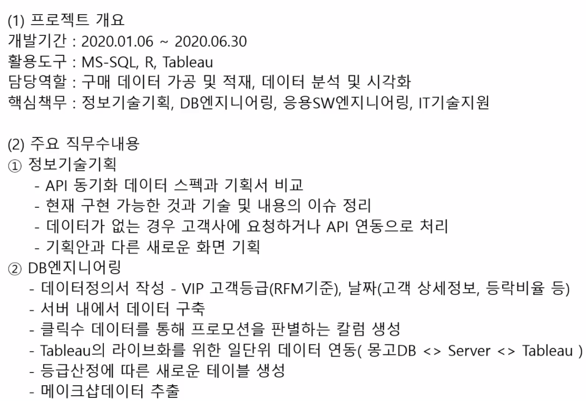
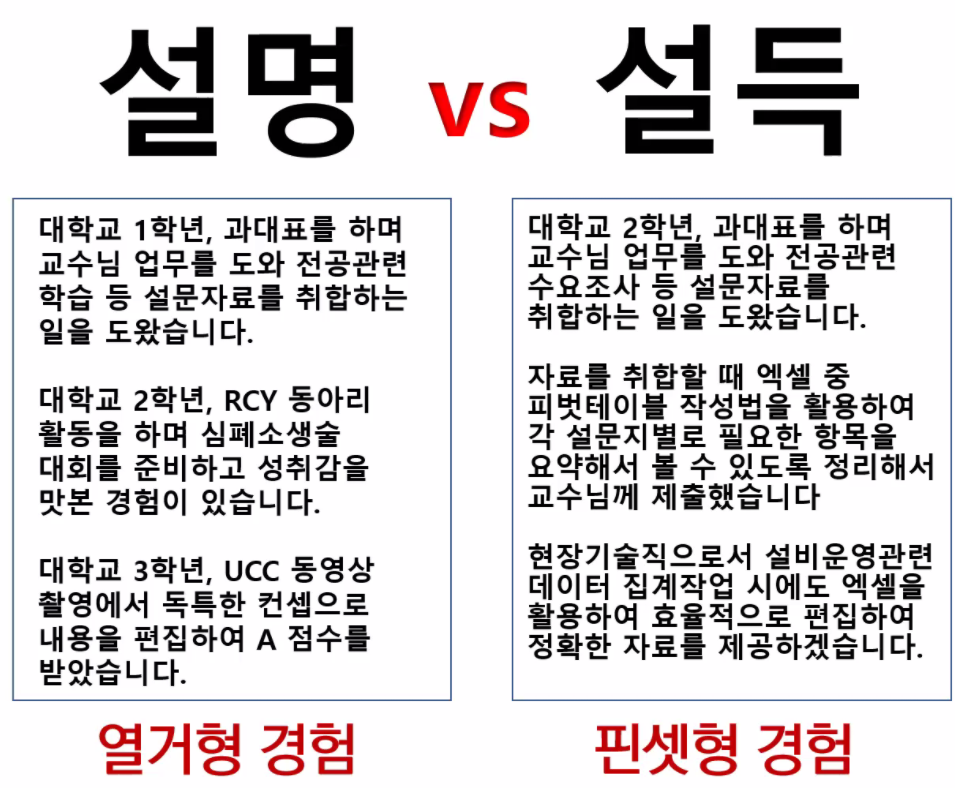

# 21.11.26. 자소서 특강

## 툴은 그렇게 중요하지 않다.

* 파워포인트
* 노션
* 워드 베이스

## 자소서의 비중

* 코딩테스트를 보는 경우엔 자소서의 비중이 중요
* 그렇지 않은 경우엔 포트폴리오가 더 중요.

## 1_기업이 원하는 인재

### 인재?

* 유능하지 않아서 실패한 것이 아닌가?
* **적합한 인재**

### 기업에게 적합성이란?

|                    태도 적합성                    |                 직무 적합성                  |                      분야 적합성                      |
| :-----------------------------------------------: | :------------------------------------------: | :---------------------------------------------------: |
| 신입사원으로서의 예의있고 명랑한 분위기가 있는가? | 직무수행에 필요한 지식, 기술, 태도가 있는가? | 지원 분야 특성에 걸맞는 성향적 특성, 분위기가 있는가? |

## 2_직무적합성

2021 대기업 자소서 예시

* 수행해왔던 프로젝트 프로젝트별 역할 성과들을 잘 고도화 시켜야함.

### 뽑히는 인재 : 네카라쿠배

그 회사의 채용공고를 들어가보면 됨.

* 직무 전문성 위주의 채용공고가 진짜 많음.
* 조금이라도 배운게 있다면 연결해봐야함.
* 파이썬 해봤어, R해봤어 가 아닌 어떤 업무를 할때, python을 R을 사용하겠구나 하고 생각!

### 네카라쿠배의 공통점

개발자 채용에서 지원서를 받기 이전에 두 차례의 코딩테스트를 먼저 실시한다, 지원자가 개발자로서의 직무역량이 있는지를 확인함.

카카오 : 이름, 이메일, 전화번호, 지원부서 만 받고 뽑으려 함.

최근 IT기업들은 신입 인력 채용을 늘려가고 있다. 

경력 사원들이 가지고 있는 한계가 분명함. 평생 고용 종신 고용은 아니지만,,,

점진적 성장으로 신입사원의 비율이 중요함.

##### 꾸준히, `학습하는 인재`라는 것을 어필해야함.

### 기업 채용 키워드

* 경력직(중고신입) 선호

직무 관련 프로젝트, 기업은 무엇을 평가하고자 하는가?

프로그래밍 언어능력, 알고리즘 능력만을 평가하고자 함은 아닐 것 입니다.

전공자들은 컴퓨터에 대한 체계적 학습을 해온 경험

## 2_태도적합성

### 자소서는 단순한 글쓰기가 아니다. 

: 내가 이 일에 대하여 어떻게 얼마나 고민해왔는지가 담겨 있어야 함.

자소서를 명확하게 잘 쓰시는 분들이 대부분 면접을 잘 보게 되어 있음. 

이야기를 하면서 자소서를 씀. 알기는 아는데 **대충** 알고 있음.

왜 이런게 필요하고 무엇이 중요한지 정확하게 모르기 때문에 뒤죽박죽...!

#### 이 분야에 대해서 잘 알고 있는 사람만이 잘 쓸 수 있음.

### 2_1 꾸준함

* 좋은 개발자는 '공부하는' 개발자

* 짬데이를 갖는 회사 : 왓챠

* 10년후 간단한 코드는 인공지능이 짤거 같다.

  일정 수준 이하의 개발다들은 쓰임새가 사라질 것

#### 왜 꾸준함이 중요한가?

* 특정 기술 또는 지식을 실제 필요한 업무와 같은 환경에서 효율적으로 사용하기 위해 드는 학습비용
* 특정 기술을 습득할 때 처음에는 학습효과가 더디다가 어느 정도 이해를 하고 나면 빠르게 습득하고 후에는 다시 더뎌지는 곡선

#### 열정 보단 꾸준함으로

#### 경험이 부족하더라도, 부족하지만 꾸준히 준비하고 쌓아온...

### 취업 포트폴리오

꾸준히 해왔기때문에...묵직하게 나왔기때문에...

사례 : 속도감이 아니라 **올바른 방향**  - 꾸준함에 대한 정의

### 2_2 팀워크

회사가 원하는 목표가 있을때 목표 하나하나가 정확하게 맞아들어가도록 일할수 있는것!

#### 팀워크를 보여주는 행동이란?

* 본인이 어떤 단체에서 소속되어 공동과업을 달성하는 과정에서 구성원들과 관계에서 발생했던, 어려움은 무엇이며, 이를 극복하기 위해 노력했던 경험.

### 2_3 관점변화

: 가치를 창출하기 위해 나는 무엇을 해야하는가?

기획을 하고 기획에 적합한 아이디어를 내놓고 구현을 하는 것

문제를 있는 그대로 문제로 해결하는 것이 아님. - `비즈니스 밸류`를 만들어 내는 것

* 기존의 방식이 아닌 새로운 방법을 통해 문제를 해결해 본 경험 어떻게 아이디어를 얻게 되었는가? 문제를 해결하는 과정에서 어려움은? 극복방법은?

### 2_4 갈등관리

: 하나의 주제에 대해 서로 다른 생각을 조율할 수 있는가?

* 자신과 다른 의견을 가진 사람을 설득하여 본인이 원하는 방향으로 이끌었던 경험
* 본인이 어떤 단체에 소속되어 활동하면서 갈등을 겪었던 경험을 작성하되, 갈등원인, 갈등해결을 위한 본인 역할, 갈등 해결과정 등을 구체적으로 작성하세요.

#### 기업이 무엇보다도 중요하게 생각하는 강점

### [keyPoint]취업희망 학생들을 지도하면서 아쉬운 점이 있다면?

경험을 말하기 앞서, 각 단어를 어떤 의미로 정의하고 관련 경험을 설명하느냐가 더 중요합니다.

##### 공감해주는 것, 경청해주는 것, 원만하게 대화하는 것 - 

##### 하지만, 이러이러한 나의 자료들을 봤을때, 내 방향으로 

### 단어를 어떻게 정의하느냐에 따라 풀어나는 방식이 다름.

내가 내 생각을 정확하게 전달하는 사례, 상대방이 전달하고자 하는 바를 정확하게 전달 받은 사례

### 정리해보자!

|        키워드        |                          용어 정의                           |                관련 경험으로 활용가능한 예시                 |
| :------------------: | :----------------------------------------------------------: | :----------------------------------------------------------: |
| (예시) 의사소통 | 상대의 이야기 핵심을 정확히 파악하여  상대가 원하는 방식을 적용해 보는 것 | 은행 인턴 당시, 사수의 업무지시사항 중  문서 작성의 핵심 포인트를 정확히 묻고  다시 확인하여 목적에 맞는 문서를 작성했던 경험. |
|        팀워크        | 소프트스킬 중 하나로, 팀의 구성원들과 공동의 목표를 달성하기 위하여 각 역할에 따라 책임을 다하고 협력적으로 행동하는 것을 말함. | 멀티캠퍼스에서 진행한, 기업 요구에 따른 문제해결 프로젝트 당시 텍스트 마이닝을 기반으로 한 트렌드 예측 모델을 구축하기 위해 경영학, 광고홍보학, 호텔조리학 등의 서로 다른 도메인 지식을 가진 팀원들 이었지만, 백엔드, 프론트엔드, PM으로 각자의 역할을 부여하여 서로 부족한 부분들을 채워 서비스를 구현한 경험이 있습니다. 어떻게 협력했는지? 협업툴 뭐쓰셨어요? 어떤 결과가 달라졌나요? 협력의 과정을 툴과 함께 설명 |
|        리더십        | 1) 변화의 흐름을 파악하고 이에 적응하기 위해 2) 상호 협력하여 3) 원하는 결과를 이루는 것 | 1) 왜 생소한 기술을 활용해서 팀프로젝트를 진행해야하는지? 2) 스터디를 구성했다던지, 간단한 코딩 연습시간을 만들어 서로 멘토멘티로 |
|       갈등관리       |                                                              |                                                              |
|                      |                                                              |                                                              |

정의를 갖고 `numbering`을 함. : 구조화한 글쓰기

뼈대를 세우기 : 협력을 어떻게 하는지?

#### 제한된 자원 안에서 협력으로 빠른 성과 도출

배운점도 적어야함...

강점에 맞춰서 역할을 나눴다.

### 자주 나오는 단어

* 절대적 기준은 없다...발표 울렁증이 있어서...죽어도 발표를 못하는 사람입니다.
* 발표 울렁증이 있지만, 도전이고 경험으로,,,창의적으로 무언가를...
* `디자인씽킹` : 나의 창의적인 경험

취업용 자기소개서 질문으로 자주 등장하는 내용

* 본인이 어떤 단체에 소속되어 공동과업을 달성하는 과정에서 구성원들과 관계에서 발생했던 어려움은 무엇이며, 이를 극복하기 위해 노력했던 경험

  공동과업 어려웠던 점 해결과정1) 역할분담방법 2)  결과 경험을 통해 배운점

리더형? 팔로우형? - 리더십을 보여주는 행동?! 

: 누가 시키지 않아도 자발적으로 집단활동에 참여하여 이를 달성하도록 유도하는 능력

셀프 리더십...자발적으로 무언가를 할수 있는가?!

`나에게 자발적 목표` `목표수립이유` `구체적 노력방법1` `구체적 노력방법2` `결과` `배운점` 

갈등관리 문제?

* 자신과 다른 의견을 가진 사람을 설득하여 본인이 원하는 방향으로 이끌었던 경험
* 본인이 어떤 단체...

원인이 있고 서로 다른 생각이 있어서 문제가 되서 생기는 것이 갈등

`생산적 갈등` vs `파괴적 갈등`

#### 생산적 갈등

## 파괴적 갈등이 있었던 경우

* 갈등을 해결해본 경험이 있는지 ? - 그렇다면 사용하기에 적합하지 않음.
* 갈등을 겪었던 경험 + 극복하기 위해 노력했던 경험을 쓸때는 적합함.
* 포기하고 싶은 순간 힘든 순간이 없더라도 회사 생활에서...

## 갈등을 경험한 적이 없다.

파괴적 갈등뿐만 아니라 생상적 갈등을 경험한 것도 소재가 될 수 있다. 

## 갈등에 대한 나의 태도

: 갈등 상황에서 갈등 원인과 해결과정을 어떤 방식으로 전개했는지 갈등대응유형에 접목하여 정리해보자.

갈등이 왜 발생하는가?

갈등 원인을 찾고 그에 맞는 갈등해결방법 매칭 중요

`역할 모호성	`  -서로의 강점을 명확히 파악하여 명확한 역할 분담 조율로서 해결

`방법 목표에 대한 불일치` `절차에 대한 불일치` `책임/가치에 대한 불일치` - 소통의 부재로 나타난 갈등유형이므로 각 영역에 대한 상호 생각을 충분히 공유하고 최대한의 합의점을 도출하여 해결방안 모색

`공존할 수 없는 스타일 차이` - 사례로 쓰기 힘듦.

## 좋은 자소서 사례

### 의사소통 사례

* 특정 에피소드를 핀셋으로 딱 찝어서 끌어올려야 함. - 한 사건, 한 순간을 이야기 해야함

* 경험 - 정확한 정의 - 배운점 - 앞으로의 통용

### 팀워크 사례

* 맨 첫줄은 내가 말하고자 하는 `키워드`와 관련이 있습니다.

  꾸준함 :  3개월 동안 꾸준함을 갖고....

* 문제 상황을 구구절절하게 적지마라!!

* 한정된 자원 -> 공동의 목표를 이루는데 중요했다.

* 협력했다면, 협력의 방법이 1) 2) 3)... 식으로
* 배운점, 깨달은점
* 성과보단 배운점!
* 팀워크의 정의에 맞는 내용...!

## 프로젝트 경력/경험기술서 작성한 사례

### 자소서 형식의 프로젝트 기술서

## 자유형식의 자기소개서

: 지원직무와 관련된 자신의 강점을 경험 중심으로 소개하여 채용하도록 작성한 설득문

지원 직무와 관련된 강점 : 직무적합성, 태도적합성, 분야적합성

#### 텍스트로 정리해보기

직무 관련 `인턴십` > 직무 관련 `프로젝트` > 직무 관련 `아르바이트`...나머지...

6개월 간 있었던 극강의 꼼꼼함...! 그걸 자소서로

경험 과 `학생회장` - 설득력을 발휘해 본 경험

### 설명문 vs 설득문

## 경험보다 중요한 배우고 느낀점

* 경험을 쓰고 나면 반드시 **배우고 느낀 점**을 쓰자!

* 경험 다음엔 배우고 느낀 점이 있어야 함.

-> 일에 대해서 느낀 점이 있었나요? 배운점 있었나요? 어려움.

#### 마지막으로 하고 싶은 말

## 거버닝을 써주기!

#### 시공엔지니어에게는 왜 소통능력이 중요한가요?⭐⭐⭐⭐⭐

: `여러 공정`간 `조율`을 통해 `관리`해야 하기 때문에 `소통`이 중요하다.

* 여러공정 : 건축, 기계, 전기 토목
* 조율 : 시공측면 - 일정준수 안전측면 - 법령준수
* 관리 : 공기준수 관련 법령 준수
* 소통 : 상대부서가 어떤 점을 요구하는지 정확히 이해하는 능력 - 상호논의를 통해 원칙은 지키되 중요하지 않는 부분은 융통성 발휘하는 소통

## 지원 직무 구체적 업무내용 이해 및 역량 도출

* 직무명 :
* 구체적인 업무 내용을 작성해보세요.
* 해당 업무에서 일잘하는 사람들의 특징을 작성해 보세요.
* 일잘하는 사람들과 자신의 공통점을 써보세요.

### 나의 강점과 키워드 매칭

### 자기소개서 1개 항목을 구성하는 4요소

## 몽타 최명경 센터장님 교육

