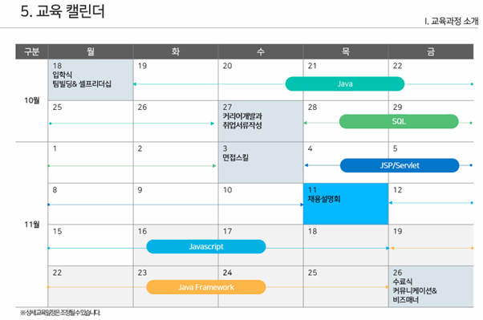

# javaEduSummary📝

> 미라콤 협력회사 채용연계 과정 수업 내용을 정리한 레포지토리입니다.
>
> 기간 : 21.10.18 - 21.11.26 6주 과정

## 셀프리더십 특강🤝

> 이여진 강사

* 21.10.18 (월) [SelfLeadershipLecture](./211018셀프리더십특강.md)

## JAVA☕

> 하승현 강사

* 21.10.19(화) [1일차](./211019JAVA1일차.md) : `J2SE`,`J2EE`, `JRE`, `OOP`
  * [Greeting](./miracom_edu/javaWorkspace/java01_Greeting)
  * [NoteBook](./miracom_edu/javaWorkspace/java02_NoteBook)
* 21.10.19(수) [2일차](./211020JAVA2일차.md) : `DataType`, `Method` & `Field`, `Constructor`, `returnType`
  * [DataType](./miracom_edu/javaWorkspace/java03_DataType)
  * [Constructor](./miracom_edu/javaWorkspace/java04_Constructor)
  * [work01](./miracom_edu/javaWorkspace/work01)

## 자소서 특강🖋️

* 21.11.26 (월) [👉](./211126자소서특강.md)